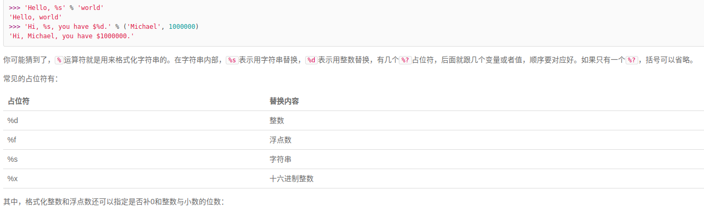

<!--
 * @Author: Liu Weilong
 * @Date: 2021-04-22 16:33:35
 * @LastEditors: Liu Weilong 
 * @LastEditTime: 2021-04-22 16:48:13
 * @FilePath: /Codes/27. python_basic/basic_liao_xue_feng/doc.md
 * @Description: 
-->
1. 字符串格式化
   
2. list[]、tuple ()
   list 内容可变，tuple 内容不可变，所以tuple会有更高的安全性
3. list[]、dist{}
   dist 查找速度更快 list 查找速度慢
   和list比较，dict有以下几个特点：
    查找和插入的速度极快，不会随着key的增加而变慢；
    需要占用大量的内存，内存浪费多。
    而list相反：
    查找和插入的时间随着元素的增加而增加；
    占用空间小，浪费内存很少。
4. set