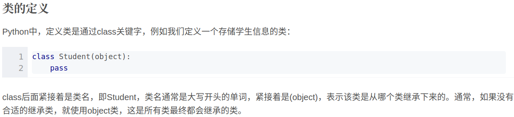

<!--
 * @Author: Liu Weilong
 * @Date: 2021-04-22 16:00:35
 * @LastEditors: Liu Weilong 
 * @LastEditTime: 2021-04-22 16:03:19
 * @FilePath: /Codes/27. python_basic/python_practice_msckf/gram.md
 * @Description: 
-->
1. 类的继承
   