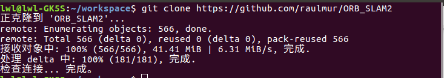
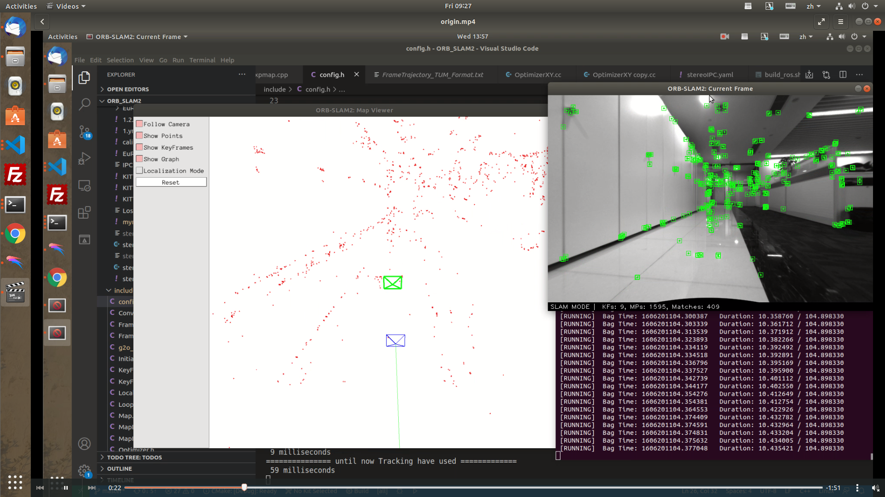
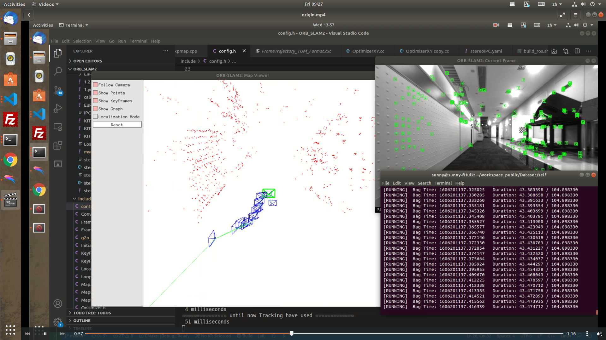
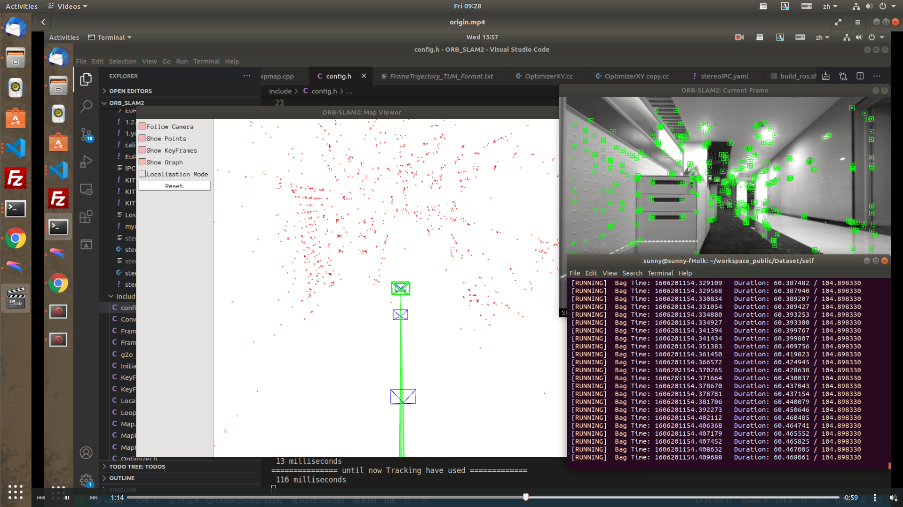
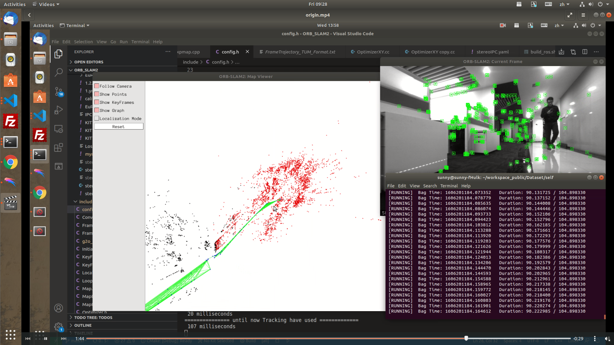
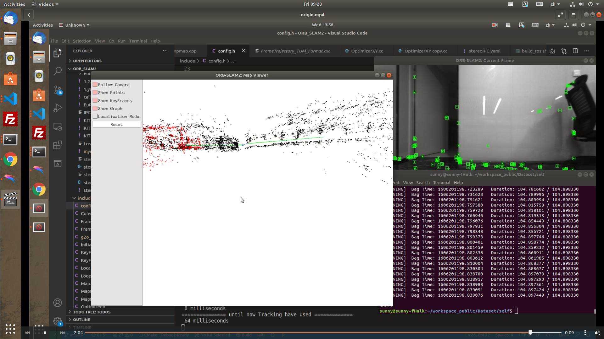

<!--
 * @Author: Liu Weilong
 * @Date: 2021-01-16 21:41:22
 * @LastEditors: Liu Weilong 
 * @LastEditTime: 2021-01-22 09:30:19
 * @Description: 
-->
### 1. 熟悉Linux
1. 如何在 Ubuntu 中安装软件（命令⾏界⾯）？它们通常被安装 
   apt install yum install ... 等 
   /usr/lib /usr/include /usr/share /opt 等位置 
2. linux 的环境变量是什么？我如何定义新的环境变量? 
   我的理解是系统层面上的变量,在许多程序中,都可以直接获取到 
   export XXX=xxx  i.e. export HOME="/home/lwl"
3. linux 根⽬录下⾯的⽬录结构是什么样的？⾄少说出 3 个
   /media 就是插移动硬盘的时候,可以访问   
   /usr   用户程序  
   /tmp   临时文件  
   /home  HOME 
4. 假设我要给 a.sh 加上可执⾏权限，该输入什么指令? 
   chmod +x a.sh 
5. 假设我要将 a.sh ⽂件的所有者改成 xiang:xiang，该输什么指令? 
   chown xiang:xiang a.sh 

### 2. 综述阅读
1. SLAM 会在哪些场合中⽤到？⾄少列举三个⽅向。 
   自动驾驶,AR VR 测绘 
2. SLAM 中定位与建图是什么关系？为什么在定位的同时需要建图？ 
   在没有其他传感器辅助的时候,单传感器是鸡生蛋,蛋生鸡的关系 
   还有其他功能需要使用地图,比如八叉树用于导航等 
3. SLAM 发展历史如何？我们可以将它划分成哪⼏个阶段？ 
   从滤波到Local BundleAdjustment 到增量平滑  
4. 列举三篇在 SLAM 领域的经典⽂献 
   EKF-SLAM 开始关注定位的一致性问题 
   SVO 稀疏直接法+深度滤波 
   ORB SLAM 特征点法的系统方案 

### 3. cmake练习
见cmake_practice

### 4. 理解ORB_SLAM2框架
1. 从 github.com 下载 ORB-SLAM2 的代码。地址在：https://github.com/raulmur/ORB_SLAM2.
提⽰：在安装 git 之后，可以⽤ git clone https://github.com/raulmur/ORB_SLAM2 命令下载
ORB-SLAM2。下载完成后，请给出终端截图. 

2. 此时我们不着急直接运⾏ ORB-SLAM2，让我们⾸先来看它的代码结构。ORB-SLAM2 是⼀个 
cmake ⼯程，所以可以从 CMakeLists.txt 上⾯来了解它的组织⽅式。阅读 ORB-SLAM2 代码⽬录 
下的 CMakeLists.txt，回答问题： 
(a) ORB-SLAM2 将编译出什么结果？有⼏个库⽂件和可执⾏⽂件？ 
(b) ORB-SLAM2 中的 include, src, Examples 三个⽂件夹中都含有什么内容？ 
(c) ORB-SLAM2 中的可执⾏⽂件链接到了哪些库？它们的名字是什么？ 
a. 一个主要库:lib/libORB_SLAM.so 还有两个附带的第三方库 ThirdParty/g2o/lib/libg2o.so ThirdParty/DBWod/lib/libDBWod.so  
超级多的可执行文件: i.e. Example/ROS/ORB_SLAM/Stereo Mono RGBD 
b. include: 头文件 src:源文件 Examples: 主函数文件 和配置文件 
c. 可以ldd 一个可执行文件 进行查看,有很多的库. 三方库:libORB_SLAM.so libg2o.so
libDBWod.so libopencv_core.so 

### 5. 自己跑ORB
因为视频大概 300M，就截取了图片上传

