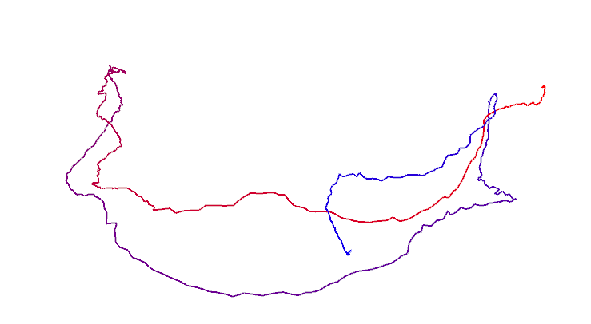

<!--
 * @Author: Liu Weilong
 * @Date: 2021-01-30 23:35:36
 * @LastEditors: Liu Weilong 
 * @LastEditTime: 2021-02-01 09:18:16
 * @Description: 
-->
### 1. 群的性质
1. ${Z,+}$ 是不是群？ 是\
a. 封闭性，两个整数相加还是整数\
b. 结合律，满足\
c. 幺元，0\
d. 逆元， 整数的负数\
2. ${N,+}$ 是不是群？ 不是\
a. 封闭性，两个自然数相加还是自然数\
b. 结合律，满足\
c. 幺元，0\
d. 逆元， 不存在\

### 2. 验证向量叉乘的李代数性质
1. $g={R^3,R,×}$ 性质验证\
a. 封闭性：R^3×R^3 还是 R^3 \
b. 双线性: 
$$
    [aX+bY,Z] = (aX+bY)×Z = aX×Z + bY×Z
$$
c. 自反性: 同方向向量叉乘=0\
d. 雅可比等价:
$$
    [X,[Y,Z]] + [Y,[Z,X]] + [Z,[X,Y]]=
    X×(Y×Z) + Y×(Z×X) + Z×(X×Y)
$$
这一部分是叉乘的一个性质。

### 3. 推导SE(3)的指数映射
$$
       \frac{1}{2}
       \left[
       \begin{matrix}
       \phi^{\land} & \rho\\
       \pmb{0} & 1
       \end{matrix}
       \right]
       \left[
       \begin{matrix}
       \phi^{\land} & \rho\\
       \pmb{0} & 1
       \end{matrix}
       \right] = \left[
       \begin{matrix}
       \frac{1}{2}(\phi^{\land})^{2} & \frac{1}{2}(\phi^{\land})\rho\\
       \pmb{0} & 1
       \end{matrix}
       \right] 
$$
$$
\frac{1}{6}
\left[
       \begin{matrix}
       \phi^{\land} & \rho\\
       \pmb{0} & 1
       \end{matrix}
       \right]
       \left[
       \begin{matrix}
       \phi^{\land} & \rho\\
       \pmb{0} & 1
       \end{matrix}
       \right]
       \left[
       \begin{matrix}
       \phi^{\land} & \rho\\
       \pmb{0} & 1
       \end{matrix}
       \right] = \left[
       \begin{matrix}
       \frac{1}{6}(\phi^{\land})^{3} & \frac{1}{6}(\phi^{\land})^{2}\rho\\
       \pmb{0} & 1
       \end{matrix}
       \right]
$$

之后的规律就很容易了,可以推出

$$
\begin{aligned}
    &exp(\xi^{\land})
   \\ =& \sum^{\infin}_{n=0}\frac{1}{n!}\left[
       \begin{matrix}
       \phi^{\land} & \rho\\
       \pmb{0} & 1
       \end{matrix}
       \right]^n
    \\ = & \left[
       \begin{matrix}
       \sum^{\infin}_{n=0}\frac{1}{n!}(\phi^{\land})^{n} & \sum^{\infin}_{n=0}\frac{1}{(n+1)!}(\phi^{\land})^{n}\rho\\
       \pmb{0} & 1
       \end{matrix}
       \right]
\end{aligned}
$$
### 4. 伴随
假设空间中存在，两个向量 $a$$b$ a^b的值和方向，可以认为和$ab$ 是固连的所以存在以下关系。

$$
    \begin{aligned}
    (Ra)^{\land}(Rb) = R(a^{\land}b)
    \\
    \rightarrow(Ra)^{\land}R = Ra^{\land}
    \\
    Ra^{\land}R^{T} = (Ra)^{\land}
    \end{aligned}
$$

$$
    Rexp(p^{\land})R^{T} = R\sum^{\infin}_{n=0}\frac{1}{n!}(\phi^{\land})^{n}R^T 
    = \sum^{\infin}_{n=0}\frac{1}{n!}(R\phi^{\land}R^T)^{n}
    =\sum^{\infin}_{n=0}\frac{1}{n!}((R\phi)^{\land})^{n}
$$

### 5. 画轨迹
1. 事实上， TW C 的平移部分即构成了机器⼈的轨迹。它的物理意义是什么？为何画出 TW C 的平移部分就得到了机器⼈的轨迹？\
Twc 的平移代表 camera 的原点在世界坐标系下的表示
2. 画轨迹

    
