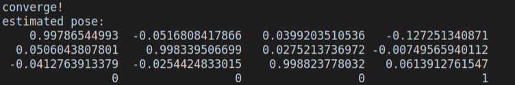

<!--
 * @Author: Liu Weilong
 * @Date: 2021-02-21 21:14:53
 * @LastEditors: Liu Weilong
 * @LastEditTime: 2021-02-21 22:37:01
 * @Description: 
-->
### 1. ORB提取
1. 因为描述子是利用比较的灰度之间的大小关系来描述，只有大小(1和0)的关系，所以是一个二进制的特征
2. 更大更小的值对应让ORB 的匹配判断要求更低和更高
3. 均匀化提取、添加运动先验、词袋加速匹配

### 2. 从E恢复 Rt 

### 3. GN优化

1. 如何定义重头影误差？
$$
    e = \left[
        \begin{matrix}
        u\\
        v
        \end{matrix}
    \right] - 
    \left[
        \begin{matrix}
        f_x&0&c_x\\
        0&f_y&c_y
        \end{matrix}
    \right]     \left[
        \begin{matrix}
        \cfrac{p_x}{p_z}\\
        \cfrac{p_y}{p_z}
        \end{matrix}
    \right]
$$
$$
    \left[
        \begin{matrix}
        p_x\\
        p_y\\
        p_z
        \end{matrix}
    \right]=
    Tp
$$

2. 雅可比矩阵
   $$
    J = J_{p}^{u,v}J^{p}_{\xi}
    $$
    $$
    J_{p}^{u,v} = \left[
        \begin{matrix}
        f_x/p_z& 0& \cfrac{-f_x}{z^2}\\
        0&f_y/p_z&\cfrac{-f_y}{z^2}
        \end{matrix}
    \right]
$$
$$
    J^p_{\xi} = \left[
        \begin{matrix}
        I\in{R^{3×3}}&& -[p]×
        \end{matrix}
    \right]
   $$

3. 因为上面雅可比矩阵采取左扰动模型，所以在更新的时候也是进行左乘的更新

### 4. icp轨迹匹配
见icp.cpp。

