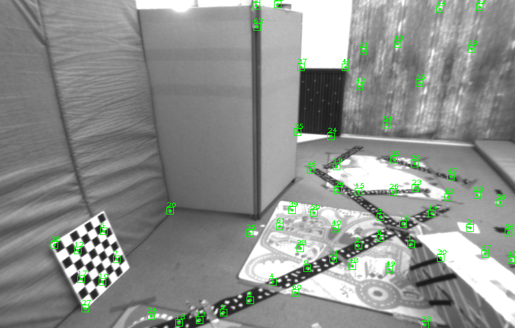
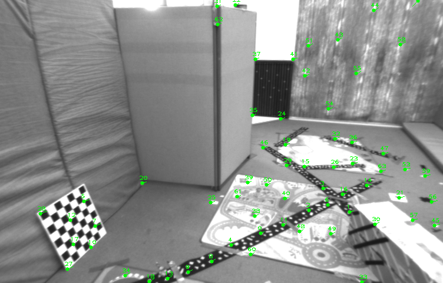
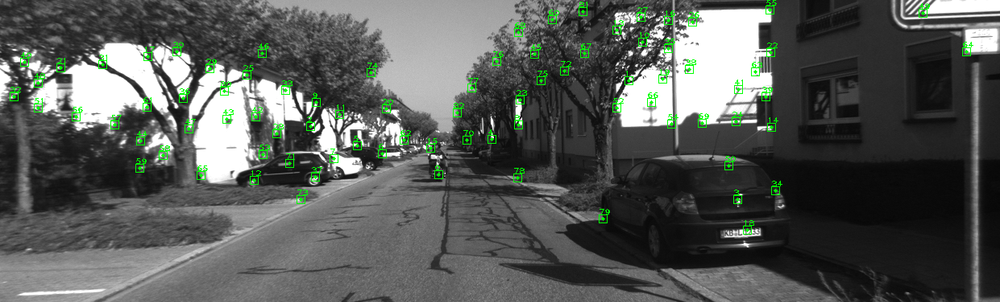
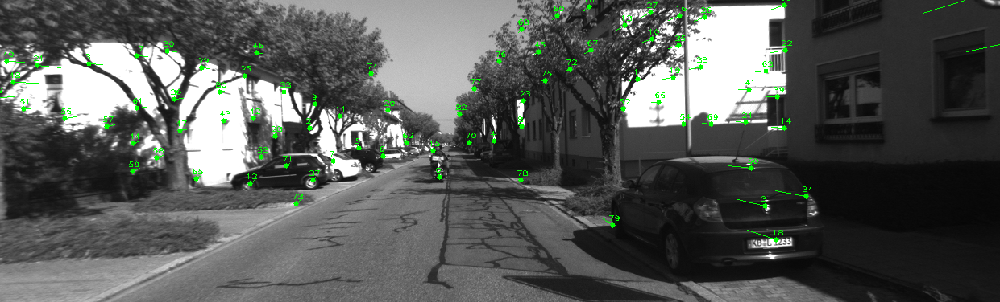
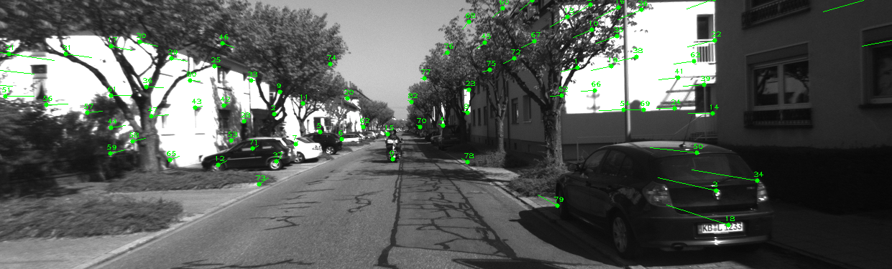
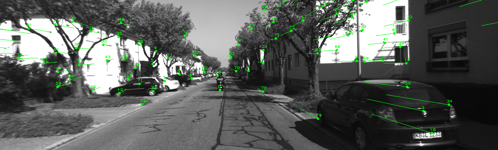
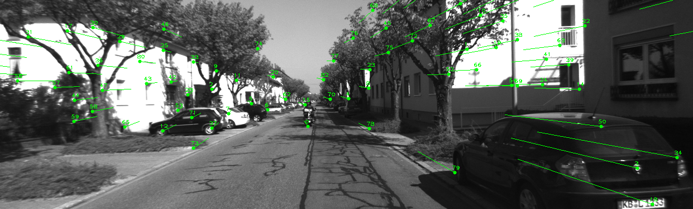
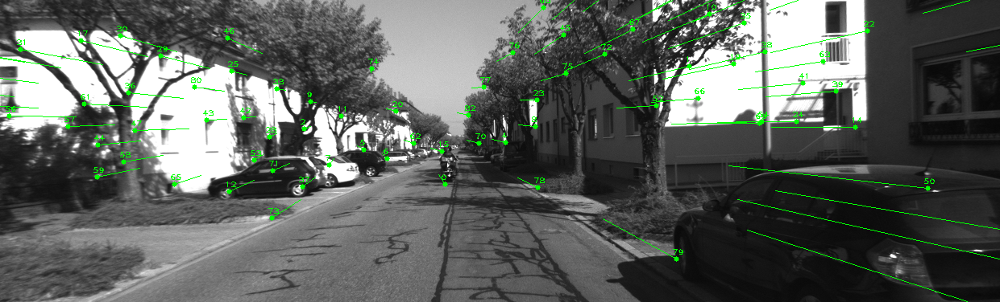

<!--
 * @Author: Liu Weilong
 * @Date: 2021-02-27 22:14:40
 * @LastEditors: Liu Weilong
 * @LastEditTime: 2021-03-14 12:07:20
 * @Description: 
-->
### 1. LK光流
#### 2.1
1. 按此文的分类，光流法可分为哪几类？
   四类 forward addition forward compositional inverse addition inverse compositional
2. 在 compositional 中，为什么有时候需要做原始图像的warp？该 warp 有何物理意义？
   (a)因为要作为优化的参数进行patch 上的灰度值进行优化。(b)相当于对patch 做仿射变换 
3. forward 和 inverse 有何差别？
   在积分的时候对Warp 进行了一次换元处理
#### 2.2
代码见 test_case.cpp 和 LK_self_tracker.h
1. 从最小二乘角度来看，每个像素的误差怎么定义？
   $$
    \underset{\Delta x \in T}{\sum} I_{cur}(x_{cur}+\Delta x) - I_{pre}(x_{pre}+\Delta x)
   $$
2. 误差相对于自变量的导数如何定义？
   $$
    \cfrac{\partial I}{\partial x} = \left[
        \begin{matrix}
            I_x\\
            I_y
        \end{matrix}
        \right]
   $$
#### 2.3
代码见 LK_self_tracker.h
#### 2.4
opencv 

inverse

forward

1. 所谓 coarse-to-fine 是指怎样的过程?
   金字塔一层一层下降的过程
2. 光流法中的金字塔用途和特征点法中的金字塔有何差别？
   光流一层一层是为了定位，特征点法的金字塔是为了克服尺度

#### 2.5
1. 我们优化两个图像块的灰度之差真的合理吗？哪些时候不够合理？你有解决办法吗？
   (a) 自动曝光的问题，在优化项中加入 均值m 的优化
   (b) Patch 不一定是 正方形的问题。可以使用仿射进行优化
2. 图像块大小是否有明显差异？取 16x16 和 8x8 的图像块会让结果发生变化吗？
   有明显的差距，可以修改config.yaml 的template size，从8改成21 会把之前很多匹配不上的点匹配上(opencv实现的速度还是太快了)
   新添加:
   设置窗口时，窗口大光流鲁棒性好，窗口小光流精确性好, 存疑！！
3. 金字塔层数对结果有怎样的影响？缩放倍率呢？
   有明显影响，具体可以修改config.yaml 进行体验，000003.png 和 00004.png 会发现很多匹配不上，都能匹配上了
   新添加:
   金字塔层数一般越多越好，但是在4-5层之后，图像会变得很小，特征点像素太过紧密容易引起误追踪。
放大倍率小，金字塔层数增加，迭代层数增加，效果变好

### 直接法 
#### 3.1 单层直接法
1. 该问题中的误差项是什么？
    $$
    \underset{\Delta x \in T}{\sum} I_{cur}(\pi(Tx_{pre})+\Delta x) - I_{pre}(\pi(x_{pre})+\Delta x)
   $$
2. 误差相对于自变量的雅可比维度是多少？如何求解？
   $$
    J = \left[
        \begin{matrix}
            I_x\\
            I_y
        \end{matrix}
        \right]
        \left[
        \begin{matrix}
            f_x/z&0&\cfrac{-f_xx}{z^2}\\
            0&f_y/z&\cfrac{-f_yy}{z^2}
        \end{matrix}
        \right]
        \left[
        \begin{matrix}
            I\in R^{3×3}&[p×]
        \end{matrix}
        \right]
        \\
        p =         
        \left[
        \begin{matrix}
            x\\
            y\\
            z
        \end{matrix}
        \right]
   $$
3. 窗口可以取多大？是否可以取单个点？
   窗口大小可以类似光流，但是窗口相较光流需要小一点，具体原因不知道。具体见config.yaml 的最优效果配置就可以知道。可以取单个点，容易陷入局部极小

#### 3.2 多层直接法
效果:
目标:

000001:

000002:

000003:

000004:

000005:

$$ 
    t1 = \left[
        \begin{matrix}
            -0.0216915 & -0.00693169 &  -0.721478
        \end{matrix}
        \right]
        \\
    t5 = \left[
        \begin{matrix}
            0.0476834 & 0.0459361 & -3.76152
        \end{matrix}
        \right]
$$

结果基本ok

#### 3.3 拓展讨论
1. 直接法是否可以类似光流，提出 inverse, compositional 的概念？它们有意义吗？
   可以，只要积分换元的时候Warp 是一个群就可以。有意义，速度更快。
2. 请思考上面算法哪些地方可以缓存或加速？
   换成Inverse Compositional 速度可以加快。
3. 在上述过程中，我们实际假设了哪两个 patch 不变？
   灰度的patch不变，patch的形状不变
4. 为何可以随机取点？而不用取角点或线上的点？那些不是角点的地方，投影算对了吗？
   因为匹配的是3D点？ 不太懂。
   经过实验可以取角点。
5. 请总结直接法相对于特征点法的异同与优缺点。
    (空)|直接法|特征点|
   ---|---|---|---|--
   优点|a. 快，非常快 b. 整体上的优化，会比光流的匹配更加稳定 c.可以不用非要是角点的特征也可以进行跟踪，对于场景特征要求不大。|a. 稳定匹配 b. 大运动可以克服||
   缺点|a. 相机帧率需要足够快 b. 参数需要进行调节|a.慢 b. 场景单一||

### 4. 附加题
实在做不动了