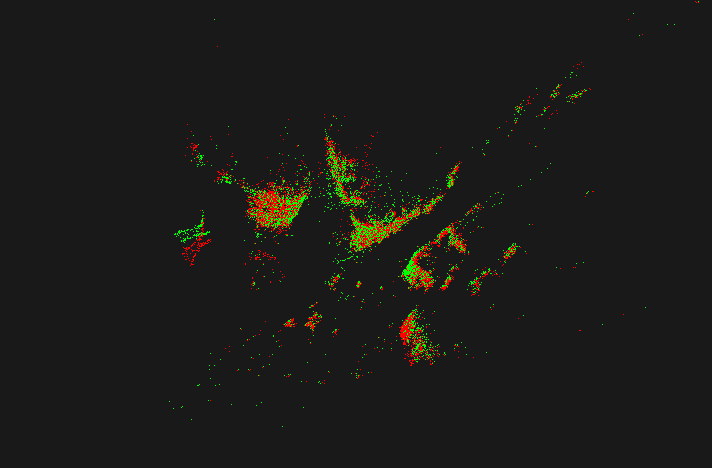
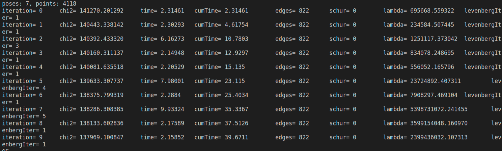

<!--
 * @Author: Liu Weilong
 * @Date: 2021-03-06 21:07:34
 * @LastEditors: Liu Weilong 
 * @LastEditTime: 2021-03-20 13:50:25
 * @Description: 
-->
### 2.1 Bundle Adjustment
1. 为何说 Bundle Adjustment is slow 是不对的？
   
   因为没有利用稀疏
2. BA 中有哪些需要注意参数化的地⽅？ Pose 和 Point 各有哪些参数化⽅式？有何优缺点
  Pose 有四元数+平移 旋转矩阵+平移 SO3+平移 SE3
  Point 齐次方程 
  SE3 的稳定性更高 
  旋转矩阵的优化更加复杂，而且带有其他约束
  
3. 本⽂写于 2000 年，但是⽂中提到的很多内容在后⾯⼗⼏年的研究中得到了印证。你能看到哪些⽅向在后续⼯作中有所体现？请举例说明？
   
   图优化的SLAM基本已经替代了之前的滤波的算法，在加入了各种cholmod 和 schur补之后计算速度大幅提升。

### 2.2 BAL

红色是优化后 绿色是优化前
代码见code/BAL

### 3.1 Direct BA
代码见 code/DSO

1. 如何描述任意⼀点投影在任意⼀图像中形成的 error？
   $$
    \underset{W}{\sum}(I(p_i)-I(\pi(KTp)))
   $$
2. 每个 error 关联⼏个优化变量?
   
   优化 Pose(6维) Point(3维) 两个变量
3. error 关于各变量的雅可⽐是什么？
   $$
    \cfrac{\partial I}{\partial \xi} = \left[
        \begin{matrix}
            I_x\\
            I_y
        \end{matrix}
        \right]
        \left[
        \begin{matrix}
            f_x/z&0&\cfrac{-f_xx}{z^2}\\
            0&f_y/z&\cfrac{-f_yy}{z^2}
        \end{matrix}
        \right]
        \left[
        \begin{matrix}
            I\in R^{3×3}&[p×]
        \end{matrix}
        \right]
   $$
   $$
    \cfrac{\partial I}{\partial p} = \left[
        \begin{matrix}
            I_x\\
            I_y
        \end{matrix}
        \right]
        \left[
        \begin{matrix}
            f_x/z&0&\cfrac{-f_xx}{z^2}\\
            0&f_y/z&\cfrac{-f_yy}{z^2}
        \end{matrix}
        \right]
        R
   $$
### 3.2 实现

4000*7*16的数值自动求导，花时间太多，这里只能说明已经是在不断下降的，但是无法给出最终结果。

1. 能否不要以 [𝑥,𝑦,𝑧]𝑇 的形式参数化每个点？
   
   可以，可以用逆深度模型进行参数化
2. 取 4x4 的 patch 好吗？取更大的 patch 好还是取小⼀点的 patch 好？
   这一点，现有数据集无法进行验证。
   只能说patch 大小都有好处和坏处，大的patch 会更加准确，但是因为是BA 一般是在关键帧之间进行，所以对于一般的情况下，大patch 因为运动带有旋转，会引入更大误差，这里需要进行仿射变换，来降低误差。而且大的patch的计算量是无法忽略的，所以更加需要inverse compostional 来解决。
   小的patch，在不添加额外warp 的情况下会更加合适关键帧之间的BA,但是过小的patch很容易陷入局部极值。
3. 从本题中，你看到直接法与特征点法在 BA 阶段有何不同？
   error 定义不同。
4. 由于图像的差异，你可能需要鲁棒核函数，例如 Huber。此时 Huber 的阈值如何选取？
   看别的论文一般取0.1

