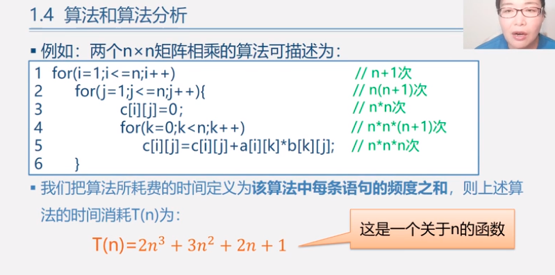
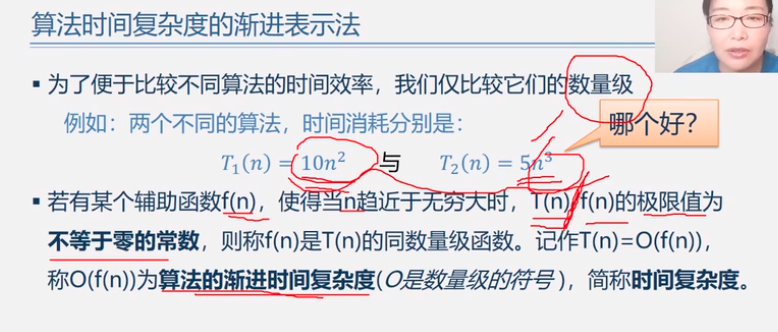

<!--
 * @Author: Liu Weilong
 * @Date: 2021-01-20 21:13:13
 * @LastEditors: Liu Weilong
 * @LastEditTime: 2021-01-20 21:28:55
 * @Description: 
-->
### 概念
1. 数据 、数据元素、数据项 
   数据>数据元素>数据项
2. 抽象数据类型 ADT 
3. 算法时间效率的度量 
   事前分析、事后统计 
   事前分析：  运行时间=$\sum$语句运行的次数×运行一次需要的时间 
   
   