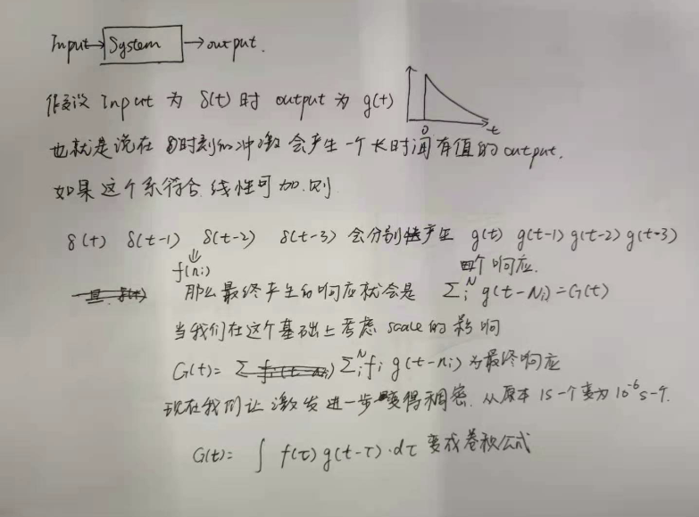
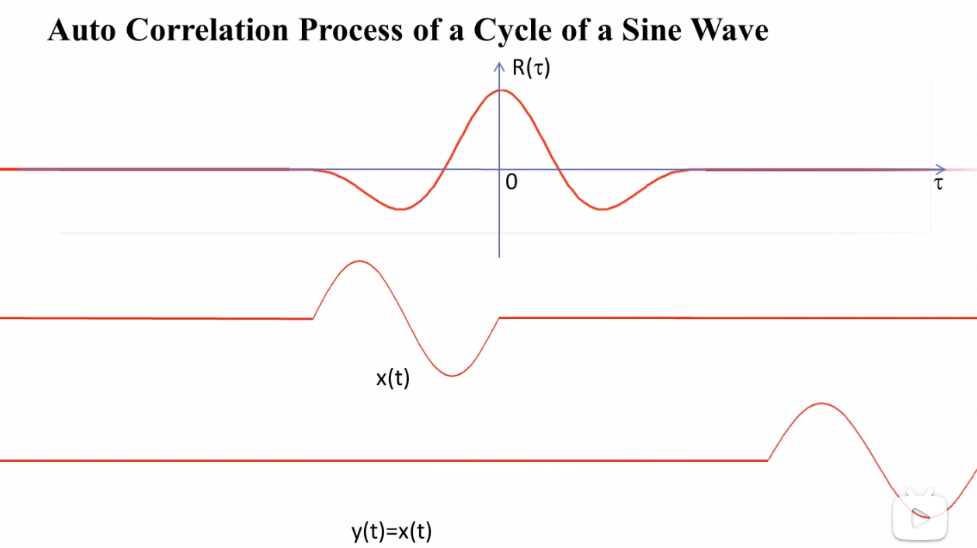

<!--
 * @Author: Liu Weilong
 * @Date: 2021-05-25 21:29:54
 * @LastEditors: Liu Weilong
 * @LastEditTime: 2021-05-31 09:08:39
 * @Description: 
-->
### 梗概
1. Convolution
2. Cross-Correlation 
3. Normal Cross-Correlation
3. Signal-Matching
4. Cross-corr as Convolution

声明: 这里的NCC 和图像NCC 的关系我还没有搞清楚
   
----

1. Convolution (卷积)
   
   这里对于卷积这个概念的理解主要是建立在线性系统上的。

   

   下面引出另外一种理解

2. cross-correlation(互相关)

   主要是用于评测两个信号在哪里最相似

   定义:
   $$
   \omega(\tau) = \int ^\infin_{-\infin}u^*(t)v(\tau+t)dt
   $$

   2.1 为什么可以衡量？

   目前最喜欢的一个理解是: 使用向量来进行理解。

   这里我们假设u(t) 和v(t) 是一个向量$[u_1,u_2,...u_N]_{N\rightarrow\infin}$
   
   那么我们在思考的时候，最容易想到的就是，两个向量的点积只有在向量方向相同的时候可以取到。

   所以这里的 $\tau$ 就变成了如何调整 v(t) 可以让 v(t) 和 u(t) 的向量在同一个角度上，让二者乘积达到最大。

   那么最终这个$\omega(\tau)$ 的最高点当然也就对应了 最优调整的$\tau$

   

   注意: 这里的$\omega(\tau) = \int ^\infin_{-\infin}u^*(t)v(\tau+t)dt$ 和 DSPDF 中的$\omega(t) = \int ^\infin_{-\infin}u^*(\tau)v(\tau+t)d\tau$ 只是换了个表示符号，其他都一样

   然后继续看DSPDF 中 CrossCorrealtion 的频域表达，就能够和POC 中的公式推导完全串起来