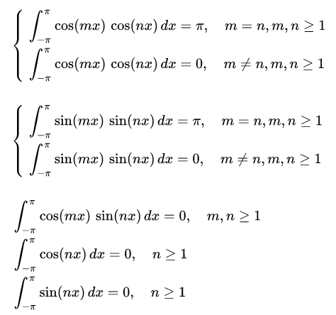
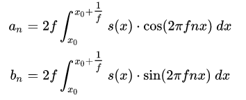
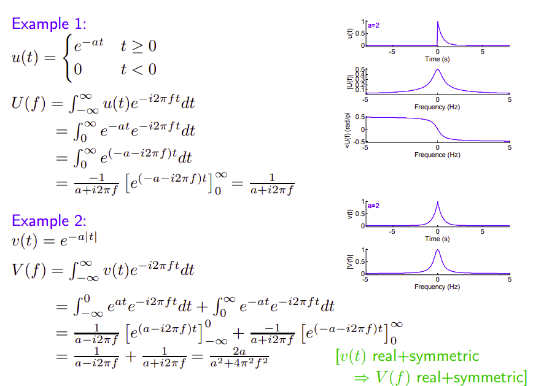

<!--
 * @Author: Liu Weilong
 * @Date: 2021-05-24 19:30:14
 * @LastEditors: Liu Weilong
 * @LastEditTime: 2021-05-27 08:19:36
 * @Description: 
-->
Some Basic Conception in Frequency Analysis

### 主要内容如下:
1. Fourier 变换的一般作用
2. Fourier 变换的组成
3. Fourier 变换的正交基
4. Fourier 变换的欧拉公式引入(连接复数域和实数域)
5. 小结
6. Fourier 参数估计(周期函数) 
7. Fourier 参数估计(非周期函数)
8. 再进一步 Fourier 变换
9. Fourier 逆变换
10. Fourier 变换的相位、幅值关系

-----

1. Fourier 变换的一般作用:
   
   函数拟合，主要思想就是用多个sin 或者 cos(sin 和 cos 是一样的，只差一个相位)来对函数进行拟合。 为什么可以拟合和拟合的精度，不是这里能够讨论得了的。
   
   但是，可以记住一个结论，能够拟合的函数有哪些特征？

2. Fourier 变化的组成:
   
   有了上面的概念之后，那么假设一个可以拟合的函数，就可以写成
   $$
    f(x) = \sum a_i sin(2\pi f_ix+\theta_i)
   $$
   在加上三角函数的一直基础性质:
   $$
    sin(\theta_1+\theta_2) = sin(\theta_1)cos(\theta_2)+cos(\theta_1)sin(\theta_2)
   $$
   之后，那个可以拟合的函数就可以写成
   $$
    \begin{aligned}
        f(x) &= \sum a_isin(2\pi f_ix+\theta_i)
        \\
        & =\sum [\underbrace{a_i cos(\theta_i)}_{= A_i}sin(2\pi f_ix)+ \underbrace{a_i sin(\theta_i)}_{=B_i}cos(2\pi f_ix)] 
        \\
        & = \sum [A_isin(2\pi f_ix)+ B_icos(2\pi f_ix)] 
    \end{aligned}
   $$
   这里为了让函数的上下幅度加入常数补偿

   $$
   f(x) = a_0 + \sum [A_isin(2\pi f_ix)+ B_icos(2\pi f_ix)] 
   $$

3. Fourier 的正交基:

   下面，开始引入Fourier的正交基的概念，并进一步推导公式成
   $$
   \begin{aligned}
      f(x) &= a_0 + \sum [A_isin(2\pi f_ix)+ B_icos(2\pi f_ix)]
      \\
       & = a_0 + \sum^N_{n=1} [A_isin(2\pi fnx)+ B_icos(2\pi fnx)]
   \end{aligned}
   $$

   也就是进一步把 $\sum a_isin(\theta_i + 2\pi f_ix)$ 规范化为  $\sum^N_{n=1} b_i sin(\theta_i + 2\pi fnx)$ 的表示

   3.1. 周期函数的基

   为了规范化，就需要先对比向量空间的基。
   
   组成向量空间的基的向量之间存在一个关系。
   
   $$
   a_i ^T a_j = 0
   $$

   那么，定义函数之间的是否正交，就是把函数看作一个区间内无限多维的向量。
   
   那么函数正交就可以定义为
   $$
   \int^{a}_{b} f_1(x)f_2(x)dx = 0
   $$

   这个时候
   $$
   \int^{\pi}_{-\pi} cos(x)sin(x)
   = 0
   $$
   严格正交

   进一步引出的正交关系有

   

   由此,我们可以得出一个结论。
   
   如果我们想要去拟合一个周期为T函数，那么我们只需要找到$\cfrac{nT}{2\pi}$

   这个时候一定会有问题是，为什么就不能用一个非正交基来表示呢？
    这个地方已经超出我能理解的范围了

   所以最后用一个结论来结束这个章节:

   周期函数(非周期函数可以使用超级长周期的函数来进行拟合),可以使用以下公式进行拟合:
   $$
      f(x)
       = a_0 + \sum^N_{n=1} [A_isin(2\pi fnx)+ B_icos(2\pi fnx)]
   $$
   并且内部使用的三角函数组成了一组正交基。

4. Fourier 变换的欧拉公式引入(连接复数域和实数域)
   
   首先，先引入欧拉公式
   $$
   e^{ix} = cos(x) + isin(x)
   $$
   然后引入一个小推导的过程
   $$ 
   c_n = p-iq , c_n^* = p+iq\\
   \begin{aligned}
      c_n e^{-ix} + c_n^*e^{ix}
      &= (p-iq)(cos(-x)+isin(-x)) + (p+iq)(cos(x)+isin(x))
      \\
      & = (p-iq)(cos(x)-isin(x)) + (p+iq)(cos(x)+isin(x))
      \\
      & = Acos(x) + Bsin(x)
   \end{aligned}
   \\
   p = \cfrac{A}{2}, q = -\cfrac{B}{2}
   $$

   有了上面的引入，整个拟合公式进一步焕然一新
   
   $$
   \begin{aligned}
      f(x) &= a_0 + \sum^N_{n=1} [A_isin(2\pi fnx)+ B_icos(2\pi fnx)]
      \\
      & = a_0+ \sum^N_{n=1} [c_n e^{-i2 \pi fnx} + c_n^*e^{i2\pi fn x}] 
      \\
      & = \sum^N_{n=-N} c_n e^{i2\pi fn x}
   \end{aligned}
   \\
   c_n = \left\{
      \begin{aligned}
         &\frac{1}{2} (A_i -iB_i) , &n>0 \\
         &a_0 ,&n=0 \\
         &\frac{1}{2} (A_i +iB_i) , &n<0
      \end{aligned}
       \right.
   $$

   另外一种推导
   $$
   e^{ix} = cos(x) + isin(x)
   \\
   cos(x) = \cfrac{e^{ix} + e^{-ix}}{2}
   \\
   sin(x) = \cfrac{e^{ix} - e^{-ix}}{2i}
   $$
   将上式带入到
   $$
      f(x) = a_0 + \sum^N_{n=1} [A_isin(2\pi fnx)+ B_icos(2\pi fnx)]
   $$ 
   也可以得到
   $$
      f(x) = \sum^N_{n=-N} c_n e^{i2\pi fn x}
   $$

5. 小结:
   5.1. Fourier 可以进行周期函数拟合
   
   5.2. 任意一个周期为T 的函数都可以写成一个这样的拟合式,且内部使用的三角函数组成一组正交基
   $$
      f(x)
       = a_0 + \sum^N_{n=1} [A_isin(2\pi fnx)+ B_icos(2\pi fnx)]
   $$

   5.3. 引入欧拉函数,进一步把拟合式写为
      $$
   \begin{aligned}
      f(x) = \sum^N_{n=-N} c_n e^{i2\pi fn x}
   \end{aligned}
   \\
   c_n = \left\{
      \begin{aligned}
         &\frac{1}{2} (A_i -iB_i) , &n>0 \\
         &a_0 ,&n=0 \\
         &\frac{1}{2} (A_i +iB_i) , &n<0
      \end{aligned}
       \right.
   $$
   
6. Fourier 参数估计(周期函数) 傅立叶级数
   
   上面已经说了很多，理论上的内容。现在我们具体来看，如何进行Fourier 拟合参数的求解，
   也就是 $A_i,B_i$ 怎么求解

   这里主要是利用了 正交基的性质

   

   所以就有了以下公式

   

   但是到了这里还只是一个

7. Fourier 参数估计(非周期函数) 
   
   那么如何进行引入非周期函数拟合呢？
  
   首先，先看一个例子。
   
   周期$6\pi$ 的函数 f为 $\cfrac{1}{3}$ 然后 正交基为$cos(\cfrac{n}{3}x) \ sin(\cfrac{n}{3}x)$

   那么周期 $100\pi$的函数 f为 $\cfrac{1}{50}$ 然后 正交基为$cos(\cfrac{n}{50}x) \ sin(\cfrac{n}{50}x)$ 
   
   那么周期 $10000\pi$的函数 f为 $\cfrac{1}{5000}$ 然后 正交基为$cos(\cfrac{n}{5000}x) \ sin(\cfrac{n}{5000}x)$ 
   
   会发现正交基越来越密

   当周期进一步扩大的时候， f为 $\cfrac{1}{\delta}$ 然后 正交基为$cos(\cfrac{n}{\delta}x) \ sin(\cfrac{n}{\delta}x)$  ,$\delta \rightarrow \infin$

   这个时候，我们再来看，周期会变为无穷公式的构建会变为

   $$
      a_n = 2f\int^{x_0+\infin}_{x_0} f(x)cos(2\pi fnx)dx
      \\
      b_n = 2f\int^{x_0+\infin}_{x_0} f(x)sin(2\pi fnx)dx
   $$

   这里我们会发现什么呢？ 当周期比较小 f 比较大的时候 fn 会是一个离散的数学， 所以得到的a_n b_n 还是一个数列，而不是一个函数
   但是当周期变得很大的时候 f 变得非常小 fn 之间的间隔变得非常小，之间构成了一个函数 $G:fn\rightarrow (a_n,b_n)$
   这个时候a_n b_n 变为 函数 a(fn) b(fn)

8. 进一步 傅立叶变换
   
   其实到了7，傅立叶变换就基本写完了，但是还不是一个最常用的形式。下面推导常用形式:

   $$
   c_n = \cfrac{1}{T}\int^{\infin}_{-\infin} f(x)e^{-i2\pi fnx}dx
   $$

   首先,周期调整到0处
   $$
   c_n = \cfrac{1}{T}\int^{\cfrac{T}{2}}_{-\cfrac{T}{2}} f(x)e^{-i2\pi fnx}dx
   $$
   当 $T \rightarrow \infin$ 时
   $$
   c_n = \cfrac{1}{T}\int^{\infin}_{-\infin} f(x)e^{-i2\pi fnx}dx
   $$   
   从正交性的性质以及一些欧拉公式的推导可以知道，存在以下性质
   $$
   \int^{\cfrac{T}{2}}_{-\cfrac{T}{2}} e^{i2\pi fnx}e^{-i2\pi fnx}dx = T
   \\
    \int^{\cfrac{T}{2}}_{-\cfrac{T}{2}} e^{-i2\pi fnx}e^{-i2\pi fnx}dx = 0
    \\
    \int^{\cfrac{T}{2}}_{-\cfrac{T}{2}} e^{i2\pi fn_ix}e^{ i2\pi fn_jx}dx = 0, i\not ={j}
   $$
   所以最终可以得到公式:
   $$
    c_n = \cfrac{1}{2 \pi}\int^{\infin}_{-\infin} f(x)e^{-i2\pi fnx}dx
   $$
   进一步修改，因为T已经变得非常大，fn符合7. 中说的非常稠密的情况，所以c_n 不再是一个数列，而是一个函数。
   
   最终,傅立叶变换可以写成
   $$
    c(\omega)= \cfrac{1}{2 \pi}\int^{\infin}_{-\infin} f(x)e^{-i\omega x}dx
   $$

   补充用例：
   

9. Fourier 逆变换
   
   问题是，知道了 $c_n$或者 $c(\omega)$ 和 $fn$ 或者 $\omega$ 如何复现出原本的函数

   对于离散的频域
   $$
   f(x) = \sum^N_{n=-N} c_n e^{i2\pi fn x}
   $$
   对于连续的频域
   $$
   f(x) = \int^{\infin}_{-\infin} c(\omega) e^{i\omega x} d\omega
   $$

10. Fourier 变换的相位、幅值关系
   
    这一部分的探索,需要从之前的参数进行。
    $$   
    c(w) = \int ^{\infin}_{-\infin} f(x)e^{-i\omega x}dx \\
      c_w = |c_w| e^{i\phi}
    $$
    幅值:
    $$
      A=|c_w|
    $$
    相位角:
    $$
      \phi 
    $$

   
    

    
    
   

