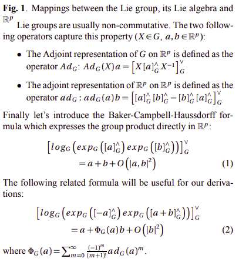
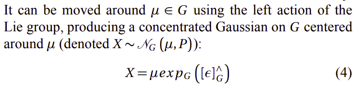
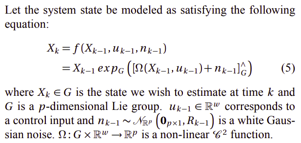
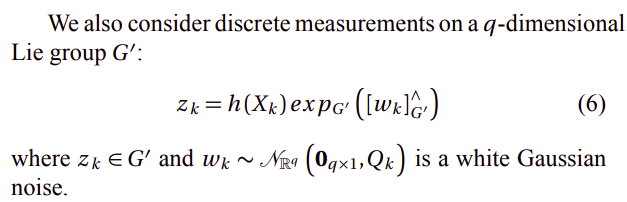
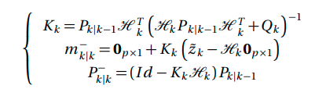
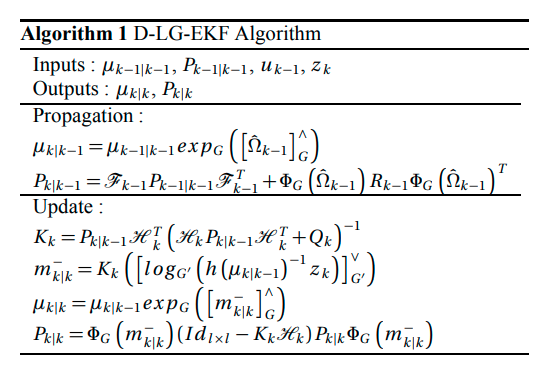

<!--
 * @Author: Liu Weilong
 * @Date: 2021-02-24 11:32:20
 * @LastEditors: Liu Weilong
 * @LastEditTime: 2021-07-06 11:14:29
 * @FilePath: /Codes/30. supplement_material/gaussian_on_lie_group(D_LG_EKF)/D_LG_EKF.md
 * @Description: 
-->
### 基础

内容主要来自D_LG_EKF(DISCRETE EXTENDED KALMAN FILTER ON LIE GROUPS)

目的: 借此一窥 李群上的概率分布

这实际上还是一个 ESKF 的框架

主要内容:

1. 基础内容
   
------
1. 基础内容---Lie Group Basic
   
   1.1 明确 $R^p,g,G$之间的关系

   $R^p$ 普通的向量，$g$李代数，$G$ 李群

    1.1.1 明确转换关系

   $R^p$ 和 $g$ 由 
   $$
   []^{\wedge}:R^p \rightarrow g
   \\
   []^{\vee}:g\rightarrow R^p
   $$
   进行联系

   $g$ 和 $G$由
   $$
    exp_G: g\rightarrow G
    \\
    log_G: G\rightarrow g
   $$
    进行联系

    1.1.2 明确dimension之间的关系

    $e_i ,i = 1,...,p, e_i \in R^p$ 对应 $g$ 中的 $E_i , i =1,...,p, E_i \in g$

    所以可以说明g 和 $R^p$ 同构

    1.2 g 空间上的部分基础补充

    存在
    $X = \sum^{p}_{i=0} a_i E_i = \sum^{p}_{i=0} a_i [e_i]^\wedge$

    1.3 一些伴随的公式和BCH
    

    1.4 Lie Group 上的概率
    
    1.4.1 Concentrated Gaussian Distribution on Lie Groups

     ?  
    这个 Concentrated Gaussian Distribution 和 一般的有什么区别或者优势吗?

    答: 应该是会把这个 误差项 和 流形上的状态独立出来。让误差项的实际作用不受到当前流形位置的影响

    

2. D_LG_EKF 正文

   2.1 系统模型

   运动模型:
    
    这里的 
    $$
    X_k = X_{k-1}exp_G(\Omega(X_{k-1},u_{k-1})+n_k) 
    $$
    并不是泰勒展开，而是实际的公式，没有任何拟合的手法

   观测模型:
    

   2.2 Propagation

   均值:
   
   $$
    \mu_{k|k-1} = \mu_{k-1|k-1}exp_G([\hat{\Omega}_{k-1}]^\wedge) 
    \\
    \hat{\Omega}_{k-1} = \Omega(\mu_{k-1},u_{k-1})
   $$

   方差:从误差进行刻画

   $$
   \begin{aligned}
    exp_G(\epsilon_{k|k-1}) &= \mu_{k|k-1}^{-1} X_{k}
    \\
    \uparrow X_k &= X_{k-1}exp_G(\Omega(X_{k-1},u_{k-1})+n_k)
    \\
    exp_G(\epsilon_{k|k-1}) &= \mu_{k|k-1}^{-1}X_{k-1}exp_G(\Omega(X_{k-1},u_{k-1})+n_k)
    \\
    \uparrow X_k &= \mu_k exp_G([\epsilon_k]^\wedge)
    \\
    exp_G(\epsilon_{k|k-1}) &= \mu_{k|k-1}^{-1}\mu_{k-1} exp_G([\epsilon_{k-1}]^\wedge)exp_G(\Omega(X_{k-1},u_{k-1})+n_k)
    \\
    \uparrow     \mu_{k|k-1} &= \mu_{k-1|k-1}exp_G([\hat{\Omega}_{k-1}]^\wedge) 
    \\
        exp_G(\epsilon_{k|k-1}) &= exp_G([-\hat{\Omega}_{k-1}]^\wedge) exp_G([\epsilon_{k-1|k-1}]^\wedge)exp_G(\Omega(X_{k-1},u_{k-1})+n_k)
   \end{aligned}
   $$

   从 G 到 $R^p$ 上的方差扩展 ，这一步存在问题，的确是存在问题的。
   
   那么这里之后的推导就使用我自己的推导了。

   $$
    \begin{aligned}
    exp_G(\epsilon_{k|k-1}) &= exp_G([-\hat{\Omega}_{k-1}]^\wedge) exp_G([\epsilon_{k-1|k-1}]^\wedge)exp_G(\Omega(X_{k-1},u_{k-1})+n_k)
    \\
    &\ \ \ \ \uparrow linearize X_{k_1}  
    \\ 
    exp_G(\epsilon_{k|k-1}) &= exp_G([-\hat{\Omega}_{k-1}]^\wedge) exp_G([\epsilon_{k-1|k-1}]^\wedge)
    \\
    &\ \ \ \ \ \ exp_G([\Omega(\mu_{k-1|k-1},u_{k-1})+\cfrac{\partial }{\partial \epsilon}(\Omega(\mu_{k-1|k-1},u_{k-1})) \epsilon_{k-1|k-1} +n_k]^\wedge)
    \\
       exp_G(\epsilon_{k|k-1}) &=  exp_G([[Ad_G(-\hat{\Omega}_{k-1})\epsilon_{k-1|k-1}]^\wedge)exp_G([-\hat{\Omega}_{k-1}]^\wedge)
    \\
    &\ \ \ \ \ \ exp_G([\Omega(\mu_{k-1|k-1},u_{k-1})+\cfrac{\partial }{\partial \epsilon}(\Omega(\mu_{k-1|k-1},u_{k-1})) \epsilon_{k-1|k-1} +n_k]^\wedge)
    \\
    &\ \ \ \ \uparrow \hat{\Omega}_{k-1} = \Omega(\mu_{k-1},u_{k-1})
    \\
    exp_G(\epsilon_{k|k-1}) &=  exp_G([[Ad_G(-\hat{\Omega}_{k-1})\epsilon_{k-1|k-1}]^\wedge)exp_G([-\hat{\Omega}_{k-1}]^\wedge)
    \\
    &\ \ \ \ \ \ exp_G([\hat{\Omega}_{k-1}+\cfrac{\partial }{\partial \epsilon}(\Omega(\mu_{k-1|k-1},u_{k-1})) \epsilon_{k-1|k-1} +n_k]^\wedge)
    \\ 
    &\ \ \ \ \ \uparrow 这里开始完全按照自己的写法来写
    \\
     exp_G(\epsilon_{k|k-1}) &=  exp_G([Ad_G(-\hat{\Omega}_{k-1})\epsilon_{k-1|k-1}]^\wedge)
    \\
    &\ \ \ \ \ \ exp_G([J_r(\hat{\Omega}_{k-1})(\cfrac{\partial }{\partial \epsilon}(\Omega(\mu_{k-1|k-1},u_{k-1})) \epsilon_{k-1|k-1} +n_k)]^\wedge)
    \\ 
    &\uparrow Ad_G(-\hat{\Omega}_{k-1})\epsilon_{k-1|k-1} \approx (\hat{\Omega}_{k-1})\cfrac{\partial }{\partial \epsilon}(\Omega(\mu_{k-1|k-1},u_{k-1})) \epsilon_{k-1|k-1} +n_k \approx 0
    \\
   exp_G(\epsilon_{k|k-1}) &=  exp_G([Ad_G(-\hat{\Omega}_{k-1})\epsilon_{k-1|k-1}+J_r(\hat{\Omega}_{k-1})(\cfrac{\partial }{\partial \epsilon}(\Omega(\mu_{k-1|k-1},u_{k-1})) \epsilon_{k-1|k-1} +n_k)]^\wedge)
   \\
    \epsilon_{k|k-1}  &= Ad_G(-\hat{\Omega}_{k-1})\epsilon_{k-1|k-1}+J_r(\hat{\Omega}_{k-1})[\cfrac{\partial }{\partial \epsilon}(\Omega(\mu_{k-1|k-1},u_{k-1})) \epsilon_{k-1|k-1} +n_k]
    \end{aligned}
   $$

   得到线性方程，就可以继续使用 EKF框架了。

   2.3 观测模型
   
   $$
    z_k = h(X_k)exp_G([w_k]^\wedge) = h(u_{k|k-1})\hat{z_k}
   $$

   $$
   z_k = h(u_{k|k-1})\hat{z_k}
   $$
   是为了求出 error state 的观测， 
   $$
   h(u_{k|k-1})\hat{z_k} = h(X_k)exp_G([w_k]^\wedge) 
   $$
   这里的公式是为了建模 状态和观测之间的关系
    $$
    \begin{aligned}
    \widehat{z}_k &= [log_G(h(\mu_{k|k-1})^{-1}z_k)]^\vee
    \\   
    & = [log_G(h(\mu_{k|k-1})^{-1}h(\mu_{k|k-1}exp(\epsilon_{k|k-1}))exp_G([w_k]^\wedge)]^\vee
    \\
    & = 0+ \cfrac{\partial }{\partial \epsilon_{k|k-1}}([log_G(h(\mu_{k|k-1})^{-1}h(\mu_{k|k-1}exp(\epsilon_{k|k-1})))]^\vee)|_{\epsilon_{k|k-1}=0}\epsilon_{k|k-1}
    \\
    &\ \ \ \ + \cfrac{\partial }{\partial w_k}(log_G(h(\mu_{k|k-1})^{-1}h(\mu_{k|k-1})exp_G([w_k]^\wedge)]^\vee)|_{w_k=0}w_k
    \\
    & = \cfrac{\partial }{\partial \epsilon_{k|k-1}}([log_G(h(\mu_{k|k-1})^{-1}h(\mu_{k|k-1}exp(\epsilon_{k|k-1})))]^\vee)|_{\epsilon_{k|k-1}=0}\epsilon_{k|k-1}+w_k  
    \end{aligned}
   $$
   

    $$
     H_k = 
    \cfrac{\partial }{\partial \epsilon_{k|k-1}}([log_G(h(\mu_{k|k-1})^{-1}h(\mu_{k|k-1}exp(\epsilon_{k|k-1})))]^\vee)|_{\epsilon_{k|k-1}=0}

    $$

    
   继续套EKF 模型
   

    
   2.4 重参数化

    这一步相当于 求解 $\mu_{k|k}$ 和 $\epsilon_{k|k}$的新方差，因为这里已经假设$\epsilon_{k|k}\sim N(0,P_{k|k})$

    和

    $m^-_{k|k} \sim N(\mu_{m^-_{k|k}},P^-_{k|k}) \sim \mu_{m^-_{k|k}} +  N(0,P^-_{k|k})$
   
   $$
   \begin{aligned}
    \mu_{k|k}exp_G(\epsilon_{k|k}) &= \mu_{k|k-1}exp_G(m^-_{k|k}) 
    \\
    &= \mu_{k|k-1}exp_G(\mu_{m^-_{k|k}})exp_G(J^{-1}_{\mu_{m^-_{k|k}}}\epsilon_{m^-_{k|k}})       
   \end{aligned}
   $$

     由此可以得到结果
    $$
    \mu_{k|k} = \mu_{k|k-1}exp_G(\mu_{m^-_{k|k}})
    \\
    \epsilon_{k|k} = J^{-1}_{\mu_{m^-_{k|k}}}\epsilon_{m^-_{k|k}}
    $$

    得到线性方程，之后进行方差的递推即可
   
   
    

   最后，流程结论:
   

   tips 有没有解决更新方向不知道如何更新的问题?
   
   答: 大概是解决了，要么直接所有过程全部左乘(右乘)，要么就是根据error state 的位置(左、右)来进行更新
   
   
   目前，这个文章的最大收获是对于 ESKF的更新问题有了更好的理解。

   并且更加深刻的理解的  state 和 error state 之间的组合关系。
   
    