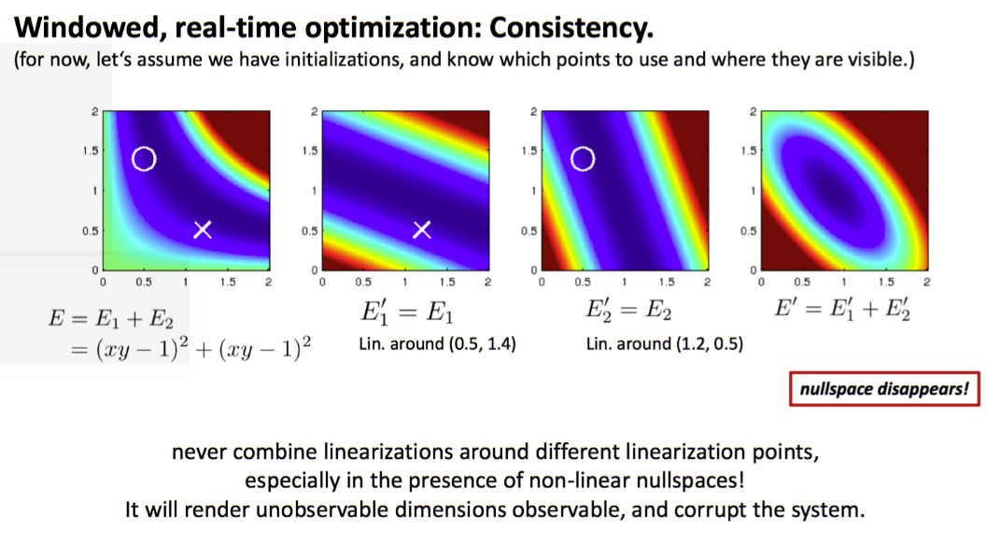

<!--
 * @Author: Liu Weilong
 * @Date: 2021-06-13 13:28:47
 * @LastEditors: Liu Weilong
 * @LastEditTime: 2021-06-13 13:39:09
 * @Description: 
-->
### 图解FEJ

横竖轴代表 xy 的数值
蓝色越深的地方代表 E_1+E_2 的值越小，
最左边的图可以知道 得到最小的范围 会是一个类似直线的范围(有nullspace)

两个不同线性化点的结果，融合在一起之后，会变成最右边的情况，之前类似于直线的解集变成了椭圆(nullspace 消失了)