<!--
 * @Author: Liu Weilong
 * @Date: 2021-04-21 09:02:07
 * @LastEditors: Liu Weilong 
 * @LastEditTime: 2021-05-13 13:35:58
 * @FilePath: /Codes/30. supplement_material/observability_analysis/basic_observability.md
 * @Description: 
-->
### 目的
说明白
1. 可观性的定义 见补充
2. 可观性的意义 见补充
3. 维护零空间的目的 见 5.

### 梗概
主要内容来自
1. Aided Inertial Navigation With Geometric Features: Observability Analysis
2. Consistency Analysis and Improvement of Vision-aided Inertial Navigation 更加详细一些
3. 一文看尽系列 https://zhuanlan.zhihu.com/p/341322063
4. Consistency of EKF-Based Visual-Inertial Odometry limingyang 大佬牛逼
5. Unobservable Directions of VINS Under Special Motions
tips： 需要找几个例子，对于这个问题进行验证

-----
状态量:
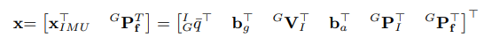
1. 转移矩阵
   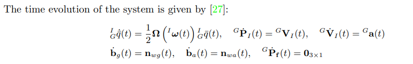
   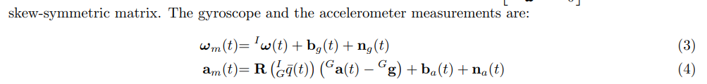
   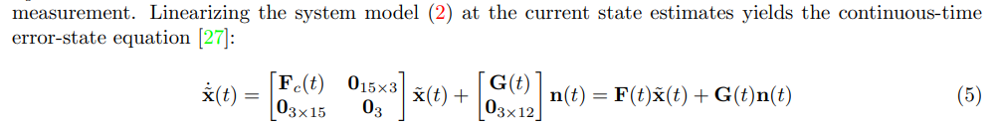
2. 观测
   
   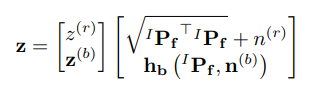

   观测线性化:
   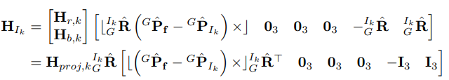
   这里存在的右半部分是因为存在一个点坐标系的转换：
   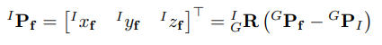
   
From 2.IV. VINS OBSERVABILITY ANALYSIS
3. 局部可观性矩阵:Local observability matrix and its
application to observability analyses
$$
    M(x^{\star})=\left[
        \begin{matrix}
            H_1 \\
            H_2\Phi_{(2,1)}\\
            H_3\Phi_{(3,1)}\\
            H_4\Phi_{(4,1)}\\
            ...\\
            H_k\Phi_{(k,1)}
        \end{matrix}
        \right]
        \\
       \Phi_{(k,1)} =  \Phi_{(k,k-1)}\Phi_{(k-1,k-2)}...\Phi_{(3,2)}\Phi_{(2,1)}
$$
$\Phi$ 为离散状态转移矩阵，$H_k$ 为k时刻的观测矩阵,这里可以提前转换好，也可以根据下列代码进行转化

4. 关于各个状态可观性的判断:
    PWCS+SVD的判断方式

5. WHY 零空间维护？
   因为从上面的结论看过来,零空间的维数直接和状态是否可观有联系，如果出现零空间减少的情况，必然会出现求解有误差的问题
   FEJ OC DSO 见 supplement_material/observability_analysis/fej.md oc.md dso.md
   其实，讨论的问题是如何让离散化，尽可能少的引入误差

-----
### 补充
1. 可观性理论补充
   理论目的:
   检验能否从观测推导得到 ，状态初始值$x_0$,因为有了初始值，就可以再根据状态转移方程，得到所有时间的状态初始值。
   这样通过一定的观测，得到所有的状态量值，所以就说系统是可观的了。
   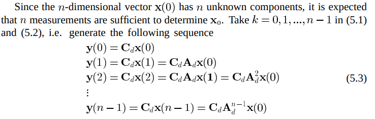
   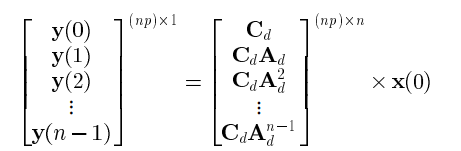
   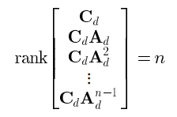
   
   只有可观性矩阵满秩，才能让$x_0$ 唯一
2. VINS on Wheel的状态分析
   Unobservable Directions of VINS Under Special Motions 
   有关于零空间方面的分析，
   对于一些特殊运动情况的可观性进行了分析。

   但是，如果想要确实进行分析，就还是需要PWCS+SVD的方法
   
 2021.5.11补充

关于可观性和优化的问题
1. 为什么在双目VINS 中不可观还要进行四个自由度的上的优化？
   答: 整体上讲，可以说是为了SLAM 建图的一致性。
   细节上讲， 因为四个自由度的不可观(位置和yaw)，所以导致camera 的位置和landmark的位置，实际上是可以在空间中到处乱跑的。
   而且是可以沿着yaw 角进行旋转的。
   那么，为什么还可以估计呢？
   因为虽然单个位置是不可以估计的，但是这次camera 和landmark 彼此之间是存在相对关系的。这就是这种相对关系，建立起了一个地图。
   
   也就是说landmark 和 各个观察帧 之间的相对位姿是确认的。
   但是这些landmark 和 各个观察帧 在world 坐标系下的位置是不确定的。

   用偏理论的方法去解释的话说，就是

   当状态是

   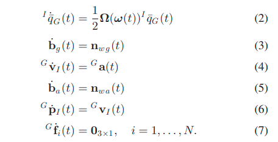

   进行可观性分析之后，发现
   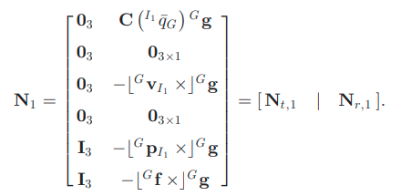

   从补充1. 就可以知道

   $$
   \left[
      \begin{matrix}
         q_G(0)\\
         b_g(0)\\
         v_I(0)\\
         b_a(0)\\
         p_I(0)\\
         f_i(0)
      \end{matrix}
      \right]
   + C_1N_{t,1} + C_2N_{r,1} = X(0)
   \\
   C_1 = \left[
      \begin{matrix}
         c_1&0&0\\
         0&c_2&0\\
         0&0&c_3
      \end{matrix}
   \right]
   \\
   c_1,c_2,c_3 \in R
   $$
   
   这些 X(0) 都符合可观性矩阵的要求。
   所以 X(0) 是在空间当中漂移的(绝对位置不可观)，是旋转的(yaw角不可观)。

   

