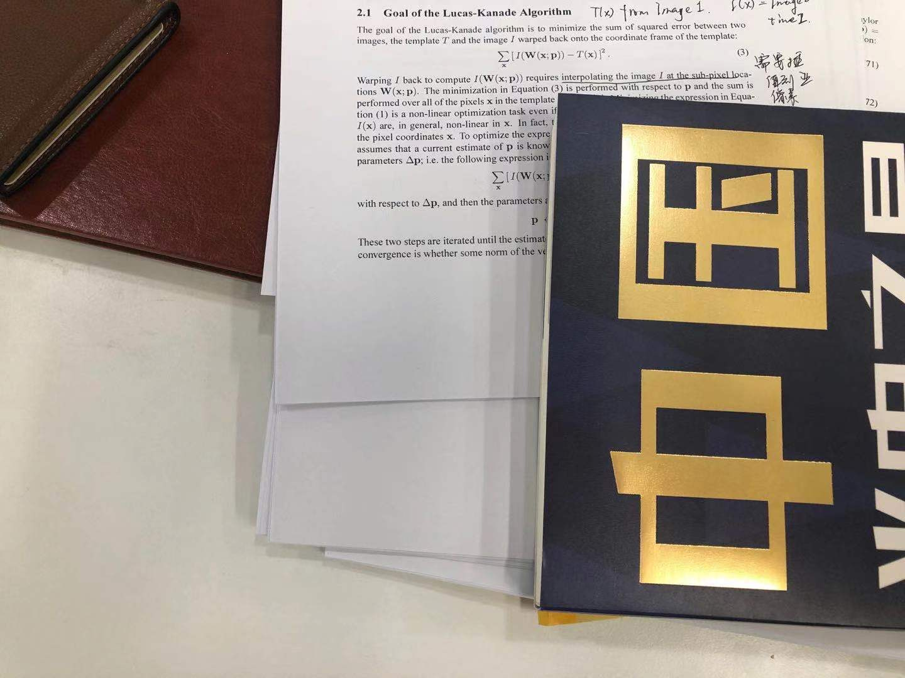

### 基础版本(Warp=Translation)
这个版本下 Compositional = additional 方法  
 
forward 版   
IMG1 提取 $cPts$    (cornerPts)  
$T$      (Template) 5×5 正方形 围绕着 cornerPts from IMG1  
构造公式
$$ 
    \begin{aligned}
    \underset{dx,dy}{\operatorname{argmin}}\underset{x,y\in{cPts}}{\sum}\underset{(t_x,t_y)\in{T}}{\sum}[&I_2(x+dx+t_x,y+dy+t_y)\\&-I_1(x+t_x,y+t_y)]
    \end{aligned}
$$
多次迭代 $dx$ ,$dy$ 
 
inverse 版  
动机： a. I_2(x,y) 不一定有梯度，因为可能不是角点   b. inverse 只需要计算一次 Jacobian 
构造公式
$$
    \begin{aligned}
    \underset{dx,dy}{\operatorname{argmin}}\underset{x,y\in{cPts}}{\sum}\underset{(t_x,t_y)\in{T}}{\sum}[&I_2(x+t_x,y+t_y)\\&-I_1(x+t_x-d_x,y+ty-d_y)]
    \end{aligned}
$$
不同的是，是具体实现，参考slambook2 
得到 更新的 $d_x$ 和  $d_y$ 之后 
会将$d_x$ 和 $d_y$ 更新到 Img2 的 x y中  
Img1 中的x y 不变，相当于把 Img2 和Img1 之间的距离拉近 

例子： 

1|||||||
---|---|---|---|---|---|---|---
0|1|0|0|0|0|0|0
0|1|0|1|1|1|0|0
0|1|0|1|1|1|0|0
0|1|0|1|1|1|0|0
0|1|0|1|1|1|0|0
0|1|0|1|1|1|0|0
0|1|0|0|0|0|0|0

2|||||||
---|---|---|---|---|---|---|---
0|1|0|1|1|1|0|0
0|1|0|1|1|1|0|0
0|1|0|1|1|1|0|0
0|1|0|1|1|1|0|0
0|1|0|1|1|1|0|0
0|1|0|0|0|0|0|0
0|0|0|0|0|0|0|0

在Warp = Translation 的情况下，inverse 还是比较好解释的。 
1图 dx= -1 dy =0 向上时得到和2图最匹配的图像 
也就是相当于 2图 x+dx 向下移动1个pixel 和1图最佳匹配 

### 稍微复杂一些的情况(Warp = Affine)
动机： 
并不是所有时候，光流的跟踪都是平移Warp就可以解决的。 
例子: 

和3 的匹配如果还是 Translation 明显是不能很好的匹配 

这个时候正式引入Warp的表达方式 

从这里开始Compositional 就不一定等于Additional了 

==========   中间插入内容 ================= 

验证Compositional 和 additive 一阶展开等价 
Compositional 版本 
$$
    \begin{aligned}
    &I(W(W(x;\Delta{p};p)))
    \\ =&I(W((W;0);p)+ \cfrac{\partial{I}}{\partial{W(W;p)}}\cfrac{\partial{W(x;p)}}{\partial{x}}\cfrac{\partial{W(x;0)}}{\partial{p}}\Delta{p}
    \\ = &I(W(x;p))+ \cfrac{\partial{I}}{\partial{W(x;p)}}\cfrac{\partial{W(x;p)}}{\partial{x}}\cfrac{\partial{W(x;0)}}{\partial{p}}\Delta{p}

    \end{aligned}
$$

Additive 版本 
$$
    \begin{aligned}
    I(W(x;p+\Delta{p})) = I(W(x;p))+\cfrac{\partial{I}}{\partial{W(x;p)}}\cfrac{\partial{W}}{\partial{p}}\Delta{p}
    \end{aligned}
$$

之后的证明基本看不懂，结论是如果 Warp 可逆就是
Compositional 和Additive 一阶等价

==========   插入结束    ================= 

$$
I(W(x;p))
$$
这里会对x进行一次Affine 变化，当然还会有更加复杂的Warp 
这里其实就可以很自然地想到SLAM里面的直接法了。 

forward additional 版本 
$$ 
    \begin{aligned}
    \underset{p}{\operatorname{argmin}}\underset{x,y\in{cPts}}{\sum}\underset{(t_x,t_y)\in{T}}{\sum}[&I_2(W(x+t_x,y+t_y;p))\\&-I_1(x+t_x,y+t_y;0)]
    \end{aligned}
$$

inverse compositional 版本 

 自己没有看明白,之后懂了再补充 