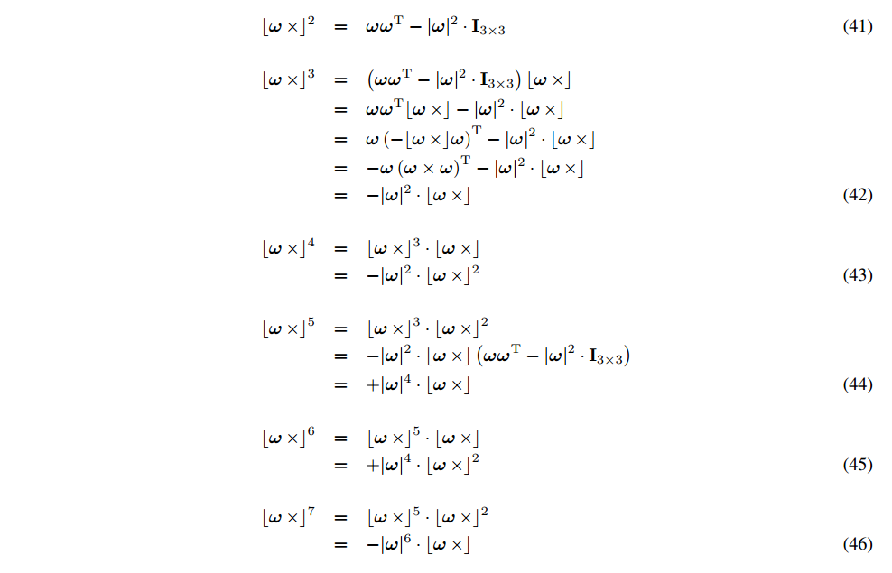

<!--
 * @Author: Liu Weilong
 * @Date: 2021-02-08 17:37:13
 * @LastEditors: Liu Weilong 
 * @LastEditTime: 2021-03-01 11:32:32
 * @Description: 
-->
### Element of Quaternion 来自 indirect KF 目前还不知道是JPL 还是 Hamintion 的表示
1. 基本的定义 
    a.1. Quaternion 定义 
$$
    q = q_4 + q_1i+q_2j+q_3k
\\
    q= \left[
        \begin{matrix}
            \pmb{q}\\
            q_4
        \end{matrix}
        \right]
        =\left[
        \begin{matrix}
            \pmb{k}\sin(\theta/2)\\
            \cos(\theta/2)
        \end{matrix}
        \right]
$$
a.2. Quaternion 性质 
 $$
    |q| = \sqrt{q^Tq} = \sqrt{|q|^2+q_4^2} =1
 $$
2. Quaternion 乘法 (类比SO3 的乘法)\

$$
\begin{aligned}
    q\otimes p &= (q_4 + q_1i+q_2j+q_3k)(p_4 + p_1i+p_2j+p_3k)
    \\
    &= L(q)p
    \\
    & = (\Omega_l(\pmb{q})+q_4I)p
    \\
    &=
    \left[
        \begin{matrix}
            q_4I-\pmb{q}×&& \pmb{q}\\
            -\pmb{q}^T&& q_4
        \end{matrix}
    \right]   
     \left[
        \begin{matrix}
           \pmb{p}\\
             p_4
        \end{matrix}
    \right]
    \\
    &= R(p)q
    \\
    &=(\Omega_r(\pmb{q})+q_4I)p
    \\
    &=
    \left[
        \begin{matrix}
            q_4I+\pmb{q}×&& \pmb{q}\\
            -\pmb{q}^T&& q_4
        \end{matrix}
    \right]   
     \left[
        \begin{matrix}
           \pmb{p}\\
             p_4
        \end{matrix}
    \right]
\end{aligned}
$$

2.a. L和R 的性质 
$$
    L^T(q) = L(q^{-1})
    \\
    R^T(q) = R(q^{-1})
$$

3. 反对称矩阵的性质s 
3.a. 反结合性 
$$
    \omega× = -[\omega×]^T
    \\
    a×b = -b×a
    \\
    a^Tb× = -b^Ta×
$$
3.b. 加法的分配律 
$$
    a× + b× = (a+b)×
$$
3.c. Scalar 的乘法 
$$
    c(\omega×) = (c\omega)×
$$
3.d. Lagrange's 公式 
$$
    [a×][b×] =(a×b)×= ba^T - a^TbI_{3×3}
    \\
    \rightarrow a×(b×c) = b(a^Tc)-c(a^Tb)
    \\
    \rightarrow [a×][b×] + ab^T = [b×][a×] + ba^T
$$
3.e. Jacobi Identity 
$$
    [a×][b×]c + [b×][c×]a +[c×][b×]a = 0
$$
3.f. Rotation 
$$
    (Ca)× = C[a×]C^T
    \\
    C(a×b) = (Ca)×(Cb)
$$
3.g. 四元数中的叉乘 
$$
    \bar{a} = \left[
        \begin{matrix}
            \pmb{a}\\
            0
        \end{matrix}
        \right] ,\bar{b} = \left[
        \begin{matrix}
            \pmb{b}\\
            0
        \end{matrix}
        \right],
        \bar{c} = \left[
        \begin{matrix}
            \pmb{a}×\pmb{b}\\
            0
        \end{matrix}
        \right]
$$

$$
\begin{aligned}
    \bar{c} &= \frac{1}{2}(\bar{b}\otimes \bar{a} + \bar{a}\otimes \bar{b}^{-1})
    \\
    &=\frac{1}{2}(L(\bar{b})+R^T(\bar{b}))\bar{a}
    \\
    &=\frac{1}{2}(\left[
        \begin{matrix}
            -b×-b×& b-b\\
            -b^T+b^T&0
        \end{matrix}
        \right])\bar{a}
\end{aligned}
$$

3.h. Powers of $[\omega×]$

4. 四元数和旋转矩阵的关系
