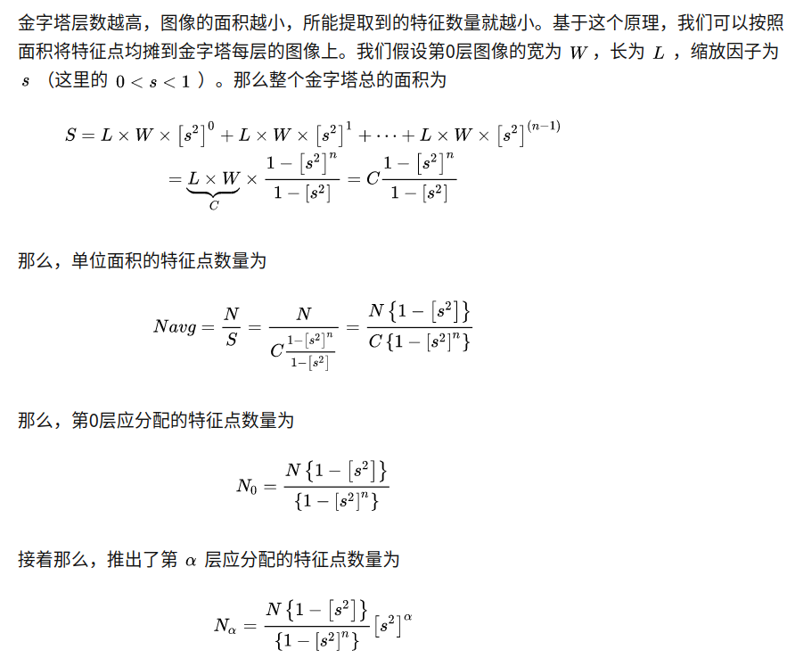
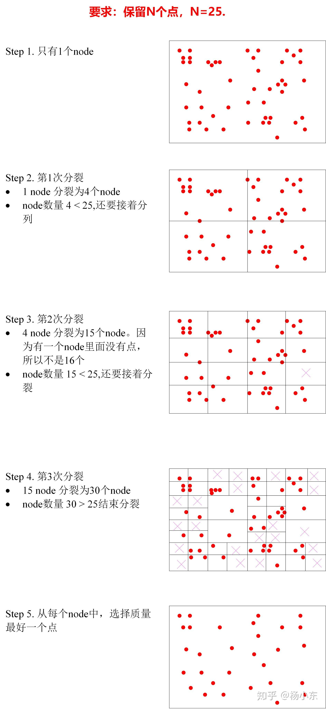
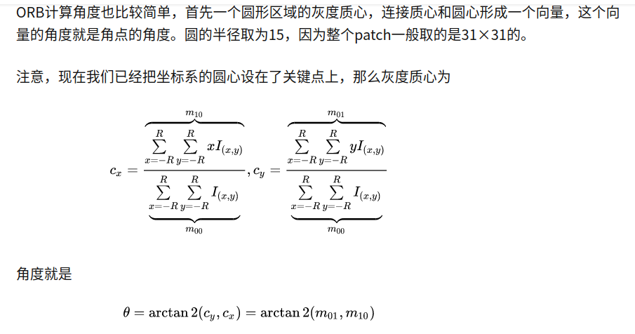

<!--
 * @Author: Liu Weilong
 * @Date: 2021-01-28 08:54:24
 * @LastEditors: Liu Weilong 
 * @LastEditTime: 2021-04-26 17:57:08
 * @FilePath: /Codes/31. orb_slam_related/origin/doc/ORB_extract_and_match.md
 * @Description: 
-->
### ORB 提取
内容来自 ORB_extractor.h ORB_extractor.cc
主函数 operator()
属性 scaleFactor、nlevels、nfeatures、FastValue

1. 造多层金字塔(留白边)
2. FAST提取 
3. 算描述子

-------------

1. FAST提取 
a. 确定各层FAST数量：各层数量,按照面积进行分配。各层面积一致。 mnFeaturesPerLevel

b. 均匀提取：对每一个金字塔层，每一个格子进行FAST提取。如果提不到就降FAST阈值再提 
   对每一个金字塔层，做四叉树均匀分布FAST。 

c. 算方向: 对每一个金字塔层，计算方向 
对一个圆形的patch内所有的像素进行计算。ORB的实现方式没有简单按照顺序进行历遍但是结果是一致的 

3. 计算描述子 
31×31 的圆patch 进行计算。生成256bit的uchar 
计算前，需要7×7 高斯滤波一下，克服ORB的噪声敏感。 
256个点对，在计算的时候使用了FAST计算出来的方向，相当于在计算描述子的时候，就已经把特征旋转到了0的位置上。 

------
reference:
https://zhuanlan.zhihu.com/p/61738607

### ORB 匹配
内容来自 ORB_matcher.h ORB_matcher.cc 
内容分成几类： 
1. SearchByProjection
2. SearchByBoW
3. SearchForTriangulation
4. Fuse
5. SearchBySim3

-----
基本是应用类

-----
1.a. SearchByProjection Used in TrackWithMotionModel 
a.1. 进行帧间Project 投影 
a.2. 根据前后移动 判断 Forward Backward NotSure 三种情况，按照情况判断进行SearchInArea,寻找匹配的candidate 
a.3. DescriptorDist 计算 
a.4. DescriptorAngleConsistency 判断 
     计算两帧之前所有对应点的FastAngle差别，最后只取，histogram中最大段区间中的匹配点 

1.b. SearchByProjection Used in TrackLocalMap 
b.1. 根据SearchLocalPoints 的时候，得到的预测Level，进行SearchInArea
b.2. DescriptorDist 计算 
b.3. 需要进行 sameLevel 和 bestDist1>ratio*bestDist2 的判断

1.c. SearchByProjection Used in LoopClosure 
c.1. 在内部进行预测金字塔Level
c.2. SearchInArea
c.3. DescriptorDist 计算 
c.4. DescriptorAngleConsistency 判断 
     计算两帧之前所有对应点的FastAngle差别，最后只取，histogram中最大段区间中的匹配点 

2.a. SearchByBoW Used in TrackReferenceKeyFrame and LoopClosure 
a.1. Brute Force 进行DescriptorDist 计算  
a.2. 进行bestDist1 < ratio*bestDist2 的判断 
a.3. DescriptorAngleConsistency 判断 
     计算两帧之前所有对应点的FastAngle差别，最后只取，histogram中最大段区间中的匹配点 

3.a. SearchForTriangulation Used in LocalMapping 
a.1. Brute Force 进行DescriptorDist 计算  
a.2. CheckDistEpipolarLine(kp1,kp2,F12,pKF2) 
a.3. DescriptorAngleConsistency 判断 
     计算两帧之前所有对应点的FastAngle差别，最后只取，histogram中最大段区间中的匹配点 

4.a. Fuse Used in SearchInNeighbors 
a.1. 在CurrentFrame 当中找到了匹配点  
a.2. 还是老几样，预测层数，寻找candidate，对Candidates寻找比较好的匹配
a.3. 根据原Frame MapPoint 的观测次数多少，判断是否进行替换
a.4. 替换也并不是完全覆盖，而是整合

5.a. SearchBySim3 Used in ComputeSim3
a.1. 