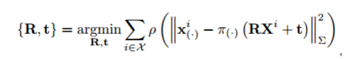
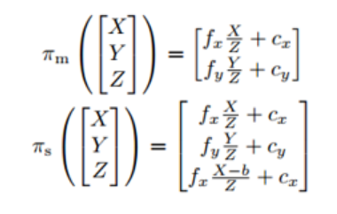

<!--
 * @Author: Liu Weilong
 * @Date: 2021-01-29 10:38:09
 * @LastEditors: Liu Weilong 
 * @LastEditTime: 2021-02-22 12:21:10
 * @FilePath: /3rd-test-learning/31. orb_slam_related/origin/doc/ORB_optimizer.md
 * @Description: 
-->
### ORB Optimizer 是几何上的优化 而不是图像灰度上的优化
PoseOptimization、LocalBundleAdjustment 
老生常谈的重投影误差 
不进一步展开了 

但是，优化项的选取，可以一起再看看
1. LocalBundleAdjustment
2. PoseOptimization
3. OptimizeEssentialGraph
4. OptimizeSim3

-----
Sim3 群的优化见Supplement_material

-----
1.a. LocalBundleAdjustment \
a.1. CurrentFrame 得到 共视帧 -> lLocalKeyFrames\
a.2. 从lLocalKeyFrames 得到地图点集 -> lLocalMapPoints\
a.3. 从地图点集的观测得到的其他关键帧，如果其mnBALocalForKF 并不是当前帧，加入固定关键帧集 -> lFixedCameras\
a.4. 加顶点lFixedCameras 的关键帧需要 fixed\ 
a.5. 加 Mono Stereo 边\
 g2o 的边缘在这里的作用存疑

2.a. PoseOptimzation PnP 优化解法

3.a. OptimizeEssentialGraph