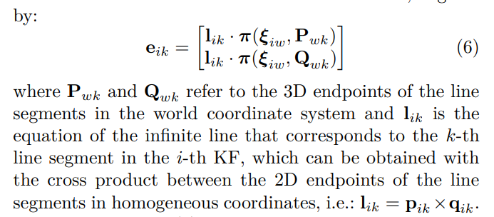

<!--
 * @Author: Liu Weilong
 * @Date: 2021-03-09 15:45:27
 * @LastEditors: Liu Weilong 
 * @LastEditTime: 2021-03-15 10:14:20
 * @FilePath: /3rd-test-learning/31. orb_slam_related/pl-slam/theory.md
 * @Description: 
-->
### 主要内容
1. line_project
2. line_optimization
3. match

======

1. line_project
   使用两点投影进行线的投影
2. line_optimization
   
   2.a. PoseOptimzation:思路就是对端点(start\end)进行几何误差上的构建
   之前的想法是错的，以下的构建才是对的
   
   观测是 图像中端点算出来的垂直向量， 优化三维空间中线段的两端点

   2.b. LBA 对于线的处理和 PoseOptimzation 相同

3. match matchNNR 一个 KNN 最近邻查找