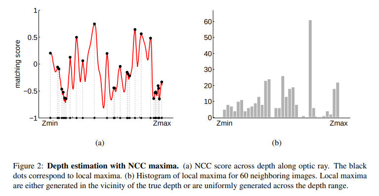
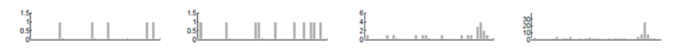
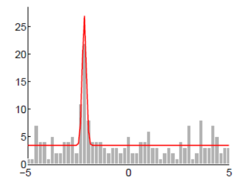

<!--
 * @Author: Liu Weilong
 * @Date: 2021-02-25 13:30:00
 * @LastEditors: Liu Weilong
 * @LastEditTime: 2021-03-13 18:48:35
 * @FilePath: /3rd-test-learning/30. supplement_material/depth_filter/supplementary_material_depth_filter.md
 * @Description: 
-->
### 参考
https://www.cnblogs.com/ilekoaiq/p/8228324.html

遗留问题：
存疑的问题2

### 问题理解
输入：多次对于同一个KeyPoint 的深度观测 
输出：观测到的点是inliner的概率(这里的inlier 的意思是不是飞点之类的错误点)？真实深度是多少？() 

### 直觉
1. 直觉理解问题：一个在Camera 1 中的点p，往Camera j 当中进行投影，然后沿着极线进行块匹配搜索(NCC)，点p的深度(depth in Camera 1)从近到远，离散成50份，然后在极线上进行块匹配，统计得分。 
下图是在单张图像的搜索，另外一个是在Camera 1 附近60帧图像搜索的结果。 

可以发现还是会有有一个值特别突出。 
之后，为了计算的简便性我们只统计NCC response 最大的Z。 

2. 采样建模出概率分布：
这里相当于使用了采样的方法来寻找概率分布 
最后建模出来的内容就是： 

$$
\begin{aligned}
    &p(x_i|\hat{Z},\pi) = \pi N(x_i|\mu,\sigma^2) + (1-\pi)U(x_i|Z_{min},Z_{max})
    \\
    & p(\hat{Z}) \propto U
    \\
    & p(\pi) \propto U
\end{aligned}
$$

3. 目标问题：
$$
    \underset{\hat{Z},\pi}{\operatorname{argmax}} \pmb[\prod p(\hat{Z},\pi|x_i)\pmb]
    \\
\begin{aligned}
    &\prod p(\hat{Z},\pi|x_i)
    \\
    = & p(\hat{Z},\pi|X)
    \\
    \propto &p(X|\hat{Z},\pi)p(\hat{Z})p(\pi)
    \\
    \propto &p(X|\hat{Z},\pi)
    \\
    = &\prod p(x_i|\hat{Z},\pi)
\end{aligned}
$$
4. 例遍方法解决目标问题：将$Z_min$到$Z_max$分成50份，将$\pi$从0到1分成100份，进行例遍，求解找到让分布最大的值即可。实际上就是一个配置 $\hat{Z},\pi$ 让建模的分布和采样的部分相符合的过程。

### 迭代求解的方法
1. 直觉方法的问题：大量的计算，在实时计算上难以实施。所以需要寻找更好的方法->比如LM之类的方法？
2. 对于隐变量y的引入:重新看概率分布。
   $$
   \begin{aligned}
       &\prod p(x_i|\hat{Z},\pi)
       \\
       =&\prod \pmb[\pi N(x_i|\mu,\sigma^2) + (1-\pi)U(x_i|Z_{min},Z_{max})\pmb]
   \end{aligned}
   $$
   能够看出来，一旦展开求解，因为$\pi$ 并不是一个二值分布，而是一个均匀分布。而且公式不是一个纯高斯分布的乘法，使用优化的话并不能找到很好的方法。 
   在这种情况下，如果我们可以知道这次观测是一个好的观测，还是一个不好的观测就可以简化问题: 
    $$
    \begin{aligned}
       & p(x_i|\hat{Z},\pi)
       \\
       =& \sum^{y_i=[0,1]}p(x_i,y_i|\hat{Z},\pi)
       \\
       =& \sum^{y_i=[0,1]}p(x_i|y_i,\hat{Z},\pi)p(y_i|\pi)
       \\
       =& p(y_i=0|\pi)p(x_i|\hat{Z},\pi,yi=0)+
       p(y_i=1|\pi)p(x_i|\hat{Z},\pi,yi=1)
   \end{aligned}
   \\
   p(y_i|\pi) = \pi^{y_i}(1-\pi)^{1-y_i}
   \\
    p(x_i|\hat{Z},y_i,\pi) = N(x_i|\hat{d},\sigma^2)^{y_i}U(x_i)^{1-y_i}
   $$
   2021.2.26添加： 
   感觉这里实际上是实现了一个让分布从加法变成乘法的过程,并没有，这一句的理解是错的 
   y和$\pi$的关系还可以进行思考一下
3. 后验分布替换：引入y之后，再看$\prod p(\hat{Z},\pi|x_i)$
   $$
    \begin{aligned}
        &\prod p(\hat{Z},\pi|x_i)
        \\
        \propto &\prod p(x_i|\hat{Z},\pi)
        \\
        = & \prod \sum^{y_i=[0,1]}p(x_i|y_i,\hat{Z},\pi)p(y_i|\pi)

    \end{aligned}
    $$
    如果我们可以提前知道 这个点是不是一个好的测量，也就是y的话,会发现公式可以进一步简化
    $$
    \begin{aligned}
    &\prod p(\hat{Z},\pi|x_i)\rightarrow \prod p(\hat{Z},\pi|x_i,y_i)
    \\
    \propto & p(x_i|y_i,\hat{Z},\pi)p(y_i|\pi)
    \\
        = & \prod \pi^{y_i}(1-\pi)^{1-y_i}N(x_i|\hat{d},\sigma^2)^{y_i}U(x_i)^{1-y_i}
        \\
        = & \pi^{\sum y_i}(1-\pi)^{n-\sum y_i}U^{n-\sum y_i}N^{\sum y_i}
        \\
        \propto &\cfrac{\Gamma(n+2)}{\Gamma(\sum y_i+1)\Gamma(n-\sum y_i+1)}\pi^{\sum y_i}(1-\pi)^{n-\sum y_i}N^{\sum y_i}
        \\
        \downarrow &\sum y_i =s
        \\
        \propto & Beta(\pi|s+1,n-s+1) × Gaussian(\hat{Z}|\mu,\sigma^2)
    \end{aligned}
   $$
    最后，把$\prod p(\hat{Z},\pi|x_i,y_i)$ 转换成了一个Beta×Gaussian 的分布
4. 回顾：
   现在，先让我们看看，我们现在有了个什么样的结论：
   $$
   \begin{aligned}
           &\prod p(\hat{Z},\pi|x_i,y_i)
           \\
            \propto &\prod p(x_i|y_i,\hat{Z},\pi)p(y_i|\pi)
           \\
           \propto  &Beta(\pi|s+1,n-s+1) × Gaussian(\hat{Z}|\mu,\sigma^2)
   \end{aligned}

   $$
   也就是说，不管是 x+1次 还是x+n次，后验分布都是可以写成Beta×Gaussian 的形式的 
5. 迭代过程：从$p(\hat{Z},\pi|X_{n},a,b,\mu,\sigma,Y_n)$ 到 $p(\hat{Z},\pi|X_{n+1},a',b',\mu',\sigma',Y_{n+1})$
   $$
   \begin{aligned}
    &p(\hat{Z},\pi|X_{n+1},Y_{n+1})
    \\ 
    \propto &p(X_{n+1},Y_{n+1}|\hat{Z},\pi)
    \\
    \propto &p(x_i,y_i|\hat{Z},\pi)Beta(\pi|s+1,n-s+1) × Gaussian(\hat{Z}|\mu,\sigma^2)
    \\
    \downarrow & s+1=a,n-s+1=b
    \\
    \propto &p(x_i|\hat{Z},\pi,y_i)p(y_i|\pi)Beta(\pi|a,b) × Gaussian(\hat{Z}|\mu,\sigma^2)
   \\
   = &\pi^{y_i}(1-\pi)^{1-y_i}N(x_i|\hat{d},\sigma^2)^{y_i}U(x_i)^{1-y_i}Beta(\pi|a,b) × Gaussian(\hat{Z}|\mu,\sigma^2)
   \\
   = &Beta(\pi|a',b') × Gaussian(\hat{Z}|\mu',\sigma'^2)
   \end{aligned}
   $$
   

### 进一步拓展(好吧，我承认前面的东西好象是没有用了)
如果y我们不知道是不是外点怎么办？ 如果无法严格的判断一次
量是不是一个好的测量，那么我们就无法得到完美的Beta×Gaussian分布。只能近似。
步骤是：
1. 默认$p(\hat{Z},\pi|X_n)$符合Beta×Gaussian 分布
2. 进行迭代计算
   $$
   \begin{aligned}
    &p(\hat{Z},\pi|X_{n+1})
    \\
    =&p(x_{n+1}|\hat{Z},\pi)p(X_n|\hat{Z},\pi)
    \\
    =& \pmb[\sum^{y_i=[0,1]}p(x_i|y_i,\hat{Z},\pi)p(y_i|\pi)\pmb]Beta×Gaussian
    \\
    = & Beta_1×Gaussian_1 + Beta_2×Gaussian_2
   \end{aligned}
   $$
3. 通过计算 $Beta_1×Gaussian_1 + Beta_2×Gaussian_2$ 和$Beta_{target}×Gaussian_{target}$的一二阶矩，用$Beta_{target}×Gaussian_{target}$来近似$Beta_1×Gaussian_1 + Beta_2×Gaussian_2$

具体计算见depth_filter.pdf

### 存疑的问题 
1. 为什么可以通过一二阶矩进行近似？ 单峰似乎是可以的，但是多峰的情况呢？ 
答： 
   1.Beta×Gaussian是一个单峰二维分布。上面的近似满足条件$Beta_1×Gaussian_1 + Beta_2×Gaussian_2$ 和$Beta_{target}×Gaussian_{target}$的峰相差不远，可以近似出一个单峰分布。 
   2.一二阶矩的拟合构成的方程已经足够构造拟合Beta×Gaussian 
2. 为什么可以默认$p(\hat{Z},\pi|X_n)$符合Beta×Gaussian 分布？ 
2021.3.1添加 
突然发现，只要问题满足了1. 单峰拟合条件，就可以假设$p(\hat{Z},\pi|X_n)$符合Beta×Gaussian。也就在启发性的方面说明了，为什么可以这样进行拟合 
http://george-vogiatzis.org/publications/ivcj2010supp.pdf 推断的部分我没有看懂，存在知识点上的缺少，需要statistic inference chapter10.1的内容

### 2021.3.13添加
昨天，想到对于Depth Filter 的理解，差点就忘掉记下来了。
先不谈论，关于极线约束的问题。
实际上，Depth Filter是从一个类似概率机器人chapter6.1的传感器建模的过程。

不过概率机器人的Chapter 6.1 是在判断一个传感器观测概率分布是那几个已知的分布按照什么比例组成的。
Depth Filter 也是在寻找两种概率分布的最佳比例。
但是这又可以同时抽象成EM 算法。
但是Depth Filter多了一步使用这个比例来进行这个特征是不是靠谱的判断。(其实这么说，也不是很靠谱，毕竟实际上svo里是不是好点的判断是靠Beta ×Gaussian里面Gaussian 分布的方差来进行判断的)

