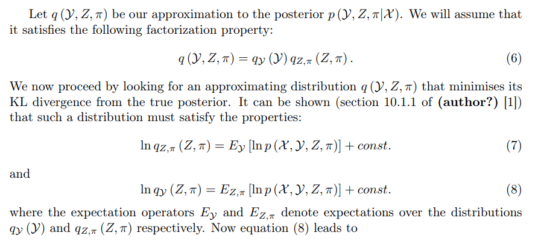
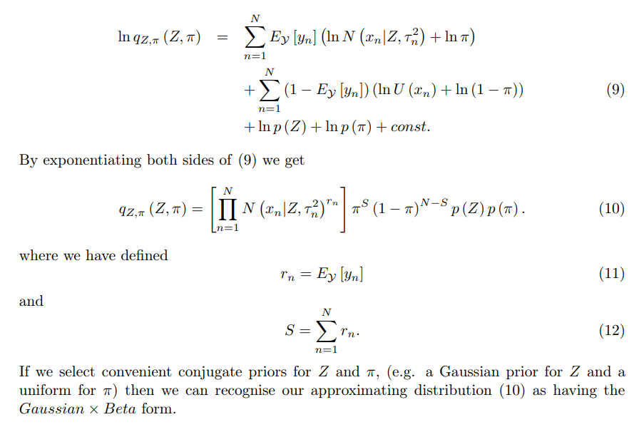
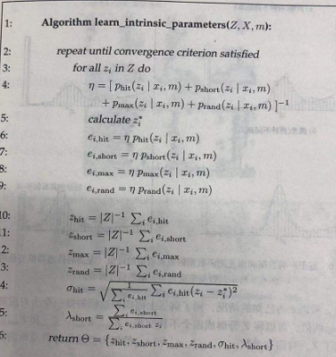

<!--
 * @Author: Liu Weilong
 * @Date: 2021-03-03 11:18:33
 * @LastEditors: Liu Weilong
 * @LastEditTime: 2021-05-11 22:42:41
 * @FilePath: /3rd-test-learning/34. svo/depth_filter/串讲.md
 * @Description: 
-->
### 2021.3.3 串讲
1. 需要的分布
   a.1. Beta分布
   $$
    \operatorname{Beta(a,b)} = p(\theta|a,b) = \cfrac{\theta^{a-1}(1-\theta)^{b-1}}{B(a,b)}\propto \theta^{a-1}(1-\theta)^{b-1}
   $$
2. 问题引出: 
   对于一个状态量，反复观测是不是能让我们最后得到的状态量，慢慢收敛，得到一个靠谱的"猜测值"？
   i.e. 
   $x$~$N(\mu,\sigma)$
   现在我们对x有了两个观测 $x_1$~$N_1(1,3)$ ,$x_2$~$N_2(1,4)$
   因为两个高斯分布相乘还是高斯
   可以得到，$x_{new}$~$N_{new}(1.0+c,\cfrac{12}{7})$
   方差收敛了(这里假设$x_1$和$x_2$是好的观测)
   那么对于图像是不是也有这样的性质呢？
   一个在Camera 1 中的点p，往Camera j 当中进行投影，然后沿着极线进行块匹配搜索(NCC)，点p的深度(depth in Camera 1)从近到远，离散成50份，然后在极线上进行块匹配，统计得分。 
    下图是在单张图像的搜索，另外一个是在Camera 1 附近60帧图像搜索的结果。 
    
    可以发现还是会有有一个值特别突出。 
    之后，为了计算的简便性我们只统计NCC response 最大的Z。 
    
    
    最后发现也是有这样的性质的，但是形成的分布却不一定是高斯了。

3. 根据结果进行建模
   $$
   \begin{aligned}
    x &= p(x|\hat{Z},\pi)
    \\ & = \pi N(\mu,\sigma^2) + (1-\pi)U(Z_{min},Z_{max})
   \end{aligned}
   $$
   这里x的观测就是 Gaussian和 Uniform 分布的混合分布了
   有了这个模型之后就是，有了多个观测之后如何进行衡量的问题了
   $$
   \begin{aligned}
    X &= [x_1,x_2,x_3,x_4,...]
   \\
    p(\hat{Z},\pi|X)&\propto p(X|\hat{Z},\pi)p(\hat{Z})p(\pi)
   \end{aligned}
   $$
   这里我们假设$\hat{Z}$和$\pi$均匀分布
   会发现如果这样的话，整个$p(X|\hat{Z},\pi)$ 会是一个非常大的公式。

4. 关于变分推断： 
   a.1. 来自Pattern Recogination Chapter 10.1的结论: 
   $p(\hat{Z},\pi|X_n)$符合Beta×Gaussian 分布,还没看懂 
   
   
   a.2. 来自概率机器人的求解方式： 
   来自Chapter6.1 传感器模型 
   直接通过EM算法求解最大似然，然后$\pi,\mu,\sigma$ 就可以全部求得。
   

   2021.3.20 补充
   今天突然想明白了， Chapter6.1 进行得EM算法是MLE 的，而SVO的深度滤波是MAP的

   2021.5.11 补充
   今天突然想明白了， 这里使用变分推断的原因，应该是因为EM算法无法进行incremental 类型的迭代更新，所以需要近似成有共轭后验的概率分布，进行incremental 类型的迭代更新

   

5. 迭代更新: 
    $$
   \begin{aligned}
    &p(\hat{Z},\pi|X_{n+1})
    \\
    =&p(x_{n+1}|\hat{Z},\pi)p(X_n|\hat{Z},\pi)
    \\
    \propto & \pmb[\sum^{y_i=[0,1]}p(x_i|y_i,\hat{Z},\pi)p(y_i|\pi)\pmb]Beta(a,b)N(\sum,\sigma^2)
    \\
    &\downarrow + p(x_i|y_i,\hat{Z},\pi) = N(x_i|\hat{d},\sigma^2)^{y_i}U(x_i)^{1-y_i}
    \\
    &\downarrow + p(y_i|\pi) = \pi^{y_i}(1-\pi)^{1-y_i} 
    \\
    = & Beta_1×Gaussian_1 + Beta_2×Gaussian_2
   \end{aligned}
   $$
   因为Beta×Gaussian 是一个单峰的，并且Beta_1×Gaussian_1和Beta_2×Gaussian_2，峰相距不远，所以可以使用另外一个Beta×Baussian 来进行近似。
   一共有四个参数需要进行估计 $\mu,\sigma,a,b$ 前两个参数来自高斯分布，后两个来自Beta分布。
   这里用一二阶矩进行近似，可以最后得到四个参数。

