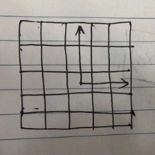
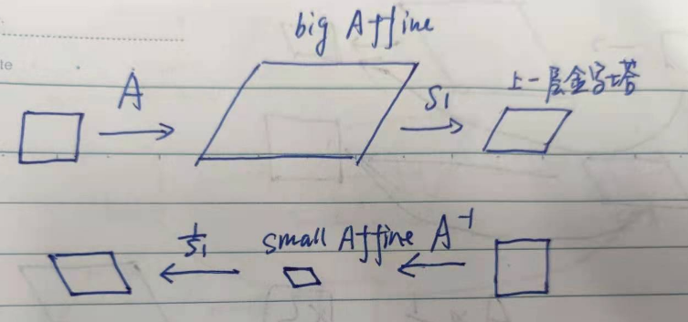

<!--
 * @Author: Liu Weilong
 * @Date: 2021-01-04 09:16:13
 * @LastEditors: Liu Weilong
 * @LastEditTime: 2021-07-06 16:21:43
 * @FilePath: /Codes/31. orb_slam_related/YGZ/doc/Theory.md
 * @Description: 
-->

### ===== 2021.1.12 添加 =====
经过学习光流之后，发现这里实际上是 Inverse Compositional 的直接法 
所以才会有各种各样提前算好的Jacobian 
具体公式如下： 
$$
    \underset{p}{argmin}\sum[I(W(x;p))-T(W(x;\Delta{p}))]^{2}
    \\
    W(x;p) =\exp(p)x
$$
进行更更新的时候
$$
    \begin{aligned}
    W(x;p)&\leftarrow{W(x;p)\circ{W(x;\Delta{p})^{-1}}}  
    \\
    & = W(W(x;\Delta{p})^{-1};p)  
    \\   
    &=\exp(p)\exp(-\Delta{p})x
    \\
    &=\exp(p_{new})x
    \end{aligned}
$$

Warp 要求是半群 
这个Compositional真的是神奇，也不知道是哪里的概念\

### SparseImageAlign 原理二次挖掘
这个是用在帧间匹配，LastFrame 和 CurFrame。\
LastFrame 带有MapPoint CurFrame 只有一张图\

$$
    \underset{p}{argmin}\sum[I(W(x;p))-T(W(x;\Delta{p}))]^{2}
    \\
    W(x;p) =\pi{(\exp(p)x)}
$$
1. 计算 Template 的雅克比，猜测这里没有使用Affine的原因是帧件匹配变化较小，所以没有必要
$$
    T(x) = \left[
        \begin{matrix}
        u_{ref}+offset_x\\
        v_{ref}+offset_y
        \end{matrix}
        \right]\\
    offset_x,offset_y \in[-GridSize,+GridSize]
$$
$$
    \cfrac{\partial{T}}{\partial{\Delta{p}}}=\cfrac{\partial{T}}{\partial{W}}\cfrac{\partial{W}}{\partial{\Delta{p}}} = R^{1×2}R^{2×6}
$$
2. 计算 Residual,这里应该是同样的小运动假设\
   把Ref 的MapPoint 投影到Cur图像上\
   所以直接3×3 顺序对应算Residual\
3. solve 和一般优化方法一致  H Jres
4. 更新
   $$
    \begin{aligned}
    W(x;p)&\leftarrow{W(x;p)\circ{W(x;\Delta{p})^{-1}}}  
    \\
    & = W(W(x;\Delta{p})^{-1};p)  
    \\   
    &=\exp(p)\exp(-\Delta{p})x
    \\
    &=\exp(p_{new})x
    \end{aligned}
$$

2021.2.23 更新 
在阅读论文 光流20年的时候大概知道了，
真正的公式推导应该是
$$
    \underset{T}{\sum} I(W(W(x;\Delta{p});p))-T(x)
\\
\downarrow y=W(x;\Delta p)
\\
\underset{W(T;\Delta p)}{\sum} I(W(y;p)) - T(W^{-1}(y;\Delta p))
\\
\downarrow \Delta p \rightarrow 0, W(x;\Delta p) = x
\\
\underset{T}{\sum} I(W(y;p)) - T(W^{-1}(y;\Delta p)) 
$$
至于为什么差了一个符号，还可以在直接法当中使用？
因为存在
$$
    W^{-1}(x;\Delta p) = W(x;-\Delta p)
$$
这个值$\Delta p$可以在更新的时候换一个正负号就可以补上。 
所以可以写成如下的形式

$$
    \underset{p}{argmin}\sum[I(W(x;p))-T(W(x;\Delta{p}))]^{2}
    \\
    W(x;p) =\pi{(\exp(p)x)}
$$

### Align2D 原理挖掘
和SparseImageAlign的区别
1. 远距离的帧间需要Affine？ 
   2021.3.10添加，说明深度的问题 
   之前在串讲的时候，发现自己对于Align2D 的Affine获取有一些疑问，就是目标点周围的pixel，如何转换到另一幅图像里？(这里的问题就是深度未知的原因) 
   答：在阅读代码的时候，发现 深度是直接使用目标点的深度。
2. 为了克服自动曝光，添加另外一个参数m来减少图像亮度平均差值
3. 没有使用直接法 存疑

$$
\begin{aligned}
    &I_{cur}(W(x;p))-I_{ref}(W(x;p))+m
    \\
    &W(x;p)=
    \left[
    \begin{matrix}
        u+p_x\\
        v+p_y
    \end{matrix}
    \right]
\end{aligned}
$$

tips: 关于代码中的Jacobian的问题 SparseImageAlign 负号组合进了 J
Align2D 的 J_I 负号没有组合进去 所以最后更新Warp 的时候是直接加而不是减
做的时候似乎都是在和金字塔有关。具体实现有些忘记了 

2021.2.23添加 
大概知道维和感是从哪里来的了 
SparseImageAlign 是围绕灰度的图像误差项 
Align2D 最后的优化是围绕着2d-3d的几何误差项 
Align2D 图像匹配过程还是为了找到匹配的2d像素位置 而不是 对应的灰度

2021.3.4 为Align2D串讲添加 
1. 大概介绍: 
   a.1. 加仿射 
    因为这一部分主要是发生在相隔比较大的两帧之间，进行光流匹配的问题。需要考虑的是原本光流的Template对于光流的匹配是不是还是合适的。在SVO里面，是把这里的变换换成了仿射变换。但是为了实时性的考虑，并不是把Warp当作一个仿射变换进行优化。 
    ACR : 是从ref 到cur 的放射变换 $p_c = ACR * p_r$ 
   a.2. 金字塔层数调整 
   因为是相隔比较大的两帧之间进行匹配，所以难免涉及到尺度的问题，SVO对此通过面积也进行了一次金字塔层数上的调整。
   a.3. 克服自动曝光 
   添加一个光流的补偿项，两帧之间的亮度进行补偿。

2. 加仿射:
   修改光流目标误差项 
   $$
    r = \underset{\Delta x}{\sum}I_{cur}(W(x+\Delta x;p))-I_{pre}(W(x+A\Delta x';\Delta p)),
    A\Delta x' = \Delta x
   $$
   a.1. 如何得到仿射？
   将$I_pre$ 正方形template 的像素投影到$I_cur$ 就可以得到Affine变换。示例:
   调整前|调整后
   ----|----
   |
   当然这个有前提的假设，也就是初值必须是比较好的。

3. 金字塔层数调整:
   这一点也是基于两帧位姿初值相对准确的情况下来进行的。
   a.1. 为什么需要进行金字塔层数调整？
   防止出现之前离得远，下一帧离得近的情况。
   a.2. 调整方法？
   根据Affine的面积进行调整，如果面积过大，就往上调一级金字塔
   但是这个的缩放没有直接乘在Affine 来调节大小
   而是在WarpAffine()的时候，通过减小patch 的大小，来间接调节
   示意图:
   

4. 克服自动曝光:
   添加一个光流的补偿项，两帧之间的亮度进行补偿。
   修改原本目标误差项为：
   $$
    r = \underset{\Delta x}{\sum}I_{cur}(W(x+\Delta x;p))-I_{pre}(W(x+A\Delta x';\Delta p)) -m
   $$

   

