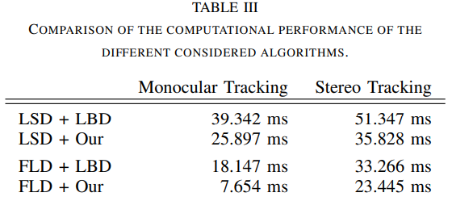

<!--
 * @Author: Liu Weilong
 * @Date: 2021-03-09 10:31:43
 * @LastEditors: Liu Weilong
 * @LastEditTime: 2021-07-06 15:25:46
 * @FilePath: /3rd-test-learning/38. line_feature/doc.md
 * @Description: 
-->
### 测试

图片标准 752 480
测试端 PC

(空)|Edgelet|Common Line|Vanishing
---|---|---|---
提取|a. Gaussian+ScharrXY+Canny 30ms|a. 直接LSD(opencv) 50ms b. LSD(Custom) 0.5倍缩放 12.5ms(extract) + 4ms(des)  c. fld(ZhangGuoxuan) 17ms 质量还不错  d. EDLines 16ms 提取质量比较差  e. MCMLSD 论文显示是LSD的20倍耗时|a. VanishingPointDetection(3rdParty) 70ms   b. VanishingPointDetection(Ground Assumption)+OpenMP  8-12ms
匹配|a. 直接光流匹配|a. LSD(Custom) 0.5倍缩放 0.1ms(match)   b. 端点光流(pl-svo) |a. 无需进行匹配
优化|a. 光流优化|a. PL-VIO plucker 4自由度优化 8iter 完成优化  b. PLSLAM 两点优化 4 iter 完成优化 |a. 可以不进行优化   b. 或者采用旋转优化的方式
优点|a. 不容易被遮挡  b. 提取速度应该可以加速 |a. 普遍性|a. 对于场景存在要求(场景与假设越相似，优点越大)  b. 完全不用担心无匹配的问题   c.对于yaw具有不变性，这个性质让在有IMU的时候，让分类更加简单。  d. 提供的旋转观测是一个类似于GPS的全局旋转 
缺点|a. Aperture Problem|a. 容易被遮挡 b. 容易被截断导致匹配不上|a. 需要运动连续性的假设  
鲁棒性策略|a. NMS 一定要有  b. 梯度方向判断  c. 仿射块匹配检测|a. 视差检测  b. 角度检测  c. 端点位置检测  d. 优化之后的角度检测  e. 块匹配检测(option)   f. 描述子的匹配策略(左右匹配、第一和第二的比例)|a. 连续运动先验  b. 多条线的精细化操作 
### 备注

序号|Edgelet|Common Line|Vanishing
---|---|---|---
1. ||光流端点匹配尝试一下？|
2. ||LSD+L1|
3. ||Point Feature存在的问题|1. 在KF和KF之间的匹配中，会出现前后线不一定能够检测到的问题。2. 大量移动会导致线出现巨变。3. 旋转过程中，KF插入的量不足以完成线的跟踪。最终导致线的约束力不足。

4. Geometric-based Line Segment Tracking for HDR Stereo Sequences LSD+L1
   
   