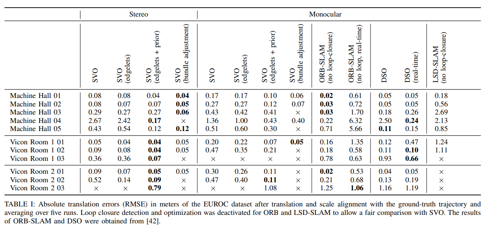

<!--
 * @Author: Liu Weilong
 * @Date: 2021-03-05 16:31:51
 * @LastEditors: Liu Weilong 
 * @LastEditTime: 2021-03-08 15:43:21
 * @FilePath: /3rd-test-learning/38. line_feature/edgelet/doc.md
 * @Description: 
-->
### edgelet :
1. 定义:具有连续且强的灰度梯度的小线段 
2. 长线的缺点:容易被遮挡\慢 
3. 缺点: aperture problem
4. 空间表示: 一个?
5. 提取： Gaussian 滤波， Scharr XY 出梯度， Canny 提边缘

### recommand material
1.  Edge Landmarks in Monocular SLAM
2.  Improving the agility of keyframe-based SLAM
3.  a video-rate object tracker
4.  Real-time visual tracking of complex structures
5.  A realtime tracker for markerless augmented reality
6.  Combining edge and texture information for real-time accurate 3d camera tracking
7.  Going out: robust model-based tracking for outdoor augmented reality
8. https://cecas.clemson.edu/~stb/students/ssundar_thesis.pdf

https://github.com/chsasank/Image-Rectification

### Paper Reading 
1. SVO2.0
   
   感觉Edgelet带来的提升并不大 
    测试下来PC端大概需要30ms 才能处理完一张752 480的图片
2. 