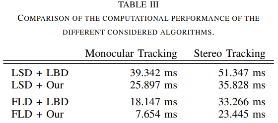

<!--
 * @Author: Liu Weilong
 * @Date: 2021-03-09 16:21:03
 * @LastEditors: Liu Weilong 
 * @LastEditTime: 2021-03-09 16:35:26
 * @FilePath: /3rd-test-learning/38. line_feature/paper_reading.md
 * @Description: 
-->
1. Geometric-based Line Segment Tracking for HDR Stereo Sequences LSD+L1
   内容： 
   
   fld 速度大概之后 lsd 的1/4，而且效果差别不大 可以尝试

2. PLS-VIO: Stereo Vision-inertial Odometry Based
on Point and Line Features 

2. Building a 3-D Line-Based Map Using
Stereo SLAM 

    内容： 
    a. 线特征 Plucker 用于初始化 orthonormal 用于优化
    
3. Visual-Inertial
Odometry with Point and Line Features

4. PL-VINS: Real-Time Monocular Visual-Inertial SLAM with Point and
Line Features

5. Leveraging Planar Regularities for Point Line VisualInertial Odometry

6. Guoxuan Zhang 一系列的线特征
7. Building a 3-D Line-Based Map Using
Stereo SLAM
摘要: 

简介: 

8. Structure from motion using lines: Representation, triangulation and bundle adjustment 
   摘要： 
   一个对于线特征优化的总结。 
   

9. Plucker Coordinates for Lines in the Space
   
10. http://web.cs.iastate.edu/~cs577/ 一个小课程