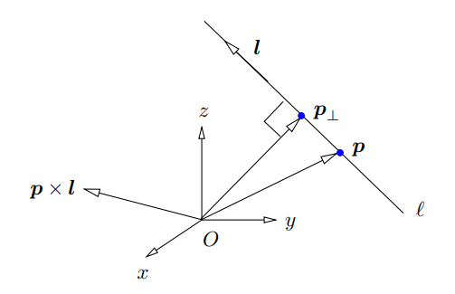
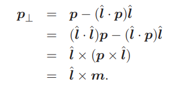
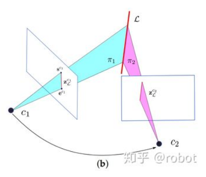
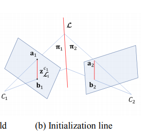
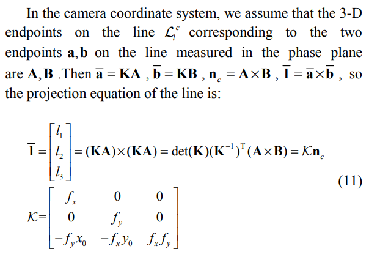

<!--
 * @Author: Liu Weilong
 * @Date: 2021-01-26 09:19:59
 * @LastEditors: Liu Weilong 
 * @LastEditTime: 2021-04-24 13:21:48
 * @FilePath: /Codes/38. line_feature/plucker/doc.md
 * @Description: 
-->
### Plucker线表示

reference:\
Pl¨ucker Coordinates for Lines in the Space

主要内容包括
1. Plucker表示
2. 定义介绍
3. 简单的性质
4. SLAM中的应用

-----------
1. Plucker 表示
$$
(l\in{R^{3×3}},m\in{R^{3×3}})
\\
(cl,cm)=(c,m) \;c\not ={0}
\\
lm=0
$$
后两个条件限制到四个自由度

-----
2. 定义介绍\
Plucker 是使用线方向(l)，和这个线到原点的moment(m)来对线进行定义\
l 确定方向\
m 包含了距离信息\
$m = p×l$ \
p是在l 上的任意点 
m是垂直于直线l和原点组成的平面($\pi$)的直线

-----
3. 简单性质\
3.a. 确定线上距离原点最近的点$p_{\bot}$
结合1.png 来看
\
$\hat{l}$ 是$l$的单位向量\
3.b. 点到直线的距离信息\
$||m|| =p×l = ||p||||l||\sin{\theta}$\
如果$l$变为单位向量\
$||m|| =p×l = ||p||\sin{\theta}$\
更加General的情况下
$$

    dis = \cfrac{||m||}{||l||}
$$  
3.c. 关于l和m 为零的讨论\
c.1. m=0，说明l是一条过原点的线\
c.2. l=0, 值线在无穷远处,并且这个线是在 m 垂直的平面上的。\
     线的方向会变得随意，只要在m 垂直的平面上，无穷远处的线，\
     共享(0,m)的表示。\
     这里也说明，不同的平面m会是不同的。\

------
4. SLAM上的应用\
4.a. 可以快速初始化两个相机帧中 共视的线条

过程：\
a.1. 线的在相机图像上的两个点$(s_1,e_1)$(归一化平面上在world坐标系下的表示，不是uv)和相机本身的位置$(c_1)$可以构建出一个平面$\pi$
$$
    \begin{aligned}
    &\pi_x(x-x_{c_1})+\pi_y(y-y_{c_1})+\pi_z(y-z_{c_1})=0\\
    \rightarrow &\pi_xx+\pi_yy+\pi_zz = \pi_w
    \\
    &\pi_w = \pi_xx_{c_1}+\pi_yy_{c_1}+\pi_zz_{c_1}
    \end{aligned}
    \\
    \pi = \left[
        \begin{matrix}
        \pi_x,\pi_y,\pi_z,\pi_w
        \end{matrix}
    \right]
$$

a.2. 通过对偶关系得到Plucker的参数 
$$
    L_c = \left [
        \begin{matrix}
        l× & m\\
        -m^T&0
        \end{matrix}
        \right]=\pi_1\pi_2^T-\pi_2\pi_1^T
$$

4.b. 变换可以做的很快速   

$$
    L^c = \left [
        \begin{matrix}
        m^c\\
        l^c
        \end{matrix}
        \right] = T^c_wL^w = 
        \left[
                \begin{matrix}
        R^c_w & t_w^c×R^c_w\\
        \pmb{0} & R^c_w
        \end{matrix}
        \right]L^w
$$

4.c. 重投影误差\
在归一化平面上来进行优化\
$$  
    e_1 =  \frac{p_s^Tm}{\operatorname{norm}(m)}\\
    e_2 =  \frac{p_e^Tm}{\operatorname{norm}(m)}\\
$$
$m\in{R^3}$ 来自plucker 的垂直部分\
$p_s$和$p_e$ 是观测在归一化平面上的表示$\in{R^3}$\

这里的物理意义:
最小化起始点到 平面的距离

优化过程\
$L$是一个$(l,m)$ 的plucker表示
plucker进行QR分解
$$
    \begin{aligned}
    L & = 
    \left[ \begin{matrix} l&m \end{matrix}\right] 
    \\&= \left[ 
        \begin{matrix}
         \frac{l}{\operatorname{norm}(l)}&\frac{m}{\operatorname{norm}(m)}
         & \frac{l×m}{\operatorname{norm}(l×m)}
         \end{matrix}
         \right]
    \left[ 
        \begin{matrix}
         \operatorname{norm}(l)&0\\
         0&\operatorname{norm}(m)\\
         0&0
         \end{matrix}
         \right]
    \\& = exp(\phi)    \left[ 
        \begin{matrix}
         sin(\theta)&0\\
         0&cos(\theta)\\
         0&0
         \end{matrix}
         \right]
    \end{aligned}
$$
对L 进行一次重排列之后
$$
\begin{aligned}
     L &= 
    \left[ \begin{matrix} l\\m \end{matrix}\right]
    \\&=\left[ 
        \begin{matrix}
         exp(\phi)\\
         exp(\phi)
         \end{matrix}
         \right]
         \left[ 
        \begin{matrix}
         sin(\theta)&0\\
         0&0\\
         0&0\\
         0&0\\
         0&cos(\theta)\\
         0&0
         \end{matrix}
         \right]
\end{aligned}
$$
分部分进行求导即可\
但是说实话是存在问题的，就是$\operatorname{norm}$ 的符号问题\
如果使用SO3×SO2的混合表示
$$
    \left[ 
        \begin{matrix}
         \operatorname{norm}(l)&0\\
         0&\operatorname{norm}(m)\\
         0&0
         \end{matrix}
         \right]=\left[ 
        \begin{matrix}
         sin(\theta)&0\\
         0&cos(\theta)\\
         0&0
         \end{matrix}
         \right]
$$
还是会存在符号上的问题，因为$\operatorname{norm}$ 都为正。\
三角函数会引入负值。\
那么反正都是直接基于plucker的表示假设，为什么不直接
$$
\left[ 
    \begin{matrix}
        \operatorname{norm}(l)&0\\
        0&\operatorname{norm}(m)\\
        0&0
        \end{matrix}
        \right]=\left[ 
    \begin{matrix}
        1&0\\
        0&\cfrac{1}{s^2}\\
        0&0
        \end{matrix}
        \right]
$$
只是每次使用需要对l和m进行归一化。但是确在符号上统一，取倒数可以保证超远距离的失效情况

### 优化再谈
1. 梗概:
   
   1.a. 优化的物理意义: 线段点到平面的距离
   1.b. 优化的步骤
   1.c. 优化的输入输出：输入 待优化的plucker参数 和 线的端点 输出: 优化后的plucker参数

2. 优化的步骤
$$  
    e_1 =  \frac{p_s^Tm}{\operatorname{norm}(m)}\\
    e_2 =  \frac{p_e^Tm}{\operatorname{norm}(m)}\\
$$

以下用$e_1$作为例子，进行公式推导
$$
\begin{aligned}
    e_1 &= p_s^T\cfrac{ m}{\operatorname{norm}(m)}
    \\
    &= p_x^T[ \cfrac{ m}{\operatorname{norm}(m)}+\cfrac{\partial \cfrac{m}{\operatorname{norm}(m)}}{\partial \theta,\alpha}]
    \\
    & = p_x^T[ \cfrac{ m}{\operatorname{norm}(m)}+\cfrac{\partial \cfrac{m}{\operatorname{norm}(m)}}{\partial m}\cfrac{\partial m}{\partial \theta,\alpha}]
    \\
    & = p_x^T[ \cfrac{ m}{\operatorname{norm}(m)}+\cfrac{\partial \cfrac{m}{\operatorname{norm}(m)}}{\partial m}\cfrac{\partial e_2^T [l,m]}{\partial \theta,\alpha}]
\end{aligned}
$$

$$
    m = [m_1,m_2,m_3]^T\\
    \cfrac{\partial \cfrac{ m}{\operatorname{norm}(m)}}{\partial m}= \cfrac{I\in R^{3×3}}{\operatorname{norm}(m)} + m\operatorname{norm}(m)^{-3}m^T
    \\
    \cfrac{\partial e_2^T [l,m]}{\partial \theta,\alpha} = e_2^T\cfrac{\partial exp(\theta)\left[
        \begin{matrix}
            \sin(\alpha)&0\\
            0&\cos(\alpha)\\
            0&0
        \end{matrix}\right]}{\partial \theta,\alpha} 
$$
往下就不继续推导了 快吐了

### remian task
1. code 里面的plucker计算相反1   问题是由法向量的方向导致的      和定义有关 完成
2. plucker 文档整理3            完成
3. L 的投影问题2                需要参考PL-VIO ?? 直线的投影矩阵是单位阵??  完成\
                              最后发现，重投影误差是在归一化平面上面做的，\
                              而不是在图像上面做的\         
4. L 的初始化问题 2             使用的公式不同导致的      完成
5. 优化尝试(so3+1/s^2)            
6. LBD LSD 

### 补充
1. 关于像素平面投影的问题,
   也就是如何把 m 投影到 像平面上的问题
   
   

### 