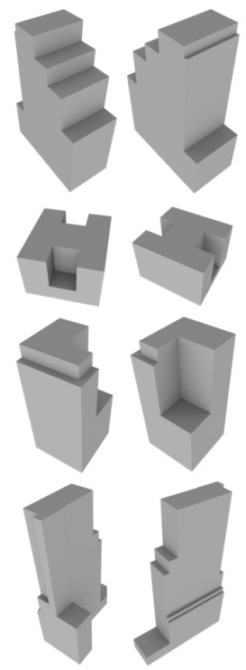
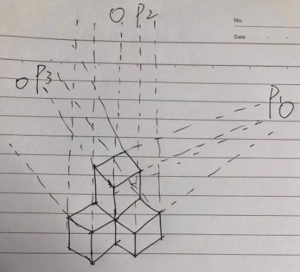

<!--
 * @Author: Liu Weilong
 * @Date: 2021-03-12 13:31:44
 * @LastEditors: Liu Weilong 
 * @LastEditTime: 2021-04-19 13:06:55
 * @FilePath: /Codes/38. line_feature/vanishing_point/doc.md
 * @Description: 
-->
### 目前留下来的问题：
1. Vanishing Point 的参数化? ok
2. Mahanttan World 是什么？ 基本ok
3. Mahanttan Frame 是什么？ ok
4. 目前看来Mahanttan World是和面有关的，那么是如何引入的Vanishing Point的概念的呢？ ok
5. Vanishing Point Pipeline 是什么？ ok
6. Vanishing Point 视觉定位基础(MW假设)

------
1. Vanishing Point 的参数化
2. Mahanttan World 是什么？
   小方块组成的世界，也就是两个相邻的面是垂直的世界。

   

   虽然现在世界上的很多东西，已经不是严格的Mahanttan世界了，但是这些物体都是可以近似成曼哈顿世界的。(类似我的世界)
   优点：可以处理缺少特征的对象，输出的内容非常干净
3. Mahanttan Frame 是什么？
   在论文中的定义是一个$S^2$的球体来进行表示优化$SO3$

4. Mahanttan World 和 VP 的关系？
   一开始认识mahanttan world 是基于面进行构建的，感觉和vanishing point 没有什么关系，但是如果用画画的想法来看，一切都会不一样
   
   
   4.a. 在Mahanttan World 中所有的线条都只和3个VP有关。
   4.b. 并且3个VP在多视图几何中对应的三维空间中的方向就是Mahanttan World 坐标系的方向.
   4.c. 严格的Mahanttan World中的平面都是由两个VP对应的平行线生成的。
   4.d. 不同的orthVPs(三个垂直的VP)，构成不同的mahanttan world
   
5. Vanishing Point Pipeline？
   5.a. first image
     a.1. LSD
     a.2. Parallel Cluster
     a.3. VP Init
   5.b. Second
     a.1. LSD
     a.2. Parallel Cluster
     a.3. VP Init 关于VP的参数化求解还是需要看一看
     a.4. Opt SO3
   不自己写一下是不会知道结果的

6. Vanishing Point 视觉定位基础(MW假设)
   6.a. MW 在世界中的坐标系
        MW 在世界中的坐标系，是可以直接使用$I\in R^{3×3}$ 来进行表示的
        在这个表示下，2类MW 假设线在相机中的都是平行的，另外一类MW假设线相交于 pricipal point (cx,cy)，这是目前最好的情况。
   6.b. 图像得到的位姿 $R^{mw}_c$和MW 坐标系
        从vp_basic.md 中，得到的结论
        $$
         d \propto \pi(RD)
        $$
        在 MW 假设下，公式可以更新为
        $$
         d_i \propto \pi(R^{mw}_c I_i)
         \\
         R^{mw}_c I_i \propto \pi^{-1}(d_i)
        $$
        通过这个方法就可以得到$R^{mw}_c$
   6.c. 第一张图像的MW坐标初始化
        $R^{mw}_c$
   6.d. 之前的思想混乱是什么导致的?
        相机的旋转是在Y轴进行的，但是MW的旋转确是在X轴上进行的。也就是说$R^{c2}_{c1}$并不相同，这才是让我头疼的地方。
        所以不知道是不是因为相机和曼哈顿相机存在转轴的问题导致的。
        推导一下之后，发现并不存在转轴,只是相同的旋转，在不同的坐标系下的表示不同。
        这个内容进行建模就是，
        在坐标系W下，存在一个刚体，刚体上有一个坐标系V 和 坐标系C,两个坐标系固定在刚体上，且两个坐标系不重合。

   6.e. 最后发现bug 是因为转换的问题导致的。
        也就是如下的例子：
        最后发现Debug 的发生是因为在 求解 output 的result 的时候，坐标表示顺序写错了，
          *    正确的 (R^{wm}_c1) * R^{wm}_c2.inverse()
          *    错误的 (R^{wm}_c1) * R^{wm}_c2
          *    和外参没有关系

### VP 优、缺
1. 位姿平滑度不足，受场景影响大。
2. 全局最优旋转
3. 可用于改善抖动的问题，这个问题的解决大概率是因为引入了运动先验的原因

### other problem
1. 运动模糊
2. 动态环境
3. 曝光的问题(无HDR，曝光导致的特征跟丢)

