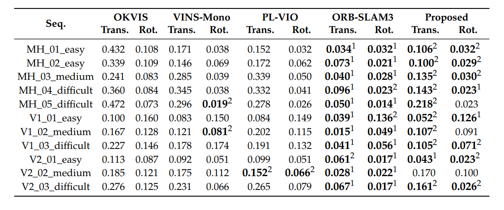
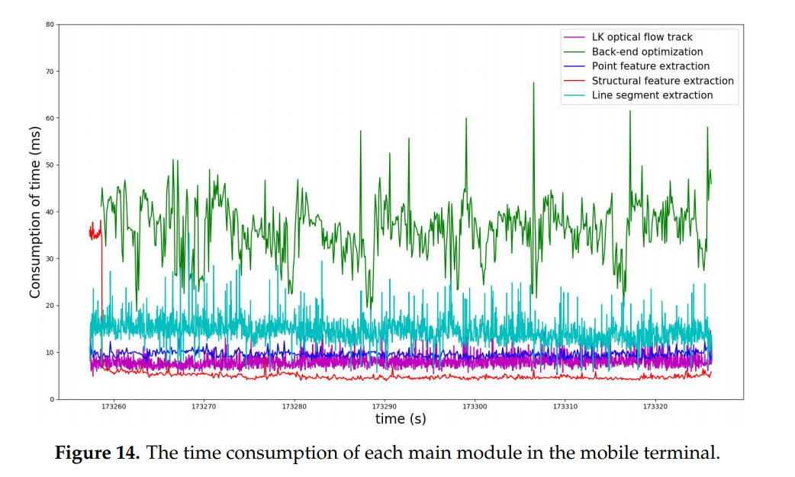
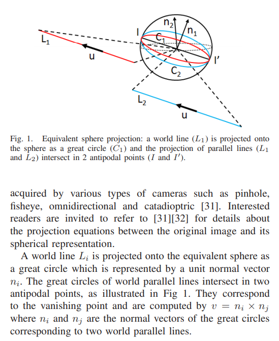
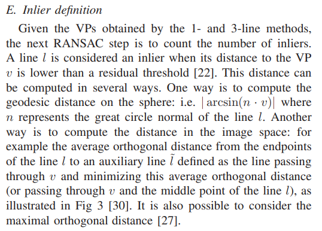
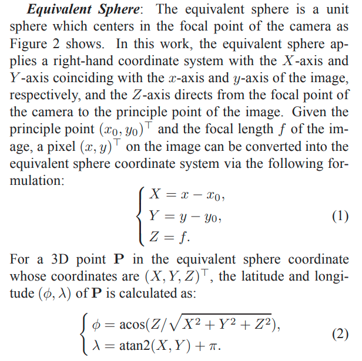
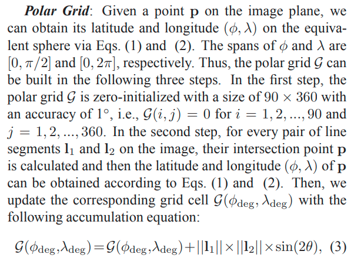
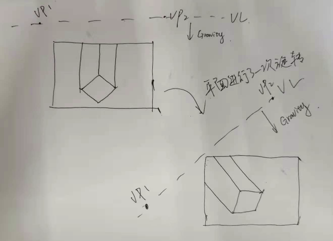
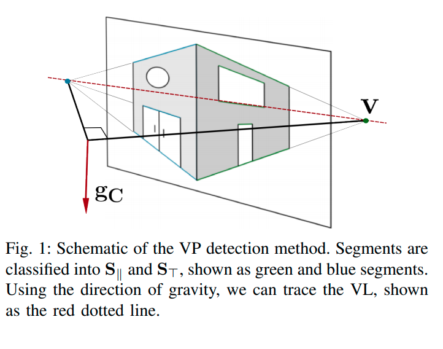

<!--
 * @Author: Liu Weilong
 * @Date: 2021-03-05 17:00:55
 * @LastEditors: Liu Weilong
 * @LastEditTime: 2021-07-08 10:01:19
 * @FilePath: /3rd-test-learning/38. line_feature/vanishing_point/paper_reading.md
 * @Description: 
-->
### Vanishing Point(硬骨头)
序号|论文名|状态|备注
---|----|---|--
1. |Manhattan World: Compass Direction from a Single Image by Bayesian Inference|没读|最经常引用的文章，但是和我想要做的VP-SLAM并不是强相关 
2. |Real-time Manhattan World Rotation Estimation in 3D|没读|需要4. 的基础
3. |Manhattan-world Stereo|读了一部分(不继续读了)|目前唯一有点谱的文章，了解了MW到底是个什么东西。想到了VP和MW的关系
4. |The Manhattan Frame Model – Manhattan World Inference in the Space of Surface Normals |还要继续读|第二篇比较靠谱的论文 没看完，有点难
5. |Visual-Inertial Odometry of Smartphone under Manhattan World|还要继续读|比较完善的VP 在Local MW下的系统，但是在大系统下，肯定是有问题的，还是需要4.的MCMC进行亚特兰大世界的构建  22-28 vanishing point 的使用 29 就是说明rotation 是error的主要原因  vanishing Point 的提取 

----
1. Visual-Inertial Odometry of Smartphone under Manhattan World 效果惊人

### Remain Problem
1. xyz 轴未知的情况下如何进行匹配
2. 

### Paper Reading
1. 3-line RANSAC for Orthogonal Vanishing Point Detection
   笔记:
   a. 3VPs 不垂直的话，就要进行近似
   b. Gaussian Sphere 上，线会投影成一个Great Circle，相交于球的两个端点
      通过叉乘两个Great Circle上面的法向量，就可以得到一个Vanishing Point。
   
   大概思路:
   a. 初始化前，使用3-LINE RANSAC 做线的分类，inliner 判断两种。
   b. 初始化之后，使用3-LINE RANSAC 进行线分类。 只要一个方向固定，其他的都好说。
   c. inliners def
   

   d. 1_line RANSAC horizon 知道了之后，也就是说竖直的线在空间中的角度已知。 就可以快速找到对应的LineSegment 进行VP1 的初始化，
   然后就是根据垂直找到
    
   2021.3.27 再次补充
   实际上，3-line 是在找一个什么样的MMS？ Line1 和 Line2 符合一个VPS Line3符合另一个VPS，然后生成三个VPS
   1-line RANSAC 也就是 知道了一个 VPS 也就相当于 line1 line2 已知，所以只需要一个line 就可以求出第二个vps
   
   a. 3-line RANSAC 的主要流程：两根线找到VP1

   因为RANSAC 从线得到的结果，所以不一定完全垂直

2. A Monocular SLAM System Leveraging Structural Regularity
in Manhattan World
   笔记：
   a. VPs 的关系
   b. Identification of Coplanar Feature Matches
    
3. Visual-Inertial Odometry of Smartphone under Manhattan World
   笔记：
   a. VP提取 ：过程都是先提取线，然后做线的聚类 参考34 37 22
   b. Structural Feature Detection and Matching:
   EDLines 提取 line segment
   初始化： 
   3rd_party_vp 提取 + 一个角度检测   -> 3VPs 确定
   多次旋转：得到优化后的 VP_w
   初始化后:
   进行主方向上VP往新图像上的投影，角度小于6度的line segement 当作 主方向VP对应的line segment -> 得到VP1
   VP2 需要参考34 也就是4.
   在得到 VP2 VP3 之后，通过统计得分得到最优的一组VPS
   VPS 匹配:
   VP1 已经知道方向之后，就只剩下一个方向进行匹配，所以这里的匹配还是需要使用连续运动假设来判断VP2和VP3的方向
   
   所以可能需要放在比较连续的图像数据中使用

   优化的部分 暂时没有看。
   

4. 2-Line Exhaustive Searching for Real-Time Vanishing Point Estimation in Manhattan World
    笔记:
    简介:
    a. VPs 的问题困难性，在于全局最优和三VPs 垂直的要求
    b. 四种方法: 遍历、EM算法、RANSAC、优化
    c. 这个算法集合了 遍历和RANSAC来达到real-time 的性能
    d. 过程，生成grid，生成假设、假设验证
    内容:
    生成grid：
    a. 生成unit sphere 网格，pixel 坐标转换成 sphere 上的极坐标 这个也就是
    
    b. 对于unit sphere 的分辨率划分为 90度*360读
    c. 遍历每一对线，求其交点，交点的pixel转化成 极坐标后，在unit sphere 上进行记分。
    
    d. 记分规则，线段越长积分越高，两线的夹角越往45度靠，积分越高   ？？？  存疑 
    e. 做一次3*3的高斯滤波，去噪声。
    假设生成:
    a. 随机选择，两根线生成 vp1 (通过RANSAC概率计算 最少有1/2的可能性 需要尝试105次)
    b. vp2 根据vp1 产生的圆上，1度的分辨率,大概有360种可能
    c. vp3 就是vp1 和 vp2 的叉乘
    假设检验:
    a. vp1 vp2 vp3 投影到积分球上， 105×360 种可能，找分数最大的一组VPS
    遗留的问题: 
    如何理解 score 的设计？ 为什么是$\sin{2\theta}$ , 也就是45度得分最高，而不是越平行得分越高 
    需要阅读一下源代码。

   5. Using Vanishing Points to Improve Visual-Inertial Odometry
   mark！！！！
   笔记:
   a. 在WM 假设下，Vanishing Line,在空间中是一条直线，有了重力方向之后，可以让知道VL的方向，想到了一个例子基本上是不需要验证。
      
   b. 1-line RANSAC 也就说 
      任何一个和VL相交的线产生一个VP.然后就是对这个VP进行一个统计(但是这里应该说已经把线分成了两类、垂直和水平线，这里的RANSAC 是对水平线进行的)
   
      然后通过已知的条件: 1. mahanttan 假设 2. 水平结构线产生的VP 都在VL上
      每一个VP 结合Gravity 都会生成一个VP set 然后进行评价就可以了。 (怪不得说是1-line Ransac)  大概思想是这样,之后再进行细致的阅读吧，还是挺有意思的。
   c. 找到最优ransac 组之后,还需要进行一次 VP refine

   

   这篇文章,现在读起来还是很有味道的。之后有机会仔细看一下
   

   6. Struct VIO

   
