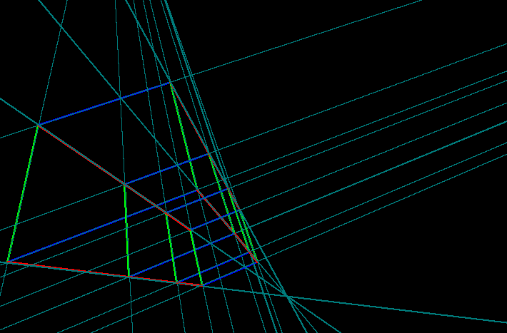
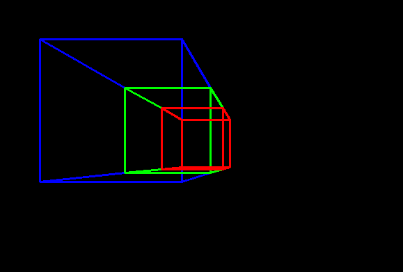
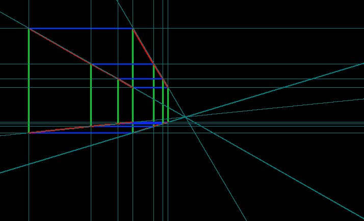

<!--
 * @Author: Liu Weilong
 * @Date: 2021-03-26 08:58:28
 * @LastEditors: Liu Weilong 
 * @LastEditTime: 2021-04-24 11:29:17
 * @FilePath: /Codes/38. line_feature/vanishing_point/vp_basic.md
 * @Description: 
-->
### 1. 打通VP 和 曼哈顿假设 的关系

1. 什么是曼哈顿假设？
   
   也就是可以理解成一个完成由八叉树组成的世界。
   现实世界中，只要分辨率够高，任何环境都可以用八叉树来进行描述。
   曼哈顿假设，也就是说我们默认世界是一个八叉树的
   

2. 什么是 Vanishing Point?

   空间平行线,在像平面上的交点
   

3. Vanishing Point 和 曼哈顿假设的关系？
   
   曼哈顿假设下的世界中，所有的平行的线都会直接和三个灭点产生关系。
   
   
   

### 2. Vanishing Point 的参数描述
1. 如何定义空间中的无限长直线？
   空间中的直线:
   $$
    L = A + \lambda D \\
    A \in [R^3,1]\\
    D \in [R^3,0] \\
    \lambda \in [-\infin,+\infin]
   $$
    Vanishing Point 最重要的就是方向Ｄ

2. Vanishing Point 如何映射在 Image 上？
   $$
   \begin{aligned}
    x &= KT(A+\lambda D)\\
      &= KTA + \lambda KTD\\
      &= KA' +\lambda KD'\\
      & = 
      \left[
        \begin{matrix}
          f_x a_x + c_x a_z + \lambda f_xd_x + \lambda c_x d_z \\
          f_y a_y + c_y a_z + \lambda f_y d_y + \lambda c_y d_z \\
          a_z + \lambda d_z
      \end{matrix}
      \right]
    \end{aligned}
    \\
    when ,\lambda \rightarrow\infin\\
    x \propto  \left[
        \begin{matrix}
          f_x a_x/\lambda + c_x a_z/\lambda + f_xd_x +  c_x d_z \\
          f_y a_y/\lambda + c_y a_z/\lambda +  f_y d_y +  c_y d_z \\
          a_z/\lambda +  d_z
      \end{matrix}
      \right]\propto      \left[
        \begin{matrix}
            f_x d_x +  c_xd_z \\
            f_y d_y +  c_yd_z \\
           d_z
      \end{matrix}
      \right]
   $$
   结论，在2d像平面上得到的VP 会和 空间当中的平行方向呈现出.
   这样的处理方式只是除了$\lambda$ 没有除$d_z$, 就相当于跳过了$d_z=0$的限制条件
   $$
   K^{-1}x\propto D 
   $$
   
   
   最后，结果就是Vanishing Point 只和三维空间中的方向有关

3. 如何从Image 反向推出 Vanishing Point 的方向？
   
   (假设所在的空间完全符合Manhattan 假设，也就是图像中所有的线，都可以分成三种三维空间中的平行线)

    大体思路还是找打三维平行线对应图像上的线，找线相交的点,然后得到方向$D'$，但是具体内容还需要讨论
    
    两根线交点的公式
    $x = l×l'$
    这个公式满足平行线和非平行线

4. 建立图像旋转和 Vanishing Point 之间，是否存在映射关系?
   
   首先，因为3最后的结论，所以我们这里只需要对线进行分类，而不需要对线和线进行匹配

    如果我们这里使用一个矩阵来容纳一个图像内，三类平行线所对应的D，那么因为Manhattan 的性质就会出现。

    $$
        D_1 = [d_1^1 d_1^2 d_1^3] \in SO3
        \\
        D_2 = [d_2^1 d_2^2 d_2^3] \in SO3
        \\
         = R^1_2 [d_1^1 d_1^2 d_1^3]
        \\
        D_2 = R^1_2D_1
    $$

    关于VP的空间旋转分析
  
    $$
      D_1 =  P + \lambda D\\
      D_2 = T(P + \lambda D)\\
      x_1    
      \propto      \left[
        \begin{matrix}
            f_x d_x^1 +  c_xd_z^1 \\
            f_y d_y^1 +  c_yd_z^1 \\
           d_z^1
      \end{matrix}
      \right]\\
      x_2 \propto K\left[
        \begin{matrix}
             d_x^2 \\
            d_y^2 \\
           d_z^2
      \end{matrix}
      \right] 
       \propto KR\left[
        \begin{matrix}
             d_x^1 \\
            d_y^1 \\
           d_z^1
      \end{matrix}
      \right] 
      \\
      normalized(R^TK^{-1}x_2) = normalized(K^{-1}x_1)\\
      R^{T}normalized(K^{-1}x_2) = normalized(K^{-1}x_1)
    $$
   
   可以见是存在一个旋转的关系的
   
### 3. 算法运行产生的问题
1. 会存在180度的突变问题，需要添加突变的check
   需要添加连续运动的假设

### 4. VanishingPoint 和 Camera 之间的标定
1. 这里是昨天遇到的一个大坑
   空间中相同旋转，在不同坐标系下的表示不同
   上面的话，转换为公式就是
   $$
      exp(\theta_c) = exp(R_c^w\theta_w)
      = R_c^wexp(\theta_w)(R_c^w)^T
   $$
   也就是说，这里的旋转不单单是左乘对于行的变换，还存在右乘对于列的变换。

