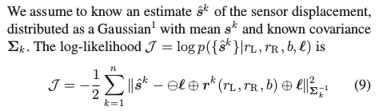

## 1. Simultaneous Calibration of Odometry and Sensor Parameters for Mobile Robots

### 问题构造

给左右轮转速和观测得到 $r_L$ $r_R$ $b$ 以及外参

也就是一个优化问题

### 可观性分析

1. 三种方法:
   
   控制方法的局部可观性: 
   需要递推和观测方程均为连续时间模型，对于非线性比较有效
   但是没有考虑到观测的噪声

   "static" analysis 静态分析:
   $$
    y = h(u,x)
   $$
   确认在某些 激励u 存在的时候，x是确定的

   Fisher Information Matrix:
   统计学上的方法
   线性化分析，但是可以确定不确定性的边界

2. 文章的可观性采用 static analysis 
   不确定性采用 FIM

### MLE 构造

文章里面说不存在递推解，但是存在闭式解，这个问题有些疑惑

### 标定方法

基本固定不太用看

### outlier 剔除方法

while(condition)
RANSAC;
Discard

### FIM

