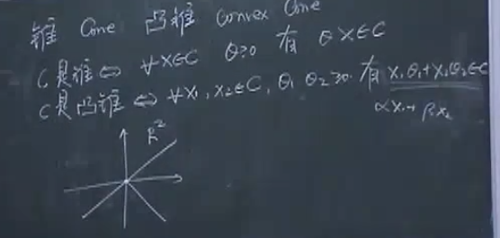
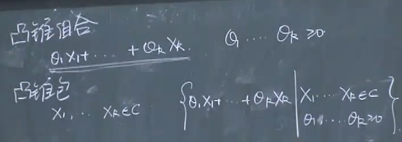
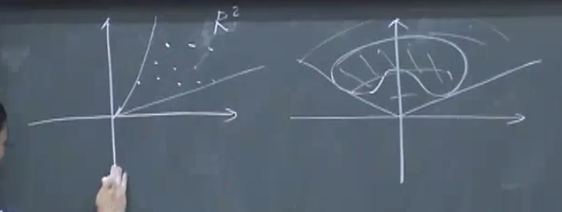
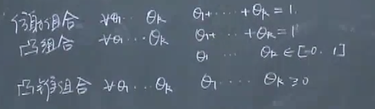

<!--
 * @Author: Liu Weilong
 * @Date: 2021-05-29 13:27:55
 * @LastEditors: Liu Weilong
 * @LastEditTime: 2021-06-21 18:52:52
 * @Description: 
-->
### 主要内容

感觉这里的主要目的是为了判断可行解集是否是一个凸集或者仿射集，
目前还没有补充图形理解

1. 仿射集、仿射组合、仿射包、仿射集相关的子空间、例子(直线)
2. 凸集、凸组合、凸包(线段)
3. 锥、凸锥、凸锥组合、凸锥包(从原点出发射线)
4. 小结

这里的逻辑是

(以凸集为例)

拿一些点进行凸组合，构成的集合就是凸包。

包含这些点的凸集可以有很多个，但是凸包只有一个。

-----
1. 仿射集、仿射组合、仿射包
   
   1.1 仿射集的定义: 

   如果C 是一个仿射集，那么任意取两个点 $x_1,x_2$ 他们连线的直线上面所有的点都在C这个集合内。
   反过来也是这样的。
   
   数学的形式就是

   $$
    C: \operatorname{Aff} \ \operatorname{Set} \rightleftarrows\\

    \forall x_i,x_j \in C\\
    y= x_i+(\theta)(x_j-x_i) = \theta x_j +(1-\theta)x_i \in C
   $$

   对于这个定义进行进一步的扩展，从两个点的定义拓展到多个点

   $$
    C: \operatorname{Aff} \ \operatorname{Set} \rightleftarrows\\

    \forall x_1,x_2,...,x_n \in C\\
    y= \sum^n_i \theta_i x_i  \in C, \sum^n_i \theta_i = 1
   $$

   拓展推导:

   $$
    C \ is  \ a \operatorname{Aff \ Set},\rightleftarrows
    \\
    \forall x_i,x_j \in C\\
    y=  \theta_j x_j +\theta_i x_i \in C , \theta_i + \theta_j = 1
    \\ 
    \because y \  \operatorname{still} \  \in C \\
    \therefore \forall x_k \in C , z = \theta_k y+(1-\theta_k)x_k \in C
   $$

   把 y 展开

   $$
   \begin{aligned}
        z &= \theta_k y+(1-\theta_k)x_k 
    \\
    & = \theta_k(\theta_j x_j +\theta_i x_i) + (1-\theta_k)x_k 
    \\
    &\ \ \  \theta_k \theta_j +\theta_k \theta_i + (1-\theta_k)
    \\
    & = \theta_k(\theta_i +\theta_j) +(1-\theta_k) = 1
   \end{aligned}
   $$

   上式得到的结论也就是

    $$
    C: \operatorname{Aff} \ \operatorname{Set} \rightleftarrows\\

    \forall x_1,x_2,x_3 \in C\\
    y= \sum^3_i \theta_i x_i  \in C, \sum^3_i \theta_i = 1
    $$

    对此进一步拓展 就可以得到 多点的结果。

    这两个定义可以互相转换，是等价的。

    图形理解:(待补充)

    1.2 仿射组合

    主要应该是为了生成仿射包

    $$
    \forall x_1,x_2,...,x_n \in C\\
    y= \sum^n_i \theta_i x_i  \in C, \sum^n_i \theta_i = 1
    $$
    
    1.3 仿射包

    对于任意一个集合，构建最小的仿射集(也就是仿射包)

    $$
    \operatorname{aff} C = \{ \sum^N_i \theta_i x_i|x_i\in C,\sum^N_i \theta_i =1\}
    $$

    这里的 $\operatorname{aff}C$的意思是对任何一个集合C进行仿射处理。

    1.4 例子

    1.4.1 仿射集相关的子空间

    这里的例子，C是一个仿射集,$x_o$是从仿射集C内，任意取出的一个点

    $$
        V = \{x - x_o | x \in C,x_o \in C \}
    $$

    先证明这个集合也是一个仿射集

    $$
        v_i,v_j \in V
        \\
        \begin{aligned}
        \theta_i v_i + (1-\theta_i) v_j 
        &= \theta_i(x_i-x_o) + (1-\theta_i)(x_j-x_o)
        \\ & = \theta_i x_i + (1-\theta_i)x_j -x_o            
        \\
        &\ \theta_i x_i + (1-\theta_i)x_j \in C
        \\
        & \therefore \theta_i v_i + (1-\theta_i) v_j \in V
        \end{aligned}
    $$

    得以证明这是一个仿射集

    但是$\theta_i + \theta_j \not ={ 1}$ 的情况呢？

    $$
    \begin{aligned}
        \alpha v_i + \beta v_j &= \alpha v_i + \beta v_j +x_o -x_o
        \\
        & = \alpha(x_i-x_o) + \beta (x_j-x_o) + x_o -x_o
        \\
        & = \alpha x_i + \beta x_j + (1-\alpha- \beta)x_o -x_o
    \end{aligned}
    \\
    \because x_i,x_j,x_o \in C\  \operatorname{and} C :\operatorname{aff \ set}
    \\
    \alpha x_i + \beta x_j + (1-\alpha- \beta)x_o \in C
    \\
    \therefore \alpha x_i + \beta x_j + (1-\alpha- \beta)x_o -x_o \in V
    $$

    我们做到这里就会发现 $\theta_i+\theta_j\not ={1}$ 的情况。
    
    V这个集合也还是一个仿射集。

    这个时候我们会说V是与仿射集C相关的子空间

    1.4.2 线性方程的解均为仿射集

    a. 首先，需要判断$C = \{Ax=b|A,b \ is \ given \}$ 是一个仿射集

    $$
    \because x_i,x_j \in C
    \\
    \operatorname{and}
    \\
    A[ax_i +(1-a)x_j] = aAx_i + (1-a)Ax_j = ab + (1-a)b =b
    \\
    \therefore C \ is \ a \ \operatorname{aff \ set}
    $$

    b. 结合1.4.1 寻找仿射集C 的子空间

    首先，写一下子空间的定义:
    $$
        V = \{x - x_o | x \in C,x_o \in C \}
    $$

    可以推出
    $$
        V = \{Ax=0 | x\in C \}
    $$

2.  凸集、凸组合、凸包

    2.1 凸集
    
    凸集的定义就是在仿射集的基础上添加了一个定义

    $$
        C: \operatorname{Aff} \ \operatorname{Set} \rightleftarrows\\

        \forall x_i,x_j \in C\\
        y= x_i+(\theta)(x_j-x_i) = \theta x_j +(1-\theta)x_i \in C
        \\
        +\theta_i \in [0,1]
    $$

    等价定义:
    $$
        C: \operatorname{Aff} \ \operatorname{Set} \rightleftarrows\\

        \forall x_1,x_2,...,x_n \in C\\
        y= \sum^n_i \theta_i x_i  \in C, \sum^n_i \theta_i = 1
        \\
        +\theta_i \in [0,1]
    $$

    图形理解:(待补充)

    2.2 凸组合

    主要应该是为了生成凸包

    $$
    \forall x_1,x_2,...,x_n \in C\\
    y= \sum^n_i \theta_i x_i  \in C, \sum^n_i \theta_i = 1\\
    +\theta_i \in [0,1]
    $$

    2.3 凸包

    对于任意一个集合，构建最小的凸集(也就是凸包)

    $$
    \operatorname{Convex} C = \{ \sum^N_i \theta_i x_i|x_i\in C,\sum^N_i \theta_i =1,\theta_i \in [0,1]\}
    $$

    这里的 $\operatorname{Convex}C$的意思是对任何一个集合C进行凸集处理。

3. 锥、凸锥、凸锥组合、凸锥包
   
   3.1 锥、凸锥

    

   锥是一根射线，凸锥是多跟射线组成的面，内部的点也符合凸集的定义
   3.2 凸锥组合、凸锥包
    
    

4. 小结
   
   4.1 凸集、凸锥、仿射集的关系   
   
   

   如果一个集合是一个仿射集，那么他一定是一个凸集。
   但是不一定是一个凸锥

    图形理解:(待补充)

   4.2 如果一个集合内，只有一个点，那么这个集合一定是一个仿射集
        
    如果这个点是零点的话，他还是凸锥。

   4.3 一个集合如果是凸锥，那么一定是一个凸集
    