<!--
 * @Author: Liu Weilong
 * @Date: 2021-06-21 18:53:19
 * @LastEditors: Liu Weilong
 * @LastEditTime: 2021-06-21 21:50:31
 * @Description: 
-->

### 主要内容: 保凸操作

1. 交集
2. 仿射函数以及逆仿射(线性变换)
3. 透视函数
4. 线性分数函数(相当于 仿射+透视)

----

2.  仿射函数 

    进入的集合是凸集，输出的集合也是凸集
    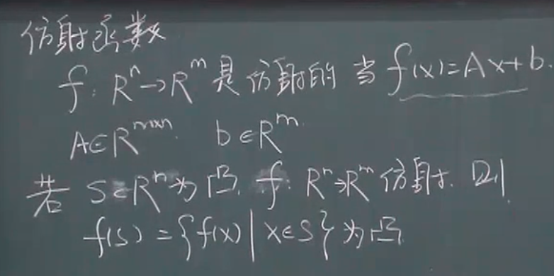

   逆仿射，也是保凸的
   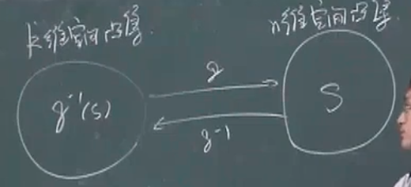

   ?? 感觉存在反例啊。有疑问

   例子:
   2.1 集合的和   可以写成线性的变换

   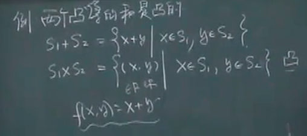
   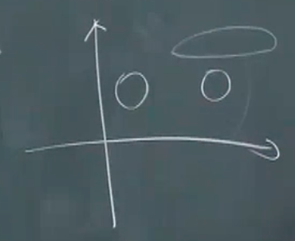

   2.2 仿射的逆变换的例子

   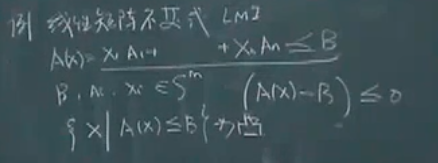 
   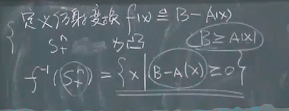

   2.3 椭圆的例子
   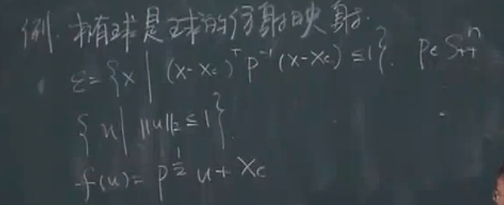

3. 透视函数
   
   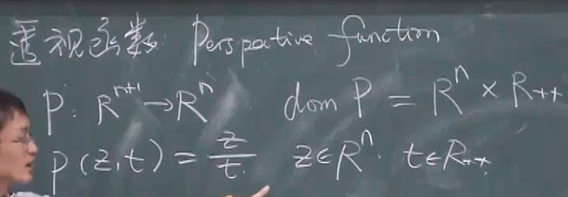

   3.1 透视之后还是线段的例子
   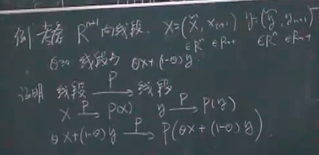
   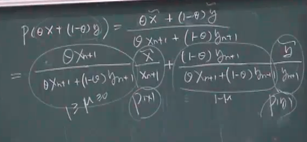

   3.2 任意凸集的反透视还是一个凸集
   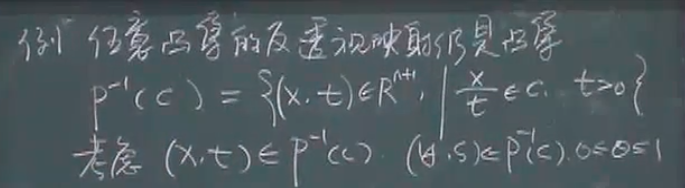
   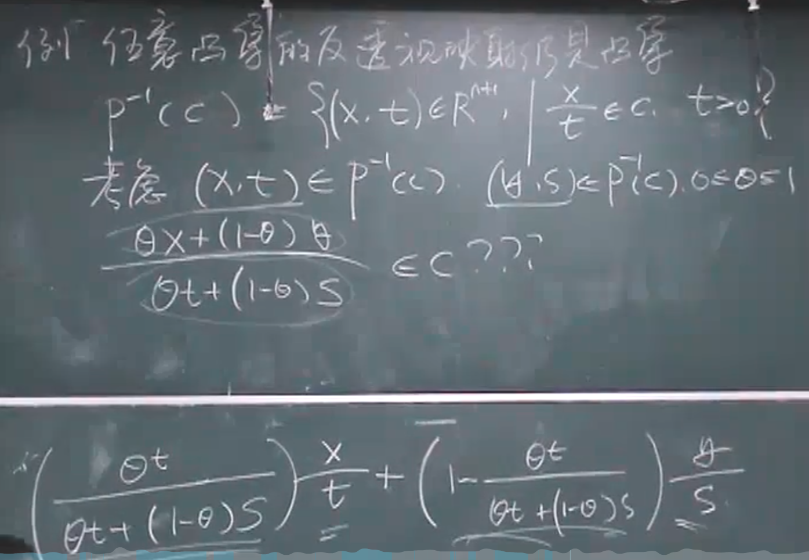

4. 线性分数函数
   
   相当于先仿射 后透视，保凸

    非线性函数当中非常好的函数

    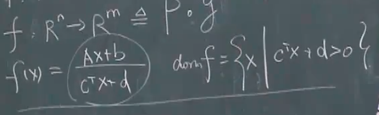
    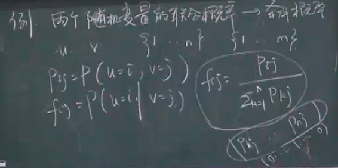

    这里相当于把条件分布写成了线性分数的形式

    但是这里的联合概率分布是凸集吗？

    感觉需要分开讨论，概率论里面的几何概率(可以利用多面体来决定定义域)来看，这个联合分布可以是凸的，也可以是非凸的。

     此处存疑，需要之后具体看一下
 

