<!--
 * @Author: Liu Weilong
 * @Date: 2021-06-24 21:37:40
 * @LastEditors: Liu Weilong
 * @LastEditTime: 2021-06-26 22:29:05
 * @Description: 
-->
### 凸函数

1. 凸函数定义
2. 拓展值函数
3. 凸函数判定条件
4. 一些常见凸函数
5. SubLevel Set 子水平集

----
1. 凸函数定义:

    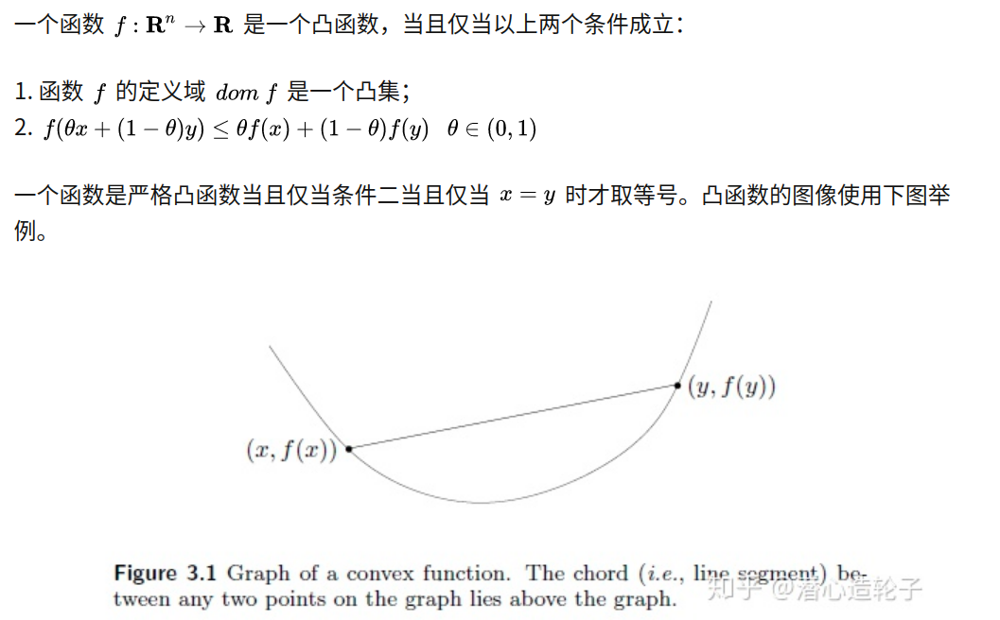

    凹函数定义:

    $$
    f(\theta x + (1-\theta)y) >= \theta f(x) + (1-\theta)f(y)
    $$

    仿射函数 是既凸又凹的

    ie.
    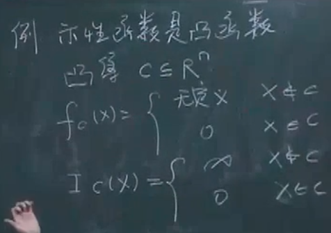
    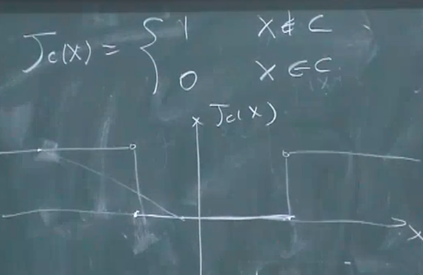

    多种定义：
    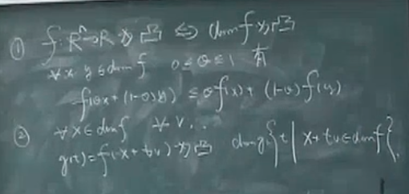

    第二个定义主要是为了把问题从高维降到一维，让问题变得更好处理(切西瓜的定义)，这里的V如何取还是存疑。

    进一步细化第二个定义，$V\in R^n$
    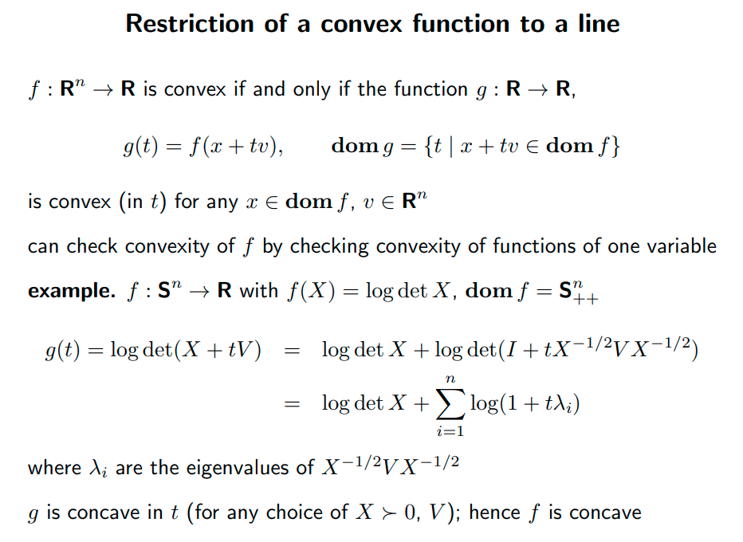

    这个定义还是非常有用的，之后会被持续的用到

2. 拓展值函数
   
   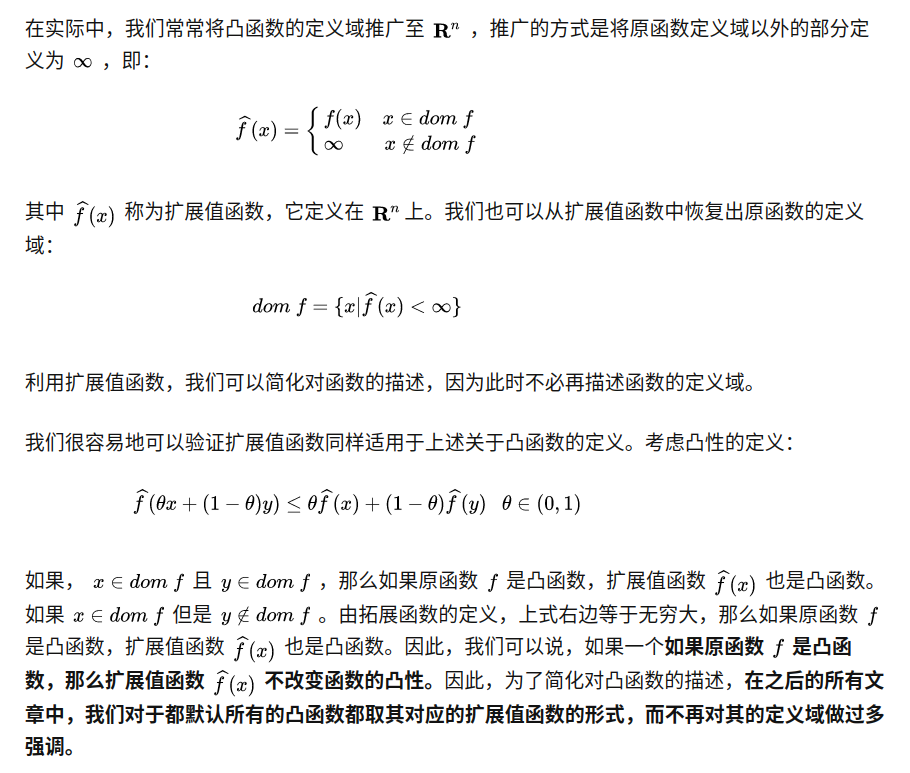

   但是这个扩展的性质只对 $\infin$有用。 如果不是 $\infin$ 就会变成和 1. 中的示性函数的例子那样(取1)，函数丧失凸性

3. 凸函数判定条件

    一阶条件

    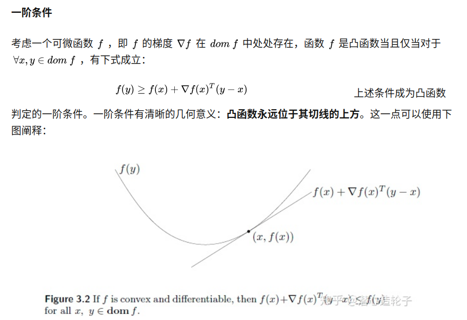
    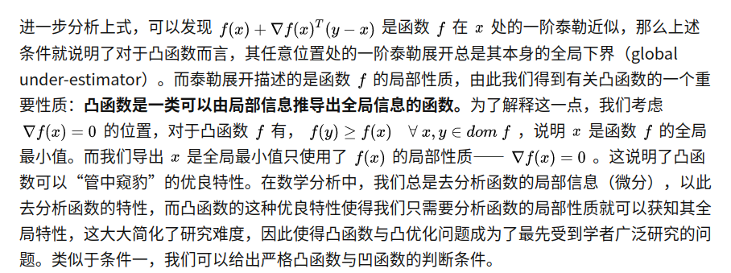

    这里同时也说明 f 的定义域必须是一个开集，如果是闭集在边界上不可微

    实际上，这个也是一个凸函数的定义

    二阶条件

    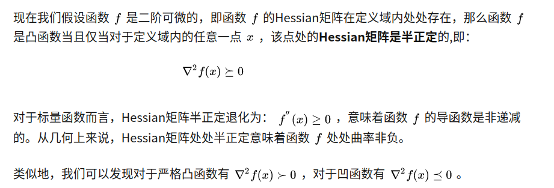

    ie. 二阶相关的凸函数

    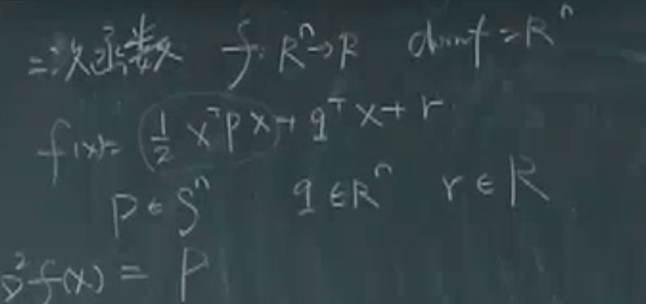

    为数不多的 严格凸和hessian 严格相关的函数

    第二个例子来了

    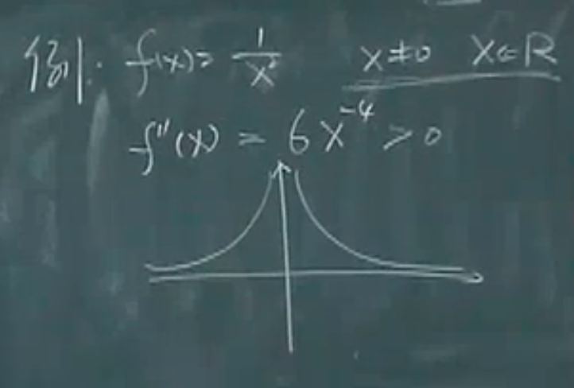

    这里为了说明，判别之前，最先确定的应该是，这个函数的定义域是不是一个是凸集

4. 一些常见凸函数

    标量:
    
    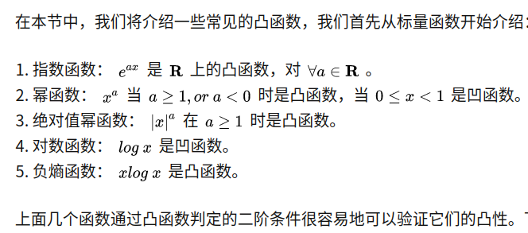

    矢量:
    
    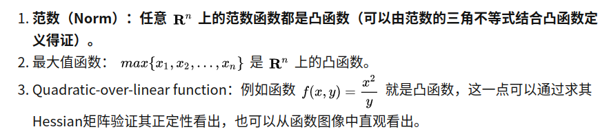
    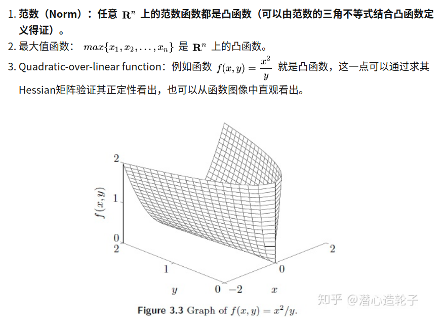
    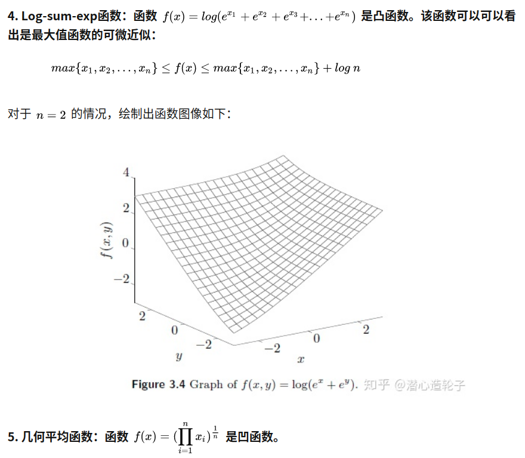
    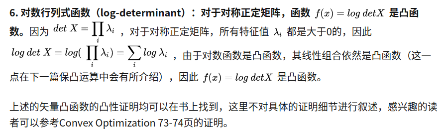

    注意,这里的log Det 函数应该是凹的，而不是凸的，这里截图里面的结论存在问题

    补充:
    
    仿射函数也是典型的凸函数

    范数:
    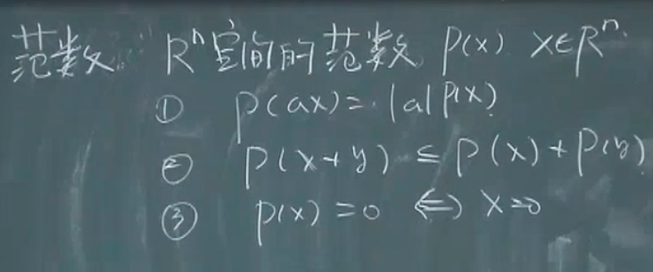

    特殊情况  零范数

    极大值函数
    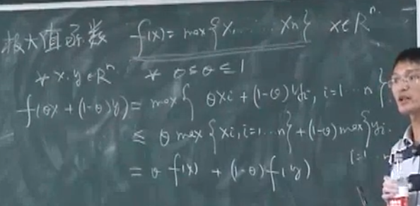

    极小极大(极大极小)问题都是凸函数所以大家都比较喜欢这类的问题
    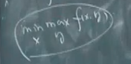

    感觉说了一个问题就是实际上我们是在把问题往一个比较好的问题上进行靠近

    但是因为极大值函数不可以求导的原因，所以需要进行解析逼近 使用 log-sum-exp函数
    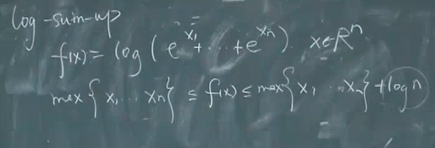

5. SubLevel Set 和 Epigraph
    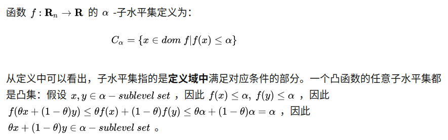

    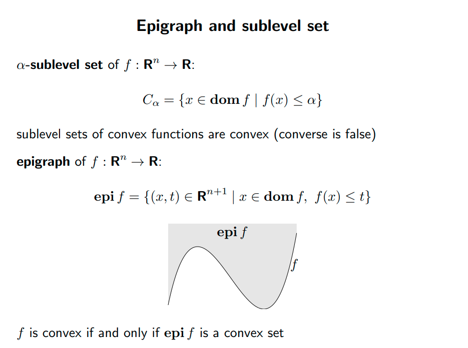

    注意，最后一句话，如果一个函数是一个凸函数的话，他的epigraph一定是一个凸集。

    可以找一个例子，让这个具体有一些几何的理解。

    