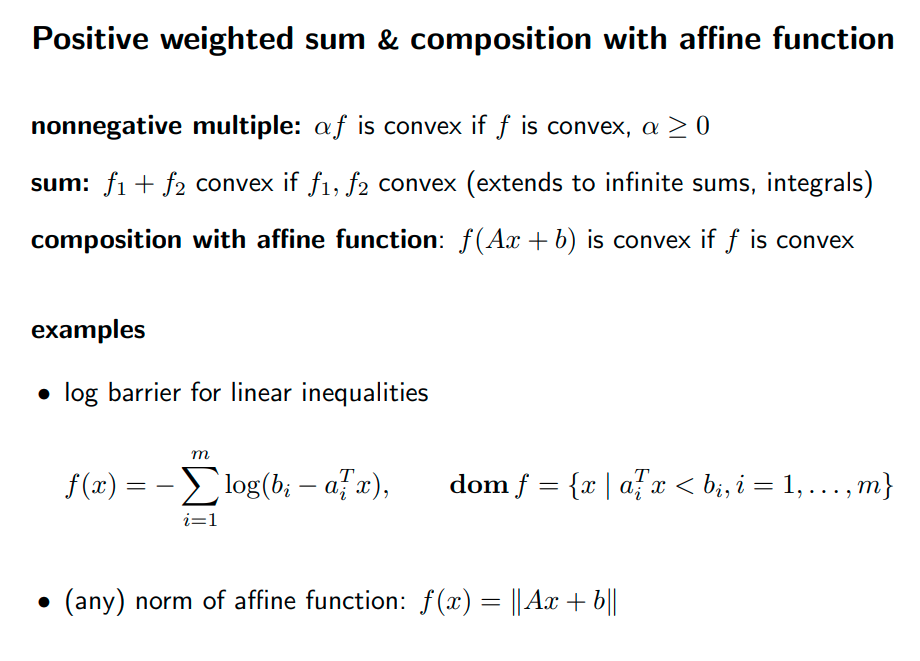
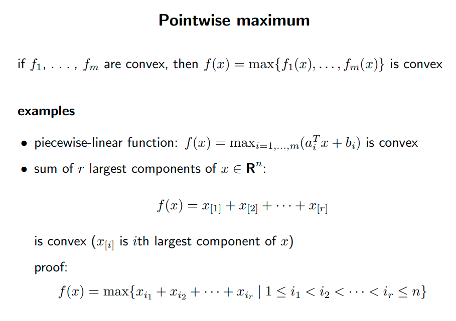
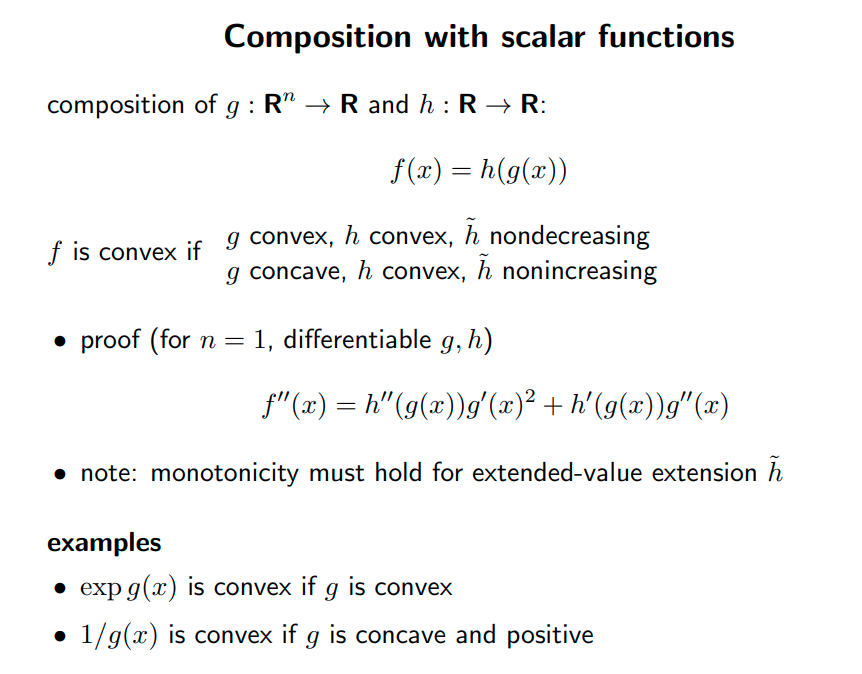
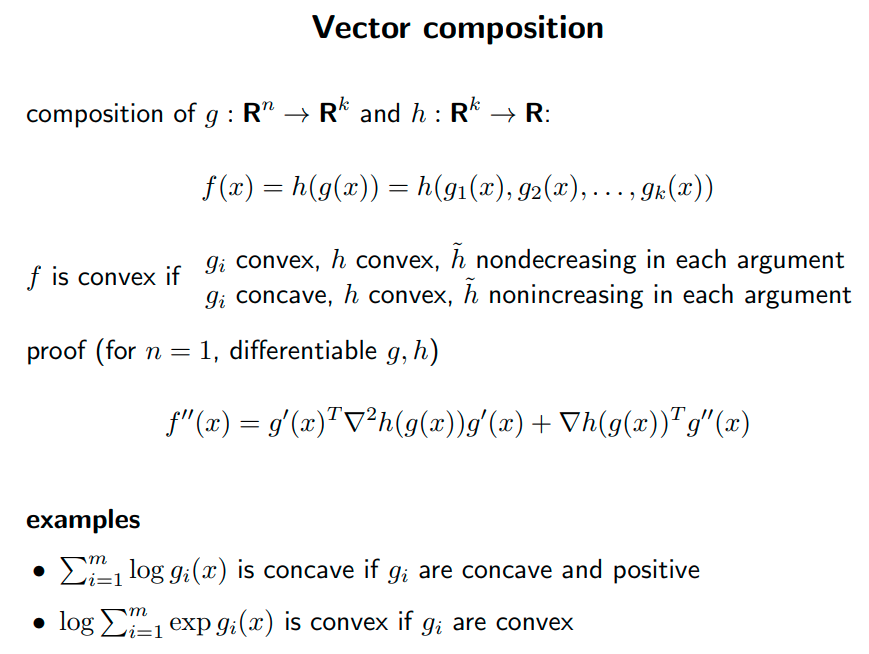
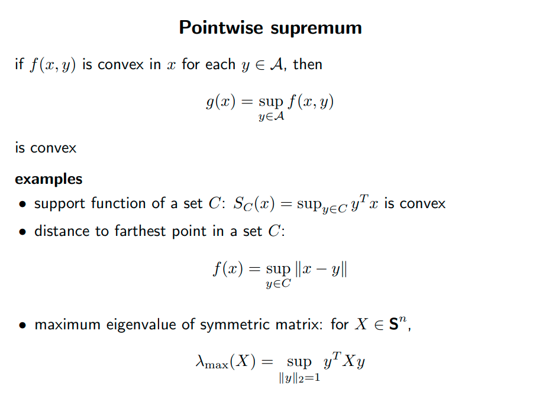
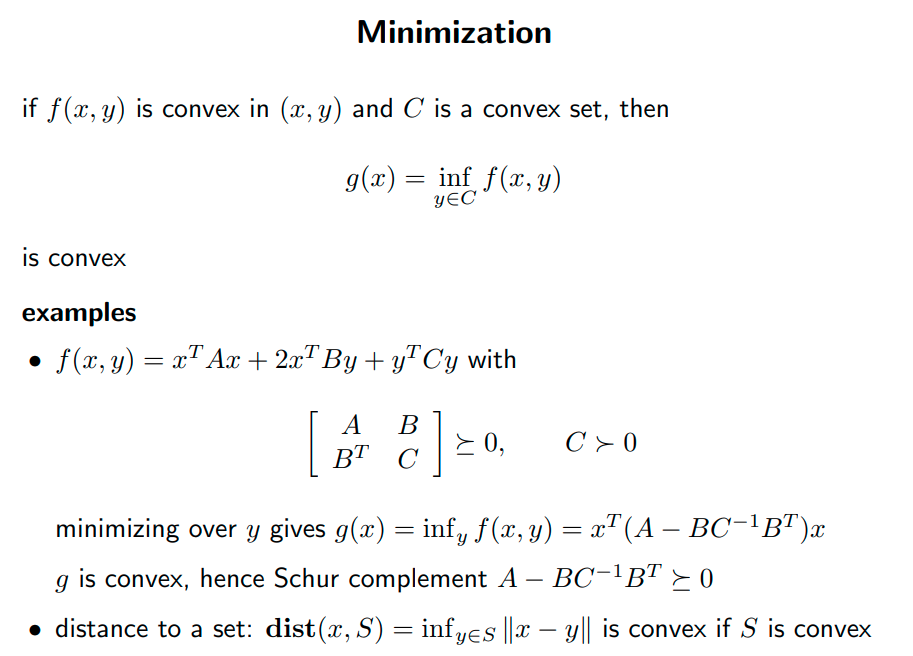
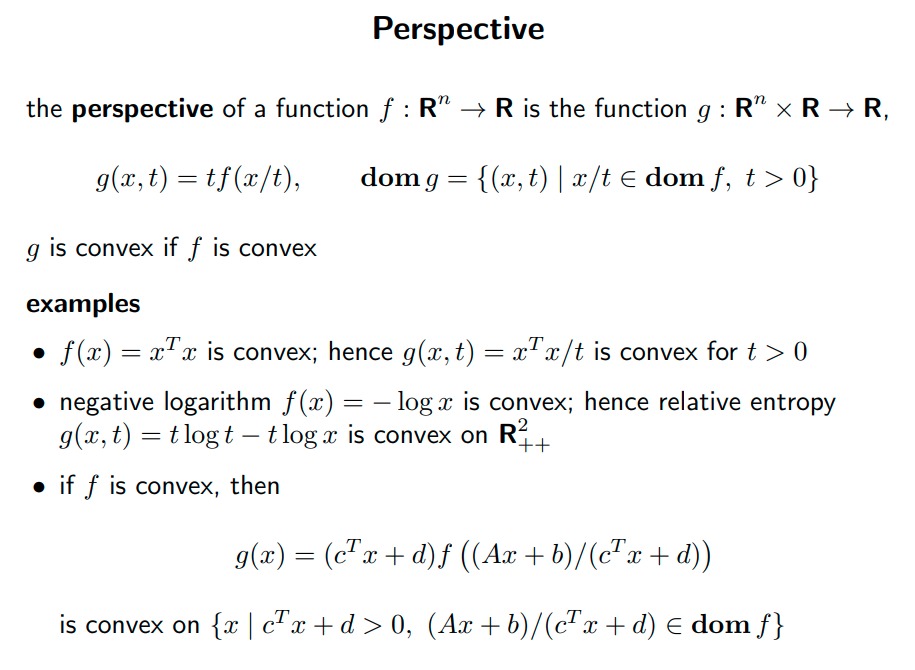

<!--
 * @Author: Liu Weilong
 * @Date: 2021-06-27 09:40:41
 * @LastEditors: Liu Weilong
 * @LastEditTime: 2021-06-27 10:14:08
 * @Description: 
-->
### 主要内容: 凸函数保凸运算

如何知道是一个函数是不是凸函数

1. 定义验证
2. 二阶导师的验证
3. 看看是不是由一些凸函数拼接而成

这里主要介绍是不是拼接而成

-----

1. 正数乘法、相加、仿射的composition

2. pointwise maximum

3. 和scalar function 的composition

4. 和vector function 的composition 

5. 最小上界、最大下界

   
6. 透视

