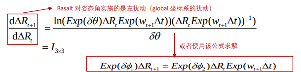
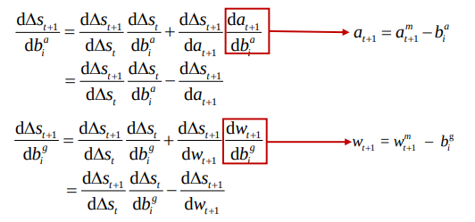

<!--
 * @Author: Liu Weilong
 * @Date: 2021-05-10 08:56:51
 * @LastEditors: Liu Weilong
 * @LastEditTime: 2021-06-12 08:12:56
 * @FilePath: /Codes/47. basalt/code_reading/imu.md
 * @Description: 
-->
### BASALT_IMU 代码过程
1. KeypointVioEstimator-> imu initialize() 进行初始化
   |__ 静止初始化
2. feed_imu
3. IntegratedImuMeasurement -> prograte
   |__ integrate()

 2021.3.10 添加  
如何正确理解 state 和 error state?
error state 是一种补充，也就是在state的存在噪声或者建模不佳的时候，对state 正确结果的补充内容。

可以说 state 是一个常量， 而 error state 是一个变量，包含均值和方差

所以我们在进行状态方差分析的时候，才会在 error state 上进行。 进一步讲 error state + state 才是 我们真实的state 变量

这个是从VINS 的预积分思想上进行的。

 2021.6.11 添加  
今天在突然的提起IMU 预积分之后，又重新回来看了一下。

发现确实对IMU 预积分的概念有了新的理解，有些时候没有把ba 和bw 放入状态方程，可能是因为ba 和bw 本身的变化已经非常小了。

而且作为一个一直不被置零的error state 存在也是可以的啊

这就和之前多传感器融合的课程联系到了一起

 2021.6.11 添加  
VIO的图优化感觉完全可以和ESKF一样进行理解。

以旋转预积分为例
$$
    \Delta R\delta \Delta R = R_iexp(\delta \theta_i)(R_jexp(\delta \theta_j))^Texp(n)
    \\
    \Delta R = R_i R_j^T
$$

$$
    R_i^T\Delta RR_j = \delta \Delta R
$$
得到观测的error state
然后建立起观测error和error state之间的关系
$$
    \delta \Delta R = exp(\delta \theta_i)exp(\delta \theta_j)^Texp(R_jn) 

    \\
    or
    \\
    \delta \Delta R = exp(R_j\delta \theta_i)exp(-R_j\delta \theta_j)exp(n)
    \\
    (exp(R_j\delta \theta_i)exp(-R_j\delta \theta_j))^T\delta \Delta R = exp(n)
$$
如果只是从MLE的框架下来看，在优化的过程中，就会不断迭代和重置$\delta \theta_i,\delta \theta_j$ ,方差取的也是IMU预积分的方差
这个过程和ESKF的过程基本是一致的。

感觉理解的还是有些问题。

VINS中保持bias 在error state  的操作和多传感器融合的ESKF的操作是一样的

BASALT并没有和VINS一样对bias 添加更新上的约束 VINS 是使用了一个bias 的随机行走的噪声当作先验。

### BASALT IMU 迭代
1. 状态迭代 就是正常的进行
   $$
    \Delta R_{t+1} =\Delta R_{t+\Delta t}= \Delta R_texp(\Delta t*\omega) \\
    \Delta R_{\frac{\Delta t}{2}+t} = \Delta R_t exp(\cfrac{\Delta t}{2}\omega)\\
    \Delta v_{t+1} = \Delta v_{t+\Delta t} = \Delta v_t + \Delta R_{\frac{\Delta t}{2}+t} a \Delta t\\
    \Delta p_{t+1} = \Delta p_{t+\Delta t} = \Delta p_t + \Delta v_t \Delta t + \cfrac{1}{2}\Delta R_{\frac{\Delta t}{2}+t} a \Delta t^2\\
    \Delta S = \left[
        \begin{matrix}
            \Delta R \\
            \Delta v \\
            \Delta p
        \end{matrix}
        \right]
   $$
2. 方差迭代
   $$
    \Delta S_{t+1} = f(\Delta S_t,\omega,a)\\
    \Delta S_{t+1} + \delta \Delta S_{t+1} = f(\Delta S_t + \delta \Delta S_t,\omega+\delta \omega , a + \delta \omega)\\
    \delta \Delta S_{t+1} = \cfrac{\partial f(\Delta S_t,\omega,a)}{\partial \Delta S}\delta \Delta S_t + \cfrac{\partial f(\Delta S_t,\omega,a)}{\partial \omega}\delta \omega +
    \cfrac{\partial f(\Delta S_t,\omega,a)}{\partial a}\delta a
   $$

   JACOBIAN $\Delta S$: 
    
   $$
   \begin{aligned}
    \left[
        \cfrac{\partial f(\Delta S_t,\omega,a)}{\partial \Delta S}
        \right]
        &= 
        \left[
        \begin{matrix}
            \cfrac{\partial f(\Delta S_t,\omega,a)}{\partial \Delta p}\\
            \cfrac{\partial f(\Delta S_t,\omega,a)}{\partial \Delta v} \\
            \cfrac{\partial f(\Delta S_t,\omega,a)}{\partial \Delta R}
       
        \end{matrix}
            \right]^T
    \end{aligned}
    $$
    Position:
    $$
    \begin{aligned}
    \cfrac{\partial f(\Delta S_t,\omega,a)}{\partial \Delta p} &=
     \left[
        \begin{matrix}
            \cfrac{\partial \Delta p_{t+1}}{\partial \Delta p_t}\\
            \cfrac{\partial \Delta v_{t+1}}{\partial \Delta p_t} \\
            \cfrac{\partial \Delta R_{t+1}}{\partial \Delta p_t}
       
        \end{matrix}
            \right]
            =
             \left[
        \begin{matrix}
            I ^{3×3}\\
            0 ^{3×3}\\
            0^{3×3}
        \end{matrix}
            \right]    
   \end{aligned}
   $$   
   Velocity:
    $$
    \begin{aligned}
    \cfrac{\partial f(\Delta S_t,\omega,a)}{\partial \Delta v} &=
     \left[
        \begin{matrix}
            \cfrac{\partial \Delta p_{t+1}}{\partial \Delta v_t}\\
            \cfrac{\partial \Delta v_{t+1}}{\partial \Delta v_t} \\
            \cfrac{\partial \Delta R_{t+1}}{\partial \Delta v_t}
       
        \end{matrix}
            \right]
            =
             \left[
        \begin{matrix}
            I ^{3×3} \Delta t\\
            I ^{3×3}\\
            0^{3×3}
        \end{matrix}
            \right]    
   \end{aligned}
   $$   
   Rotation 左乘更新:
$$
    \begin{aligned}
    \cfrac{\partial f(\Delta S_t,\omega,a)}{\partial \Delta R} &=
     \left[
        \begin{matrix}
            \cfrac{\partial \Delta p_{t+1}}{\partial \Delta R_t}\\
            \cfrac{\partial \Delta v_{t+1}}{\partial \Delta R_t} \\
            \cfrac{\partial \Delta R_{t+1}}{\partial \Delta R_t}
       
        \end{matrix}
            \right]
            =
             \left[
        \begin{matrix}
            - \cfrac{1}{2} \Delta t^2 [\Delta R_{\frac{\Delta t}{2}+t} a]^×\\
            -\Delta t [\Delta R_{\frac{\Delta t}{2}+t} a]^×\\
            I^{3×3}
        \end{matrix}
            \right]    
   \end{aligned}
   $$   
2021.5.10添加 
之前，关于ESKF 如何更新的问题，现在逐渐变得清晰 

如果 error state 是左乘在 state 进行误差状态分析，那么更新的时候进行左乘。

如果上面是右乘，那么更新的时候就进行右乘。

好像不太对啊！！ 之后还是要再看看

发现了一个很不同的地方

和我想的求导不太一样
我的想法
$$ 
\cfrac{d\Delta R_{t+1}}{d\Delta R} = \cfrac{In(exp(\delta \theta) \Delta R_t exp(\omega \Delta t))-In( \Delta R_t exp(\omega \Delta t))}{\partial \delta \theta}\\
=J_l^{-1}(\Delta R_t exp(\omega \Delta t))
$$
这样的话差的就有点大了
存疑，之后去问一下

   

Tips: 经过观察 BASALT 的 state 的存储顺序应该是 

Position Rotaion Veloctiy

JACOBIAN $a$:
$$
    \begin{aligned}
    \left[
        \cfrac{\partial f(\Delta S_t,\omega,a)}{\partial a}
        \right]
        &= 
        \left[
        \begin{matrix}
        \cfrac{\partial \Delta p_{t+1}}{\partial a}\\
            \cfrac{\partial \Delta v_{t+1}}{\partial a} \\
            \cfrac{\partial \Delta R_{t+1}}{\partial a}
       
        \end{matrix}
            \right]
        =\left[
        \begin{matrix}
        0.5 \Delta R_{\frac{\Delta t}{2}+t}\Delta t ^2\\
            \Delta R_{\frac{\Delta t}{2}+t}\Delta t \\
            0^{3×3}
       
        \end{matrix}
            \right]
    \end{aligned}
$$

JACOBIAN $\omega$
$$
    \begin{aligned}
    \left[
        \cfrac{\partial f(\Delta S_t,\omega,a)}{\partial \omega}
        \right]
        &= 
        \left[
        \begin{matrix}
        \cfrac{\partial \Delta p_{t+1}}{\partial \omega}\\
            \cfrac{\partial \Delta v_{t+1}}{\partial \omega} \\
            \cfrac{\partial \Delta R_{t+1}}{\partial \omega}
       
        \end{matrix}
            \right]
    \\
    \cfrac{\partial \Delta p_{t+1}}{\partial \omega} & = \cfrac{\partial 0.5 \Delta R_{\frac{\Delta t}{2}+t}a\Delta t^2}{\partial In(\Delta R_{\frac{\Delta t}{2}+t})} \cfrac{\partial In(\Delta R_{\frac{\Delta t}{2}+t})}{\partial 0.5\omega\Delta t}\cfrac{\partial 0.5\omega\Delta t}{\partial \omega}
    \\
    &中间的jacobian使用左乘模型
    \\
    & = -0.5\Delta t^2 [\Delta R_{\frac{\Delta t}{2}+t}a]^××J^{-1}_r(In(\Delta R_{\frac{\Delta t}{2}+t}))exp(-0.5\omega\Delta t)×0.5\Delta t  
    \end{aligned}
$$
中间 的jacobian 使用右乘模型+ 有点奇怪的求导方式

需要之后去确认一下。

考虑 bias

### 遗留问题
1. Bias 的求导,Bias的方差没有进行迭代啊
2. 位姿图优化的问题 位姿图优化测试
3. 误差参数是不是随处可放，也就是随意左乘右乘都可以   整个似乎只要不是变量的问题，其他都可以
4. D-EKF的问题

----------
1. Bias的遗留问题
   
   Bias 并没有，在误差状态分析的时候进行。

   所以这里进一步添加上
   $$
    \Delta S_{t+1} + \delta \Delta S_{t+1} = f(\Delta S_t+ \delta \Delta S_,\omega + \delta \omega- b_{gt} ,a + \delta a- b_{at})
    \\
    \Delta S_{t+1} + \delta \Delta S_{t+1} = f_0 + \cfrac{\partial f(\Delta S_t,\omega,a)}{\partial \Delta S}\delta \Delta S_t + \cfrac{\partial f(\Delta S_t,\omega,a)}{\partial \omega}\delta \omega +
    \cfrac{\partial f(\Delta S_t,\omega,a)}{\partial a}\delta a \\+\cfrac{\partial f(\Delta S_t,\omega,a)}{\partial \omega}\cfrac{\partial \omega + \delta \omega- b_{gt}}{\partial b_{gt}}b_{gt}+ \cfrac{\partial f(\Delta S_t,\omega,a)}{\partial a} \cfrac{\partial a + \delta a- b_{at}}{\partial b_{at}}b_{at}
   $$
    其实到了这一步，基本可以确定，在优化的过程中是为了调整 
    $\Delta S_{t+1}$ 来对 $\delta \Delta S_{t},b_{gt} ,b_{at}$来进行调整。
    
    $\Delta S_{t+1}$ 已经变成了$\Delta S$的微小增量

    当存在多层迭代的时候， 这里我们假设只有
    
    $$
        \Delta S_{t+2} + \delta \Delta S_{t+2} = f(\Delta S_{t+1}+ \delta 
        \Delta S_{t+1},\omega + \delta \omega- b_{gt+1} ,a + \delta a- b_{at+1})
        \\
        \delta \Delta S_{t+2} = \cfrac{\partial f(\Delta S_{t+1},\omega,a)}{\partial \Delta S_{t+1}}\delta \Delta S_{t+1} + \cfrac{\partial f(\Delta S_{t+1},\omega,a)}{\partial \omega}\delta \omega +
        \cfrac{\partial f(\Delta S_{t+1},\omega,a)}{\partial a}\delta a\\
        +\cfrac{\partial f(\Delta S_{t+1},\omega,a)}{\partial \omega}\cfrac{\partial \omega + \delta \omega- b_{gt+1}}{\partial b_{gt+1}}b_{gt+1}+ \cfrac{\partial f(\Delta S_{t+1},\omega,a)}{\partial a} \cfrac{\partial a + \delta a- b_{at+1}}{\partial b_{at+1}}b_{at+1}
    $$

    $\delta \Delta S_{t+1}$ 可以再次展开。然后又因为在一段时间我们假设存在$b_{a/gt+1} = b_{a/gt}$ 所以最后 $\delta \Delta S_{t+n}$ 可以重新写为了 和 $\delta \Delta S_t , b_{gt},b_{at}$ 有关的公式，这样就可以进行优化调整了。

    对应:
    

    并且因为$\Delta S_t$ 不含有b_gt 所以 $\cfrac{\partial \delta \Delta S_t}{b_gt}=0$，这也是为什么初始化是这样。

    以上所有的过程，其实只是为了说明白一个过程，也就是本质上进行优化实际上是在对$\delta \Delta S_t , b_{gt},b_{at}$ 的均值进行优化调整。然后$\delta \Delta S_t , b_{gt},b_{at}$ 又会被并入原始的state 继续进行优化。

    这在本质上，打通了为什么 bias 要对 error_state 而不是 state 进行求导的错误理解。

    这个过程本质上，是和ESKF的更新之后进行原状态量合并是一样的，在进行BA 优化的时候，完全可以按照这个思想进行理解,并且很多问题都讲得通了。

    还有一个问题就是 既然$\delta \Delta S_t$ 使用 $b_{gt},b_{at}$的关系进行调整，那么为什么别的？？？？ 也就是优化的时候，为什么只使用了  $b_{gt},b_{at}$ 的 Jacobian?? 
    
    因为说的到底，这是一个预积分的形式，所以和 初始状态没有关系。在实际看代码的时候，也可以发现这一点也就是，所有内$\Delta S$ 就是从0 开始迭代和任一时刻的位姿都没有关系(预积分的含义) 所以真正本质上需要进行估计的就是 imu 的固有状态 bias

    加速度的去除需要看一下:

    最后发现重力是游离在预积分外面的，最后整合的时候才重新放到了一起，所以在预积分传播过程当中就完全和外在姿态隔离开了
    
    让我重新理解了误差状态分析的意义。

2. 位姿图优化测试
   
   这里主要是为了测试一个奇怪的位姿图优化。
   如果真的可以这样，那样在做位姿i图优化的时候，很多内容就都可以省略了。

    发现了一个很不同的地方
    
    和我想的求导不太一样
    我的想法
    $$ 
    \cfrac{d\Delta R_{t+1}}{d\Delta R} = \cfrac{In(exp(\delta \theta) \Delta R_t exp(\omega \Delta t))-In( \Delta R_t exp(\omega \Delta t))}{\partial \delta \theta}\\
    =J_l^{-1}(\Delta R_t exp(\omega \Delta t))
    $$

