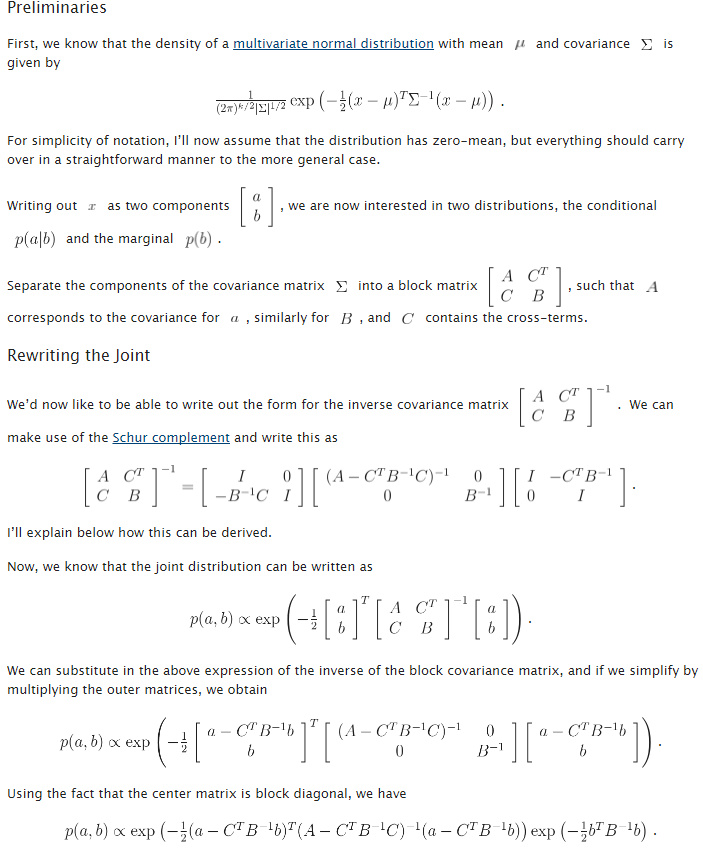

<!--
 * @Author: Liu Weilong
 * @Date: 2021-06-12 23:00:42
 * @LastEditors: Liu Weilong
 * @LastEditTime: 2021-06-13 21:23:55
 * @Description: 
-->
### 主要内容
BASALT的边缘化
1. BASALT 边缘化的小tips
2. Permutation Matrix 进行换行换列
3. Schur Complement 进行实际上的边缘化操作

----

1. BASALT 边缘化的小tips
   首先是frame_states 代表的意思是滑窗内部的帧 他们的状态包含了 position rotation vel 和 bias
   marg 的时候，如果这个frame state 是KF 那么他在marg 的时候 position rotation 会被保留下来， vel 和bias 会被marg掉。
               如果这个frame state 不是KF，那么position rotation vel 和bias 都会被marg 掉
   然后是frame_poses 代表的就是 是 KF 的frame_states 保留下来的结果 (只有position 和rotation)
   如果这个要marg 就会直接都被marg 掉

2. Permutation Matrix 换行换列操作。
   
   因为状态的存储方式是 postion rotation vel bias(滑窗内部的frame_state) position rotation(之前就已经存在的marg prior)
   为了让需要marg 的参数，排在一起，保留的参数排在一起，并且需要保持矩阵的对称性质，所以出现了这个换列换行的操作

    原式
    $$
        Hx = b
    $$
    H 是的信息矩阵 ，b是信息向量

    P 是permutation matrix ，也就是用来交换行(or或者列的矩阵)

    首先是为了让需要保留的参数放到一起，也就是改变x的次序，这里直接做的是更改H的列顺序。

    从解方程的角度来看，交换列并不影响最后的结果(也就是b)，但是影响最后求解出x 的对应顺序，因此可以通过这种方式在来间接更改优化参数的次序。

    写成式子就是如下形式。
    $$
        HPx=b
    $$

    但是因为这样单独的移动会破坏 H 的对称性，所以需要，再做如下操作

    $$
        P^THPx = P^Tb
    $$

    到这里也就完成了Permutation Matrix 的换行换列的目的

3. Schur Complement 进行实际上的边缘化操作

    
    $$
    p(a|b) \sim N(a-C^TB^{-1}b,A-C^TB^{-1}C)
    $$

4. Basalt 真的有FEJ吗？
   
   是有FEJ的，也就是说，一个状态量在线性化的时候，仅有一个点在起作用。所以才会有是不是linearized 的问题。

   在先验和各种参差里面使用的线性化点都是同一个，这就保证了FEJ