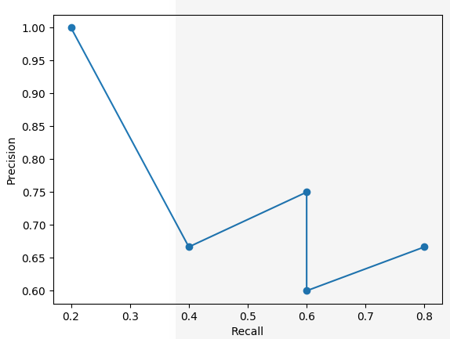

<!--
 * @Author: Liu Weilong
 * @Date: 2021-06-05 23:30:17
 * @LastEditors: Liu Weilong
 * @LastEditTime: 2021-06-06 23:50:05
 * @Description: 
-->
1. 分类:
   
    是否基于锚框|方法大类|算法名|
    ----|----|----
    基于锚框|单阶段法|a. OverFeat b. SSD   c. RetinaNet d.RefineDet|
    基于锚框|多阶段法|a. R-CNN b.Fast RCNN c. FPN  d. R-FCN  e.Mask RCNN  f.NAS-FPN  g. Cascade RCNN |
    无需锚框|关键点法|a. CornerNet  b. ExtremeNet  c. CenterNet|
    无需锚框|中心域法|a. FSAF  b.FCOS  c. FoveaBox  d. YOLO|

2. 计算
   
    精度|召回率|漏捡率|阈值
    ----|---|---|-----
    0.66667|0.8|0.2|>=0.85
    0.6|0.6|0.4|>=0.87
    0.75|0.6|0.4|>=0.9
    0.66667|0.4|0.6|>=0.91
    1|0.2|0.8|>0.91
    
    