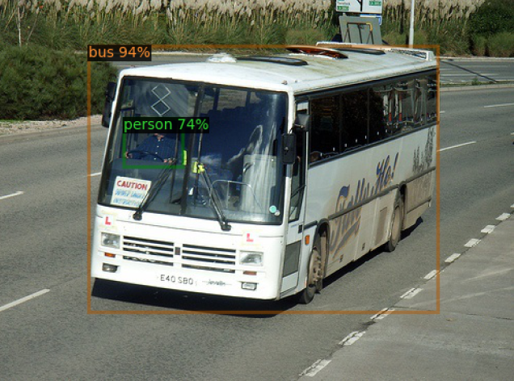
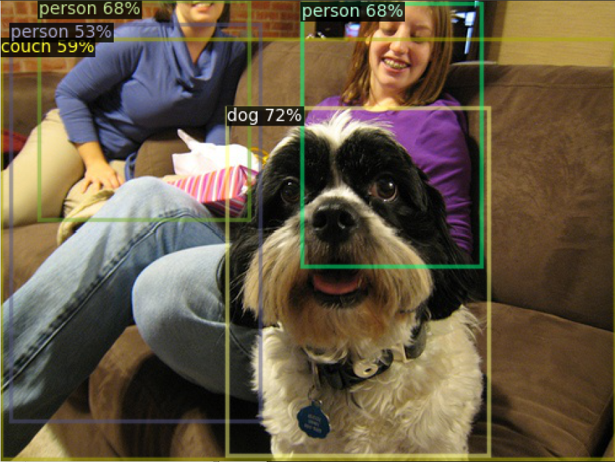
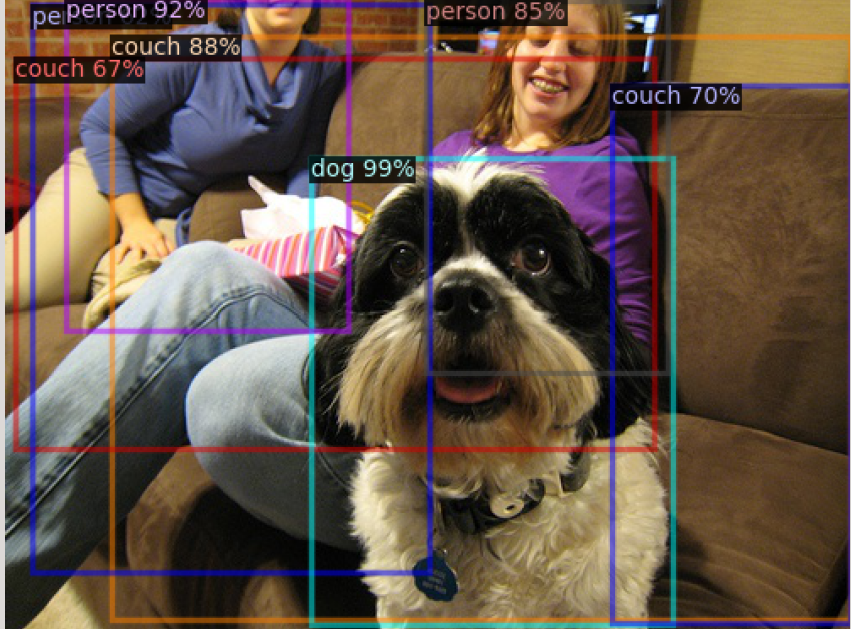
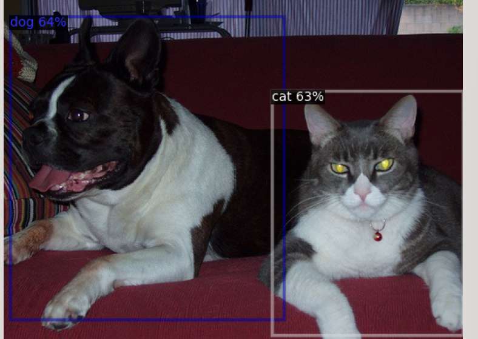
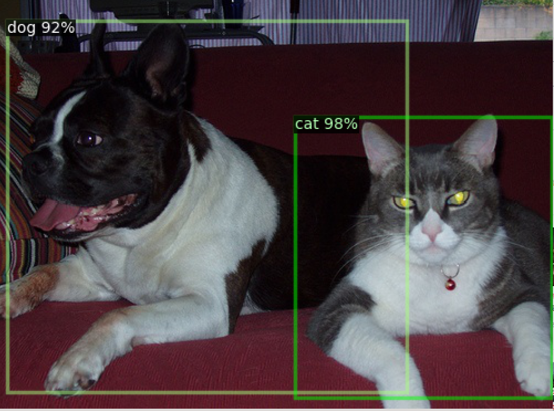
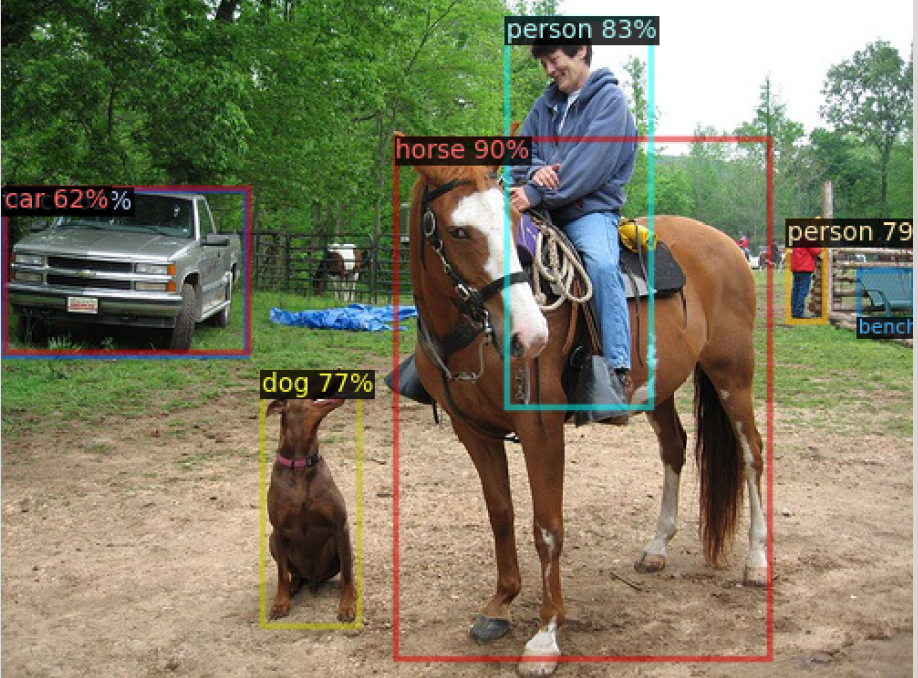
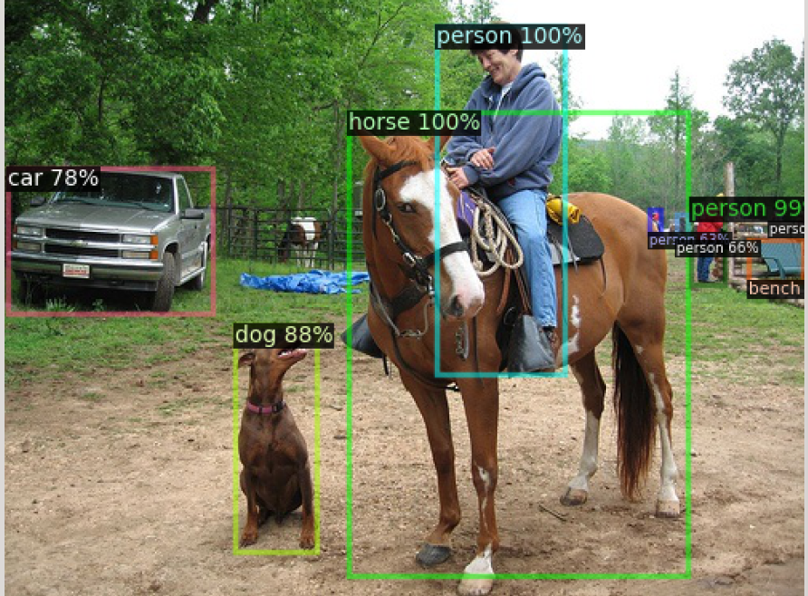

<!--
 * @Author: Liu Weilong
 * @Date: 2021-06-15 21:12:19
 * @LastEditors: Liu Weilong
 * @LastEditTime: 2021-06-16 21:53:57
 * @Description: 
-->
### 结果对比
RetinaNet|FastRCNN
----|-----
|
|
|
|
|

FastRCNN 精度更高

### Evaluation 结果
FasterRCNN
 
RetinaNet

对比官方数据 FasterRCNN 37.9 RetinaNet 37.4 
结果符合