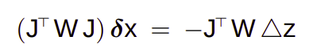
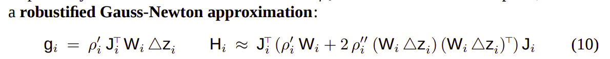
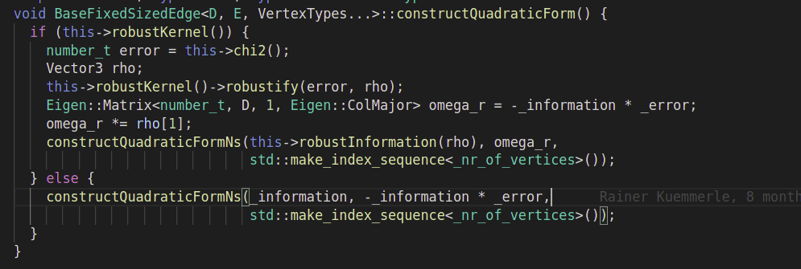
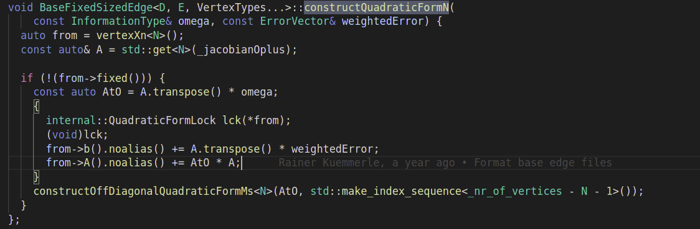

## 关于如何加入Robust Kernel
### g2o
1. 相关内容: 调用了robustify 的部分

    constructQuadraticForm
    activeRobustChi2
    RobustifyError        没有找到相关的定义

2. activeRobustChi2       
   
    目前看来内部就是使用 robust kernel 求解了一下,并取出rho[0]，之后的求导并没有使用

3. constructQuadraticForm

    计算出rho 之后，继续调用constructQuadraticFormNs
    constructQuadraticFormNs 再次调用constructQuadraticFormN

    目前认为 g2o 的内部构建近使用了一阶求导,省略了二阶导

### 具体公式

GN 算法的一般形式
    
GN 算法的鲁棒核形式
    

目前认为g2o 写的是省略到二阶导的方法
    
    

### 具体实现准备先按照g2o的来