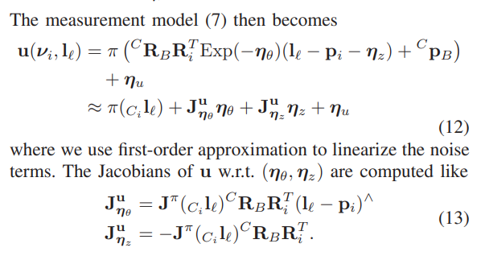
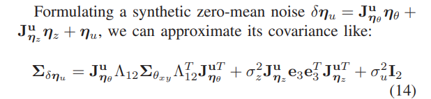

<!--
 * @Author: Liu Weilong
 * @Date: 2021-01-05 09:57:00
 * @LastEditors: Liu Weilong
 * @LastEditTime: 2021-05-21 08:44:24
 * @FilePath: /3rd-test-learning/doc/SLAM-related/se2lam/theory.md
 * @Description: 
-->

### SE2XYZ边
其实，是从侧面再次说明了那六个公式的作用。 
实际上和./19. sensor_funsion_hw/hw6_imu_wheel/IMU_Wheel.md一致，我们在这里就再次推导一下 

a. 明确图优化理论
$$
    \begin{aligned}
    \operatorname{max}(p(x|z))&= \operatorname{max}(p(z|x)p(x))
    \end{aligned}
$$
$p(z|x)$ 符合高斯分布
观测公式一般可以写成
$$
z = f(x) = f_0(\hat{x})+J^{f}_x(x-\hat{x})
$$
这里的z是可以从x推出的理想z 
当x模型存在噪声(noise)或者模型不完美(bias)的的时候 
$$
    z+\delta{z} = f(x+\delta{x})
$$
放入概率公式之后
$$
    \begin{aligned}
    ln(p(z|x)) &= (z+\delta{z} -z)^{T}\Sigma^{-1}(z+\delta{z} -z)
    \\
    &=  (z_{meas} -z)^{T}\Sigma^{-1}(z_{meas} -z)
    \end{aligned}
$$
$\Sigma$ 就是 $\delta{z}$ 的方差
$z_{meas}$ 来自传感器的观测
$z$ 就是包含待优化真值的$f(x)$

在实际进行，图优化的时候，我们需要明确的有 
-> 传感器公式 $f(x)$ 用于构建优化和误差分析 
-> 明确 $f(x)$ 存在哪些噪声和模型不完美 
-> 传感器误差分析出 $\Sigma$ 用于优化的方差  

b. SE2XYZ边的推导 
b.1. 真值推导 
$$

    uv = \pi(R^c_{bi}R^{bi}_w(l_w-p_w)+t^{c}_b)

$$
b.2. 真实分析 
误差主要是在$R^{bi}_w$ 、 $p_w$、$uv$ 上
具体见公式 
真值 
$$
    R^{bi}_w = Exp(\theta_z×e_3)
    \\
    p_w = [x,y,0]^{T}
$$
真实:考虑颠簸 
这里的情况主要是 se2到se3 的转换存在模型不完美
$$
\begin{aligned}
    R^{bi}_w &= Exp(\theta_z×e_3 +\delta{\theta_x}×e_1 + \delta{\theta_y}×e_2)
    \\
    &\approx Exp(\theta_z×e_3)Exp(\delta{\theta_x}×e_1 + \delta{\theta_y}×e_2)
    \\
    p_w &= [x,y,0]^{T} +[0,0,\delta{z}]^{T}
\end{aligned}
$$

b.3. 误差分析 

最后的$\Sigma$

总结一下: 
se2lam 的地面约束添加是在混合在了重投影误差当中的，坐标使用SE2进行表示。 
最终修改的是重投影误差的方差。 

2021.1.6 添加 
今天开会的时候，对这篇论文中的误差分析进行了思考。 
想到了为什么自己对于这个内容的理解感觉有些抗拒 
a. 对于误差的分析，这里的分析是存在问题的 
   这种递推类的误差分析，对于真实情况的考虑，这里非常直接只修正了模型上的不完美，也就是给Roll Pitch z 添加了一个0均值的抖动。 
   但是忽略了原本状态量的误差。 
   这一点在 ESKF 进行误差分析的时候，就分析地更加完整。 
   这就是为什么看着别扭 
b. 当然可以直接解释为 Yaw X Y 的误差比较小，所以不考虑，但是这一点对于在 XY 平面上运动的机器人来说，很明显是说不通的。
 
2021.2.3 添加 
今天,重新思考之后，发现别人的推导是基于Forster 进行的。 
并且，我之前1.6号，说需要给自身加误差的想法，是有问题的从误差状态预测上来讲，Yaw X Y 的误差也不应该考虑的 

 2021.5.21 
重新思考之后，得到我认为真正正确的结果，ORB框架下 属于MLE 的优化范畴，所有没有先验的引入所以没有考虑。 Yaw XY 的误差。

但是一旦之后，使用MAP的框架，Yaw XY 的先验误差就必须考虑了

对比，另外两种加法， 
第一种 Quan Meixiang 2018 直接在SE3的roll pitch 和z上 进行约束 比较现实 
第二种 VINS on wheel 在roll pitch z 上进行约束之外，再加上对于运动平面进行估计 工程量比较大可以尝试 

