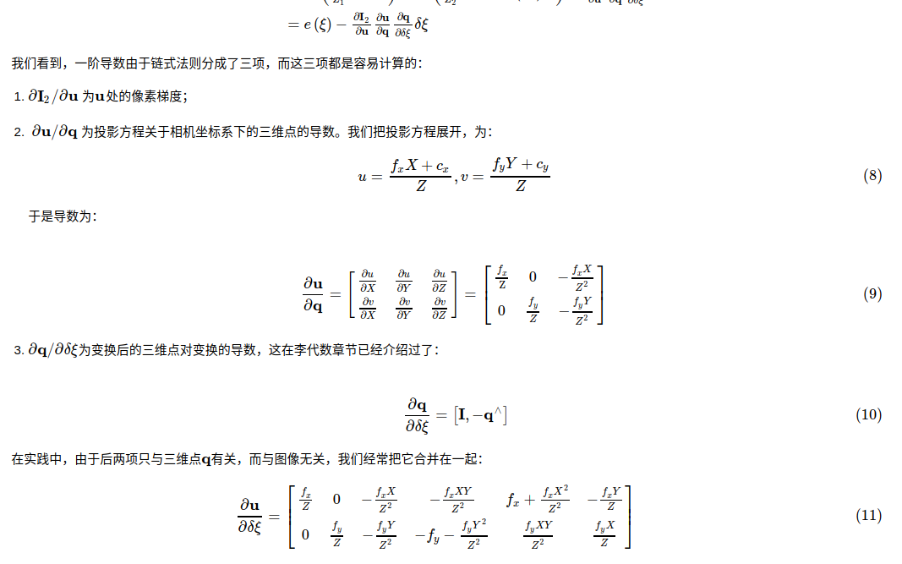

### ch5
1. Stereo
   双目深度估计
$$
    \cfrac{z(m)}{bl(m)} = \cfrac{f_x(pix)}{disparity(pix)}
$$
这里要注意内参矩阵中的 fx gy 其实就是焦距这个问题

### ch8
重新学习了一个Direct Method 
IMG1 和IMG2 这个时候 
IMG1 上的点是已经进行过三角化,最终构造出的方程实际上是

direct pesodu code
1. 得到IMG1 的角点和对应的深度
2. 对IMG1|IMG2 构建金字塔和其对应的焦距(fx\fy)
3. from high layer to low layer
        while(!converge condition)
            for each point1 from IMG1
                for each pixel from patch of point1 
                    buildDirectMethodResdiual 
            update $T^2_1$
4. 得到结果

direct method 公式 

$$
    \begin{aligned}
    &\underset{T}{\operatorname{argmin}} (I_1(u_1,v_1)-I_2(\cfrac{DKT^2_1p_1}{z_2}))\\
    = &\underset{\delta{T}}{\operatorname{argmin}}(I_1(u_1,v_1)\\&-I_2(\cfrac{DKT^2_1p_1}{z_2}))-\cfrac{\partial{I_2}}{\partial{u,v}}\cfrac{\partial{u,v}}{\partial{x_2,y_2,z_2}}\cfrac{\partial{x_2,y_2,z_2}}{\partial{\xi}}\delta{\xi})\\
    \end{aligned}
$$

这里需要注意的是 对 $T$ 求导的时候绕动模型是加在左边还是右边 
图中的绕动模型是加在右边. 

左边加扰动模型是
$$
    \cfrac{\partial{x_2,y_2,z_2}}{\partial{\xi}}\delta{\xi} = T^2_1[I,-[p_1]×]
$$

$p_1$ 代表 p1 坐标系1(IMG1)下三角化的坐标点

逻辑就是:通过修改$T^2_1$来在IMG2上,寻找和IMG1类型的位置 
一般使用会加上,金字塔\Patch\插值 来一起进行寻找. 
 并且相似的程度可以不仅仅是$I_1 - I_2$ 的方式，还有NCC SAD 等方式可以使用
具体见slambook2 ch8

LK 光流就只是 IMG1 和 IMG2 之间的匹配 

pesodu code
1. 得到IMG1和的其角点vP1
2. 对IMG1|IMG2 构建金字塔
3. 对vP1进行金字塔化即可
4. from high layer to low layer 
        while(!converge condition) 
            for each point1 from IMG1 
                for each pixel from patch of point1  
                    buildLKResdiual  
                update $\Delta{u}$ 和 $\Delta{v}$  
        update vP1 和 vP2 coordinate in a lower layer 
    
5. 统一vP1 在最低层上对应的vP2 完成匹配 得到结果

确定一下 patch 的匹配过程

LKresidual 公式 
$$
    \underset{u_2,v_1}{\operatorname{argmin}} (I_1(u_1,v_1)-I_2(u_2,v_2))\\
$$
