论文集来源
https://zhuanlan.zhihu.com/p/115599978/  吴艳敏

## 传统SLAM： 特征点、半直接、直接法

### Feasure_based

#### ORB-SLAM2/3

   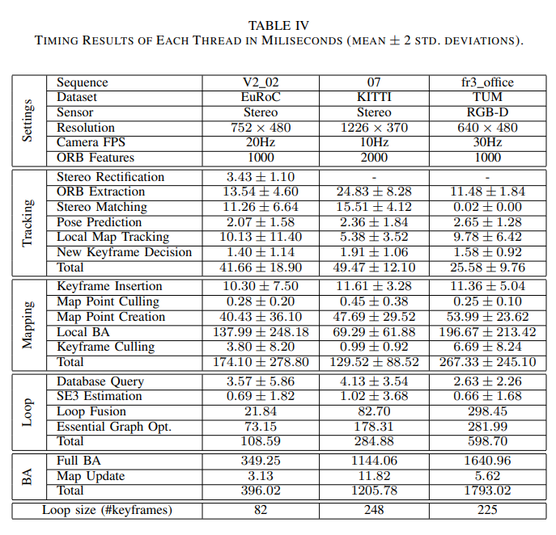

   因为比较熟悉了，所以只放开源地址。
   开源: 
   ORB2 的改进： 
   https://github.com/tiantiandabaojian/ORB-SLAM2_RGBD_DENSE_MAP 
   在高翔基础上添加了稠密闭环地图 
   https://github.com/gaoxiang12/ORB-YGZ-SLAM 
   使用SVO中直接法来跟踪代替耗时的特征点提取匹配，在保持同样精度的情况下，是原始ORB-SLAM2速度的3倍 
   https://github.com/gaoxiang12/ygz-stereo-inertial 
   双目VIO版本，加入了LK光流和滑动窗口BA优化 
   https://github.com/jingpang/LearnVIORB 
   京胖实现的VI-ORB-SLAM2 
   https://github.com/Jiankai-Sun/ORB_SLAM2_Enhanced 
   添加保存和导入地图功能 
   https://github.com/AlejandroSilvestri/osmap 
   添加保存和导入地图功能 
   https://github.com/atlas-jj/ORB_Line_SLAM 
   添加了线特征 
   https://github.com/maxee1900/RGBD-PL-SLAM 
   添加了点线融合 
   Good Feature Selection for Least Squares Pose Optimization in VO/VSLAM 
   https://github.com/ivalab/gf_orb_slam2 
   使用了一种更好的特征选择方法 
   YOLO Dynamic ORB_SLAM 
   https://github.com/bijustin/YOLO-DynaSLAM 
   用YOLO来做动态环境的检测

#### S-PTAM(双目 PTAM) 

   S-PTAM: Stereo Parallel Tracking and Mapping
   
   摘要： 
   1.对多种环境鲁棒：室内、室外、动态物体、光环境、大回环、高速运动 
   2.对多种Feature和Descriptor的测试。 
   3.一种新的初始化方法

   内容： 
   1.特征点测试了多种 
   2.DeadReckon+PnP 前端 ScanToMap 
   3.Local Map BA ScanToMap 
   4.回环BoWds(Apperance) + P3P+内点数量检测(Geometric Verification) 
   5.相关实验结果： 
   Feature 和 Descriptor 计算时间
   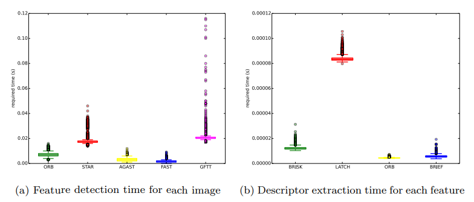
   Error 和 特征提取量的关系
   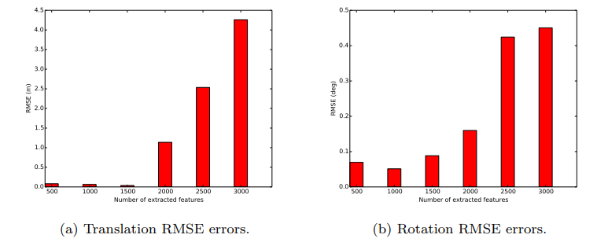

   总结： 
   中规中距的SLAM算法，对于所说的鲁棒性没有看到源码前，表示怀疑。 
   ORB 的提取速度已经意外的快了。 
   令人意外的是特征点的数量并不是越多越好，怀疑是引入误匹配的原因。 

   开源： 
   https://github.com/lrse/sptam

#### ARM‑VO (Mono)

   ARM‑VO: an efcient monocular visual odometry for ground vehicles
on ARM CPUs

   摘要： 
   在Rasperry 3B上，可以实时跑的VO。

   内容： 
   a.并行网格Fast特征提取 
   b.并行KLT追踪 
   c.特征点矫正 
   d.F和H+RANSAC+GRIC[1](模型选择) 这里选的是一个rough H 
   e.H的快速estimation[2] 
   f.多线程RT验证 
   g.Scale resolving 没看懂

   实现： 
   a.KLT 用 OpenCV 有Neon C 加速 TBB 
   b.FAST 从 OpenCV 的SSE2 换成NEON Fast Threshold 是15 TBB 
   c.H 计算和check OpenMP 
   d.对OpenCV源代码进行了更改,删除 check 和 double->float

   效果：
   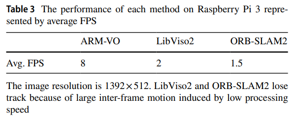
   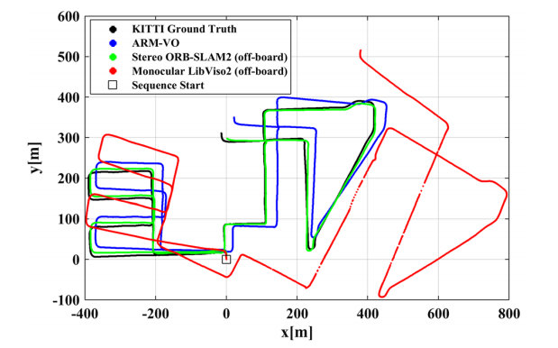

   引用： 
   [1]GRIC：An assessment of information criteria for motion model
selection. In: 1997 IEEE Computer Society Conference on Computer Vision and Pattern Recognition. Proceedings. IEEE 
   [2]Márquez-Neila, P., et al.: Speeding-up homography estimation
in mobile devices. J. Real Time Image Process. 

   总结： 
   速度快，但是精度有限。GRIC用于选择HF模型需要看一下

   开源： 
   https://github.com/zanazakaryaie/ARM-VO

### Semi-Direct

#### SVO/SVO2 (Mono/Stereo、SVO2 有机会精读一下)
   
   SVO: fast semi-direct monocular visual odometry SVO  
   SVO: Semi-Direct Visual Odometry for Monocular
and Multi-Camera Systems 

   摘要： 
   SVO1 FASTFeature + PLK 
   1. 后端的深度估计器
   SVO2 比SVO1 添加了 
   1. 一个edgelet 的特征，但还是继续使用光流进行跟踪
   2. IMU Piror 误差项
   
   内容： 
   a. 栅格FAST提取 (网友说有提取策略有一些问题) 
   b. Direct法 构建光度误差进行匹配(网友说初始化有光流) 
   c. FrameToFrame 之后 FrameToMap (一个inverse_xxx 的操作 计算Jacobian加速) 
   d. 因为单木的尺度未知，在地图线程有一个深度滤波(难点，网友说深度不容易收敛)

   开源: 
   https://github.com/HeYijia/svo_edgelet  
   贺一家修改的SVO 版本 添加 Edgelet 
   https://github.com/uzh-rpg/rpg_svo_example  
   用于SVO2.0 的使用 SVO2.0 只有Binary文件 
   https://github.com/uzh-rpg/rpg_svo  
   SVO1.0 阉割版源码 

   Tips: 
   网友修改过后的SVO1.0 还是有潜力的
   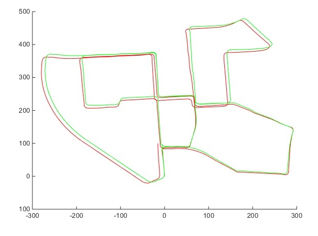
   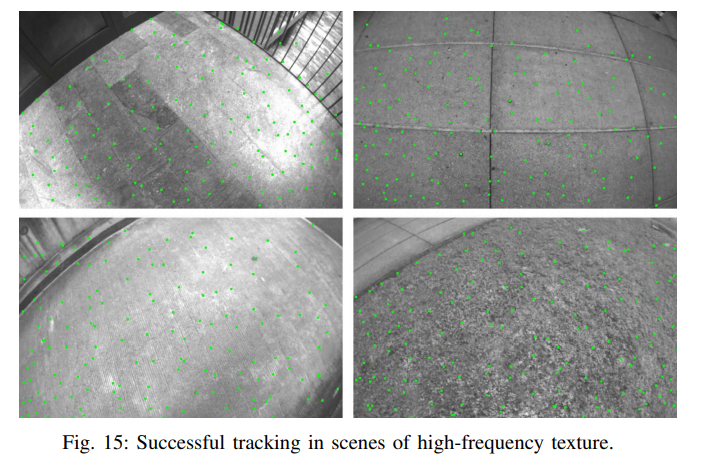
   1. 看论文效果感觉也不是完全的栅格提取
   2. Mapping 的概率点更新的方式 需要进行修改
   
   总结： 
   不知道SVO 的Mapping 线程的深度滤波是不是可以直接用Stereo DSO 的Stereo 误差项直接补掉

### Direct

#### DSO(Mono)/LDSO (精读，之前不了解)
   
   Direct Sparse Odometry
   LDSO: Direct Sparse Odometry with Loop Closure
   摘要： 
   感觉是添加了光度参数的直接法。 
   LDSO 则是使用词袋进行回环提取。 

   内容： 
   a.添加光度之后的直接法公式 
   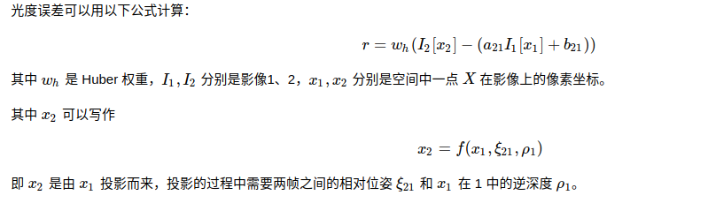
   b.应对模糊的邻域选取 
   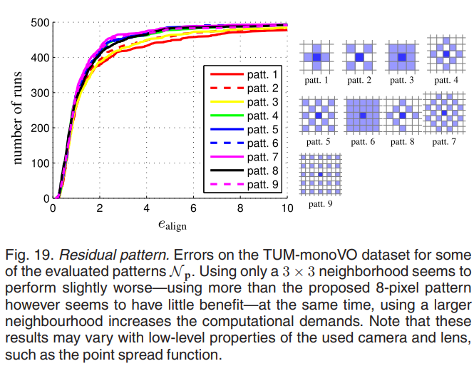
   最终使用Pattern 8 右下角的缺失主要是为了SSE加速的宽度对齐 
   c.active frame策略

   效果：DSO/LDSO 
   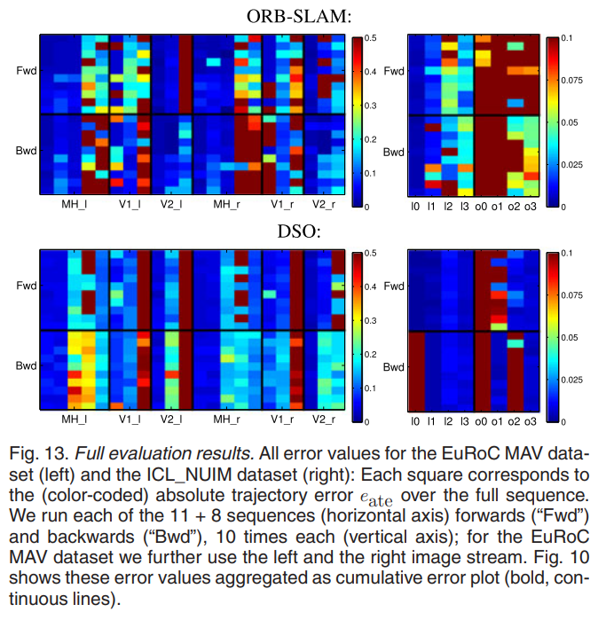
   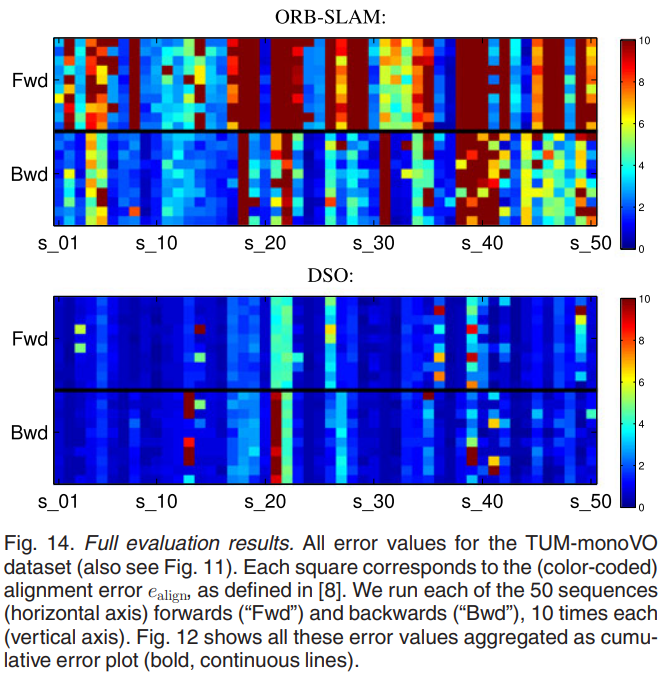
   在数据集TUM-monoVO dataset the synthetic ICL_NUIM dataset 比ORBSLAM2 表现更好，在EuRoc上不太行
   原因如下：
   a. TUM-monoVO 和 ICL-NUIM 有比较好的光度标定,EuRoc 没有这个标定
   b. EuRoc 的小回环比较多，更适合SLAM 系统而不是一个里程计
   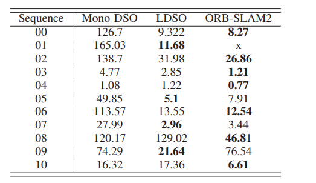

   开源： 
   https://github.com/JakobEngel/dso  
   一个单目的版本 基本无法使用
   双目版本 没有开源
   https://github.com/tum-vision/LDSO  
   https://github.com/JiatianWu/stereo-dso 
   网友的Stereo 版本 使用这个版本跑Kiiti 在笔记本上帧率大概4-5帧/s

   总结： 
   a. 精度：感觉精度一般，但是直接法对于处理低纹理区域肯定是有好处的。 
   b. 稳定性：
   光度比ORBSLAM2 更加鲁棒 
   几何没有ORB_SLAM2 稳定       
   稳定性取决于初值是否精准，感觉对于VIO 来说，就涉及到了 IMU 和 图像帧率的问题 
   c. 速度： 
   d. 硬件平台： 
   最大的贡献在于，直接法以更整体、更优雅的方式处理了数据关联问题。 
   处理了特征点法在 
   环境中存在许多重复纹理； 
   环境中缺乏角点，出现许多边缘或光线变量不明显区域；的问题 
   但是感觉这个问题是不是光流处理掉的？ 

   总体上讲，感觉更加符合对变量进行建模，进行估计的方法。对于光度进行建模是一个很好的想法。代码没有进行阅读的情况下,不知道是进行光度标定之后当作常数来使用，还是真的当作变量进行实时优化,有机会可以看看代码。 
   博客已经证实 是将两个光度参数 加入优化了。 
   那么新的问题就出现了，光度的概率模型如何确定？  还是需要看看代码 
   为了防止运动模糊使用中心点邻域的方式。 

#### Stereo DSO

   Stereo DSO:
Large-Scale Direct Sparse Visual Odometry with Stereo Cameras

   摘要： 
   1. 在实时优化的过程中添加 Stereo 对应的 ActivePoint 逆深度和光度参数估计

   内容： 
   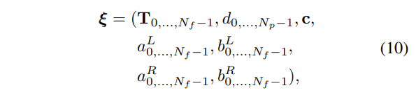
   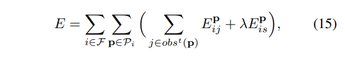
   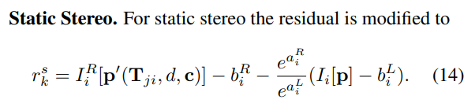
   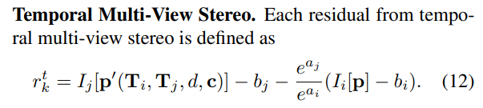

   这里是对每一个点都构建损失函数

   效果： 
      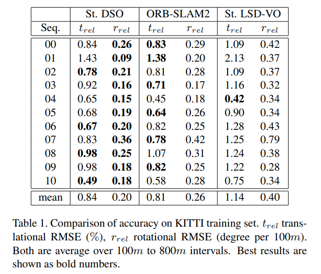
   
   总结： 
   计算量大，但是准，问题是没有开源代码，只有一个开源三方库

#### DSM 

   Direct Sparse Mapping

   摘要： 
   1. 利用光度信息的一致性地图？
   2. 局部共视图来选取active frame 的策略
   3. PBA 需要从粗到细的来进行收敛？ 有啥用？
   4. 使用T分布来进行outlier 剔除

   效果： 
   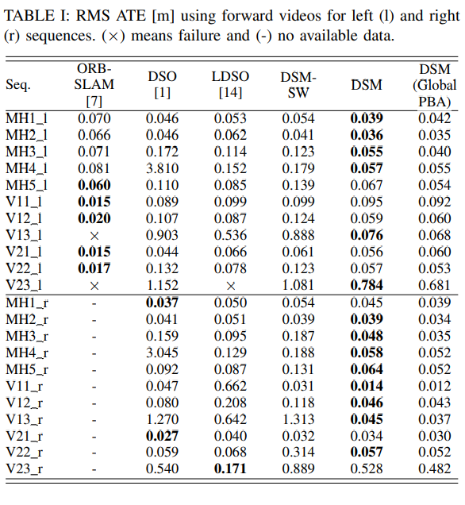
   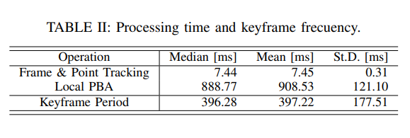

   开源： 
   https://github.com/jzubizarreta/dsm 
   视频效果看起啦 一个LocalPBA 需要 500 -1000ms 实时性堪忧

   引用： 
   [1]Robust odometry estimation for
RGB-D cameras 2013 

   总结： 
   1. 没有仔细看  之后看
   2. 这个地方可以再看看
   3. 就是加了金字塔 DSO 没加吗？？
   4. 就是在使用Huber核的基础上，对于RBGD相机来说在uv表示中，会更加合适感觉和DSO一样[1] 
      如果光度误差在分布可信域的95%之内，就说明是。
      可信域是用图像中所有点的广度误差构建出来的
   感觉中规中矩,远没有大组的DSO 做的细致
   
#### scale_optimization 拓展DSO单目到双目

其实有一篇Stereo DSO 但是代码没有开源就不进行具体介绍
但是有一个三方库可以使用

Extending Monocular Visual Odometry
to
Stereo Camera Systems by Scale
Optimization

   摘要： 
   1. 一种拓展DSO单目到双目的新方法
   2. 在光度误差上添加scale 优化
   
   内容： 
   1. 只是在误差项添加了一个Stereo(scale)项，将尺度信息引入
      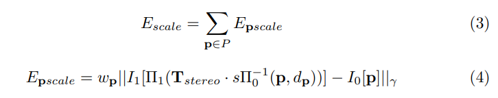
   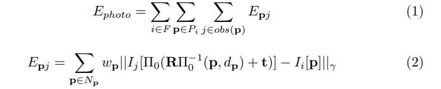
   2. DSO最主要的光度还是没有考虑，感觉这个可能是速度快和为了双目模块化的原因
   

   效果： 
   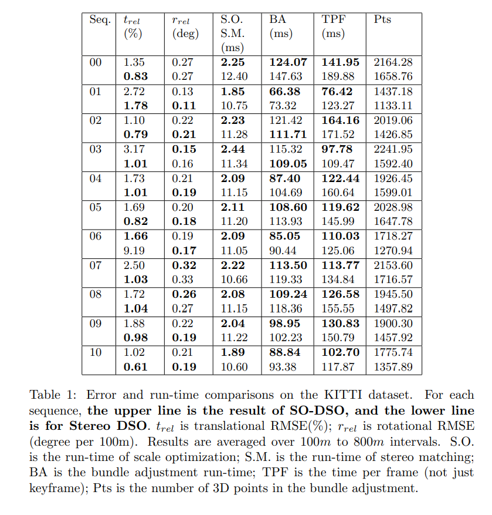

   开源： 
   https://github.com/jiawei-mo/scale_optimization

   总结： 
   方式简单粗暴，效果比放出来的DSO单目开源好的多，但是和没有开源的Stereo DSO 差距也还是很明显的   
   这个框架应该是还有优化空间的。目前看论文，感觉没有引入光度参数,应该更多的是为了双目模块化方面进行考虑 
   但是i7 -6 系的140ms 每帧的计算速度还是很让人头痛 
   和Stereo DSO 的不同是 Stereo 只是估计每一个frame的scale，但是Stereo 是在对每一个active Point 的逆深度进行估计，运算量更大。

#### BAD_SLAM(RGBD)

   BAD SLAM: Bundle Adjusted Direct RGB-D SLAM

   摘要： 

### 总结
   目前传统的内容看下来，主要的方向是
   1. 引入新的变量模型 光度等
   2. 使用新的边缘化策略
   3. 讨论更合理的概率分布
   
## VIO

#### MSCKF系列 (精读、比较适合嵌入式平台)
   A Multi-State Constraint Kalman Filter
for Vision-aided Inertial Navigation (MSCKF1.0)  
   Improving the Accuracy of EKF-Based Visual-Inertial Odometry(MSCKF 2.0) 
   Robust Stereo Visual Inertial Odometry for Fast
Autonomous Flight(S-MSCKF) 
   OpenVINS(S-MSCKF的各种优化大杂烩) 

   摘要： 
   解决状态维数爆炸的情况(MSCKF1.0)
   和别的VIO 框架一致，但是低算力，高稳定性(S-MSCKF)

   内容： 
   1. 特征点+ PLK光流跟踪(内部作了不少优化)
   2. 状态扩增(IMU预积分之后，EKF使用观测进行更新之前)
   3. 状态更新: 
      a. 对跟踪点进行三角化(优化方式的三角化)
      b. 通过这个三角化后的点，构建和各个滑床内frame 的重投影误差,来构建EKF 的更新方程
   4. 边缘化

   引用: 
   a. VIO 四个自由度优化分析： 
   [1] M. Li and A. I. Mourikis, “High-precision, consistent ekf-based visualinertial odometry,” The International Journal of Robotics Research,
vol. 32, no. 6, pp. 690–711, 2013. 
   [2]G. P. Huang, A. I. Mourikis, and S. I. Roumeliotis, “Observability-based
   rules for designing consistent ekf slam estimators,” The International
   Journal of Robotics Research, vol. 29, no. 5, pp. 502–528, 2010.

   效果： 
   quad-core i76770HQ 2.6Hz. 20HZ 的Stereo 和200 HZ的IMU 
   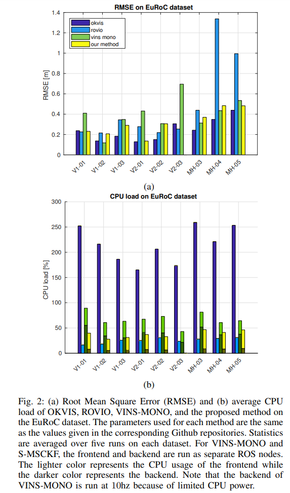

   看起来 OKVIS 基本不用看了 ROVIO 可以看一下 S-MSCKF 效果还是不错的
   开源： 
   https://github.com/KumarRobotics/msckf_vio 
   OpenVINS

   Tips： 
   优化型三角化的trick在下面的网址内有说明 
   https://zhuanlan.zhihu.com/p/77040286

   总结： 
   阅读相关内容需要看一下MSCKF，MSCKF2.0，看视频效果确实不错。不知道真实跑是什么样子,可能会用这个算法进行落地了

#### VI-DSO

   Direct Sparse Visual-Inertial Odometry using Dynamic Marginalization
   DSO的IMU拓展版

   摘要： 
   1. VI-DSO系统
   2. 一种新颖初始化方式
   3. dynamic marginalization的策略 还是在更新滑窗的策略
      不知道和直接套用isam2 比 哪个更加优秀
   4. 在EcRoc上的多种测试

   内容： 

   开源: 
   https://github.com/RonaldSun/VI-Stereo-DSO
   网友开发版

   总结： 
   因为没有开源，只有一个网友实现版，不好多加评论，感觉光度误差和IMU 之间的方差关系需要手动调参，有些失望。中规中据

#### VI-ORB

   Visual-Inertial Monocular SLAM with Map Reuse

   摘要： 
   1. IMU+ORB 耦合
   2. 一个新的IMU初始化方法
   
   内容： 
   1. IMU 的递推还是Forster 的预积分模型
   2. IMU初始化(顺序，应该是从高可观性开始，一直标到低可观性上)：
      a. 先标Gyro_bias
      b. 之后是scale 和 重力大小
      c. accel bias 和重力方向
      d. IMU速度

   开源： 
   均为网友实现的版本 
   https://github.com/jingpang/LearnVIORB 

   https://github.com/YoujieXia/VI_ORB_SLAM2 
   这个版本加不加IMU 效果不大

#### BASALT(看不懂)

   Visual-Inertial Mapping with Non-Linear Factor Recovery

   摘要： 

   开源： 
   https://github.com/VladyslavUsenko/basalt-mirror.git

#### LARVIO

Monocular Visual-Inertial Odometry with
an Unbiased Linear System Model and Robust
Feature Tracking Front-End

Lightweight hybrid visual-inertial odometry with closed-form zero velocity update

   摘要： 
   1. 一个描述子辅助的LK光流
   2. 更多的稳定性改进
   3. ZUPT 零速抑制
   内容： 
   1. 相当于对匹配的LK点对过一次描述子来再去一次outlier
      具体就是把 ORB 的方向描述使用，Shi-Tomasi的角点方向
   
   效果： 
   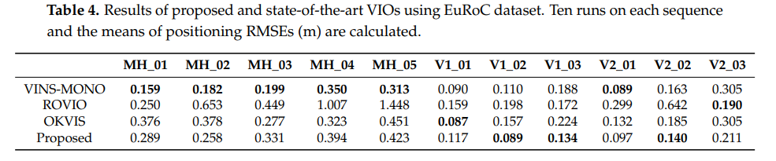
   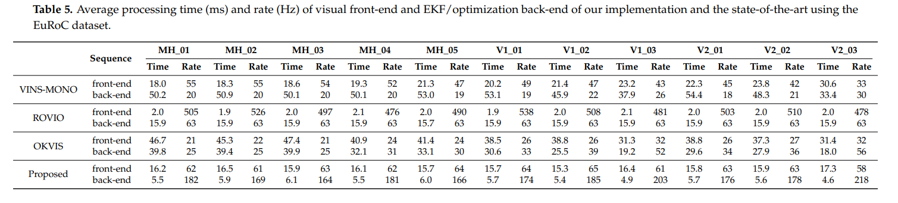 
   新版
   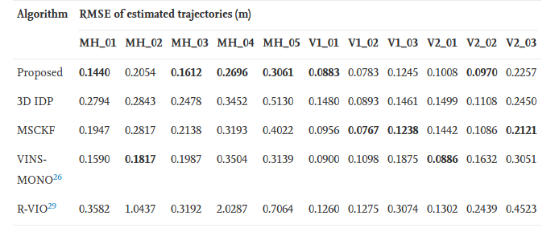
   
   总结： 
   虽然精度上不是特别好，感觉更多的是在，稳定性上 的贡献。
   看一下ROVIO 为什么前端这么快

### 总结
   主要的方向
   1. 更鲁棒的初始化
   2. IMU融合方式都用一遍
   3. 继续换边缘化策略
      这里到底是使用策略还是使用isam2 的贝叶斯树还有待商榷

## Sensor Fusion

### Visual + Odom

#### se2lam(精读，适合扫地机环境)

   Visual-Odometric Localization and Mapping for Ground Vehicles
Using SE(2)-XYZ Constraints

   摘要： 
   1. 引入一个SE2-XYZ 约束
   2. 引入一个SE2 上的预积分
   3. 开源了一个框架
   
   内容： 
   1. 引入 Oberservatin 上的约束 
   
   效果： 
   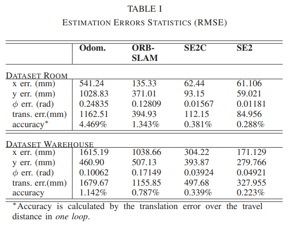
   开源： 
   https://github.com/izhengfan/se2lam 

   总结： 
   添加新约束形式

## multiple Featue

#### RESLAM (Edge)

   RESLAM: A real-time robust edge-based SLAM system

   摘要： 
   1. RGBD Edge-Based SLAM system

   内容： 
   1. 前端 EBVO Frame To Frame ： 
      a. Canny 做Edge检测 
      b. 金字塔+DT 构建重投影误差优化Pose 
         这里应该是使用了RGBD的深度信息 
      c. 初值确定方法(因为先验信息较弱，这里的计算估计在实际当中会出问题) 
   2. LocalMap Frame To Map 
      a. 进一步优化pixel的深度和内参 
   3. 回环： 
      a. 检测回环 random-fern-based bag of words 
   效果： 
   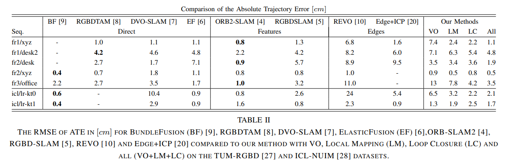

   开源： 
   https://github.com/fabianschenk/RESLAM

   总结： 
   效果不佳

#### EDVO(Edge)

   Edge-Direct Visual Odometry

   摘要： 
   1. 对边缘进行直接法
   
   内容： 

   效果： 
   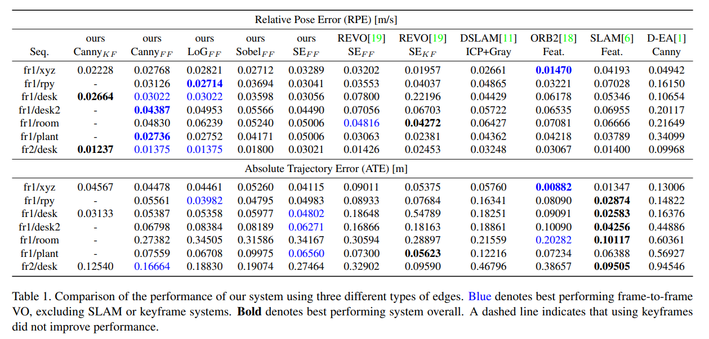

   开源： 
   https://github.com/kevinchristensen1/EdgeDirectVO

#### PL-SVO

PL-SVO: Semi-Direct Monocular Visual Odometry by
Combining Points and Line Segments 2016

摘要： 
1. 使用线特征来

内容： 
1. 只是最面一层使用了line segment patch 的方法进行直接法
2. 后来就只是提取线段端点进行优化了。

效果： 
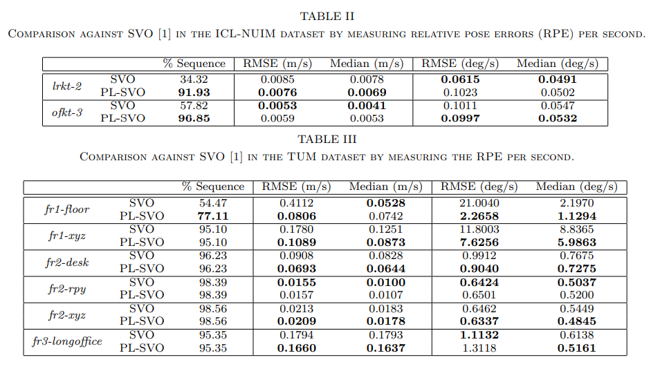

开源： 
https://github.com/rubengooj/pl-svo

#### PL-VIO

: Tightly-Coupled Monocular Visual–Inertial
Odometry Using Point and Line Features 2018

摘要： 
1. 一种线表示方法，并推导其无约束的优化方式，集成到VINS中。

内容： 
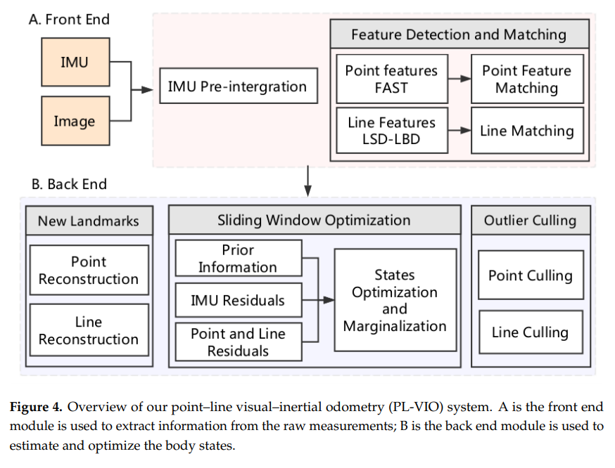

细节： 
Line 的查找和匹配都靠Opencv3 实现 LSD-LBD 
优化使用Ceres 

效果： 
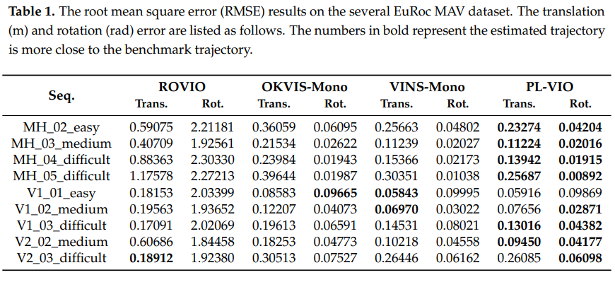
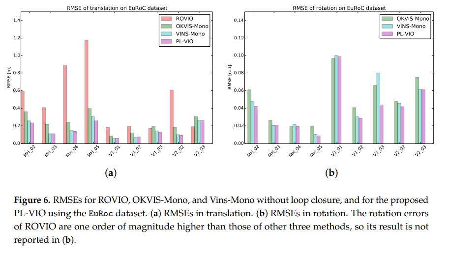
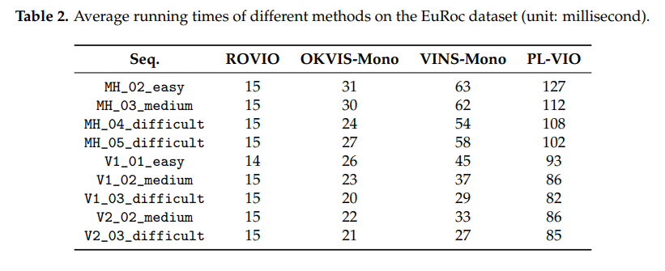

开源： 
https://github.com/HeYijia/PL-VIO 
贺一家版 
https://github.com/Jichao-Peng/VINS-Mono-Optimization 

#### PL-SLAM

LSD-LBD

摘要： 
文章内容比较综合没有侧重。

开源： 
https://github.com/rubengooj/pl-slam

#### Structure-SLAM(PL) 

摘要： 

开源： 
https://github.com/yanyan-li/Structure-SLAM-PointLine

## 深度学习SLAM
#### SuperPoint+SuperGlue+COLMAP 
#### GCNv2

GCNv2: Efficient Correspondence Prediction for Real-Time SLAM

摘要： 

效果： 
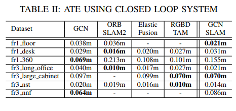
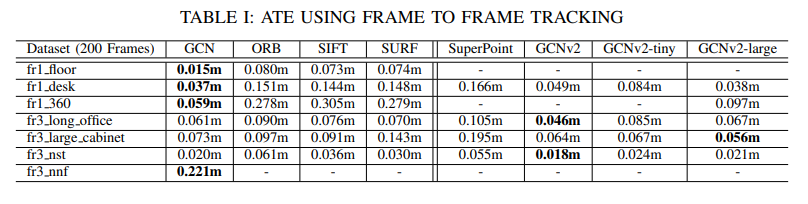

总结： 
和传统方法比，目前还没有看到非常大的优势。

## 优化类文章

#### GF 系列

Good feature selection for least squares pose
 optimization in VO/VSLAM (IROS 2018) 

Good Feature Matching: Towards Accurate, Robust
VO/VSLAM with Low Latency 

Good Line Cutting Version of PL-SLAM (ECCV 2018) 

先验： 
Good Features to Track for Visual SLAM (CVPR 2015)

摘要： 
系统理论上的内容 看不懂

开源： 
https://github.com/ivalab/gf_orb_slam2 
https://github.com/ivalab/GF_PL_SLAM 

## 其他内容

#### VSLAM 算法耗时

Comparison and Analysis of Feature Method and Direct Method in
Visual SLAM Technology for Social Robots

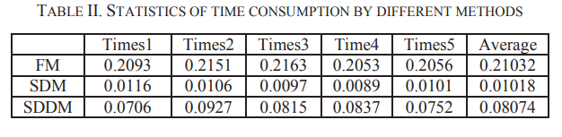

FM Feature Method
SDM SVO 类似的方法
SDDM DSO 类似的方法