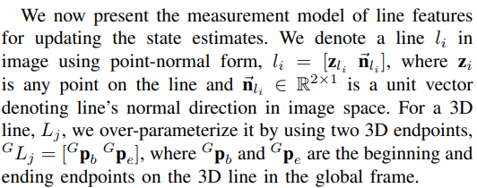
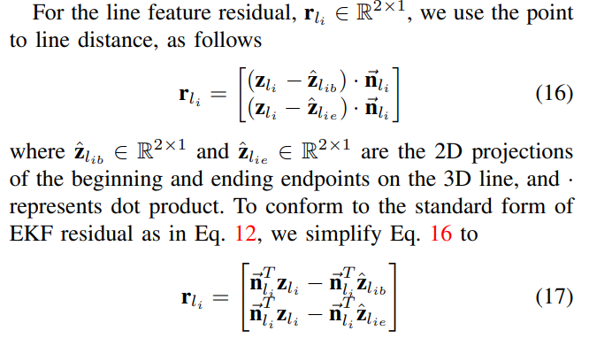
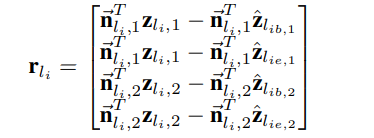
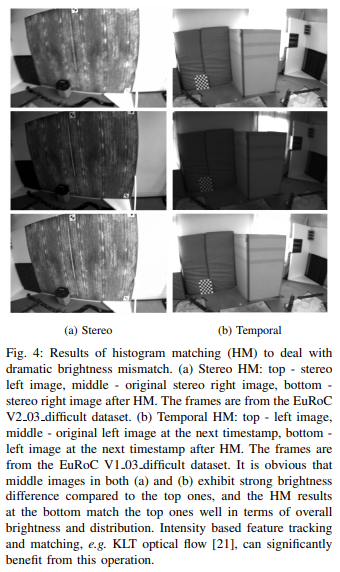

<!--
 * @Author: Liu Weilong
 * @Date: 2020-12-16 13:23:44
 * @LastEditors: Liu Weilong 
 * @LastEditTime: 2021-01-15 09:19:15
 * @FilePath: /3rd-test-learning/doc/paper-12.16-12.30/conclusion.md
 * @Description: 
-->
### MSCKF

1. Trifo-VIO: 
Trifo-VIO: Robust and Efficient Stereo Visual Inertial Odometry using
Points and Lines 

    摘要： 
    1.  点、线MSCKF
    2.  有了个轻量级的回环框架。
   
    内容：   
    1. 线的参数化 过参数化 6dof 2个端点进行表示
    
    
    图像上，线的参数化采用，一个线上的点$z_{li}$和垂直于线的单位向量$\vec{n_{li}}$。 
    两个三维空间点，约束一条线。然后用线构建一个$R^{2×1}$ 的投影误差即可。 
    $z_{li}$ 是图像上在这个线上的随意一个点。 
    思想上就还是通过重投影之后的线和$\vec{n_{li}}$ 的点积为0 
    从单目，拓展到双目。
     
    猜测EKF 更新方法和MSCKF 一致 最后确实是 MSCKF 的去除feature state的方法
    1. 回环 
    ORB描述子做会换
    1. 图像处理    真的良心   
    1.1 点 KLT+FAST 对于新帧用已有地图点跟踪   
    1.2 然后对用mask 对没有覆盖的区域进行FAST提取  
    1.3 旋转初值来自Gyro 
    1.4 HF RANSAC 去outliner
     
    1.5 线LSD+LBD 线的匹配也是使用LBD 进行匹配 
    1.6 为了鲁棒性  进行 四次check 左 to 右 \ 右 to 左 \ Last To Current \ Current To Last 四次线匹配
     
    1.7 based mean brightness check + histogram matching 克服自动曝光 对光流极大改善 
    
    
2. FAST-ORB: 
   FastORB-SLAM: Fast ORB-SLAM method with Coarse-to-Fine
Descriptor Independent Keypoint Matching
    
   摘要: 
   a. 一个更改过ORB2前端的 SLAM 系统 
   内容: 
   b. 加速度模型初匹配 
   c. 光流二次匹配 
   d. inlier check： a. 运动约束 b.RANSAC 的约束 

3. PL-VINS：
   PL-VINS: Real-Time Monocular Visual-Inertial SLAM with Point and
Line Features

   摘要： 
   1. Modified LSD 检测
   2. Plucker coordinate 表示线，将它融合进入优化
   
   内容： 
   1. 点 GoodFeature+KLT
   2. 线 LSD LBD + KNN 类似词袋 
   3. Refine 使用 hamming distance >30 且角度小于0.1rad
   4. 线表示方法 Plucker coordinate

4. PIRVS: An Advanced Visual-Inertial SLAM System with
Flexible Sensor Fusion and Hardware Co-Design

5. Using Vanishing Points to Improve Visual-Inertial Odometry 
   Vanishing Point 要多看看了
   
   顶会的点子 果然别人已经做过了
6. StructVIO : Visual-inertial Odometry with 
   Structural Regularity of Man-made Environments 
   看一下综述