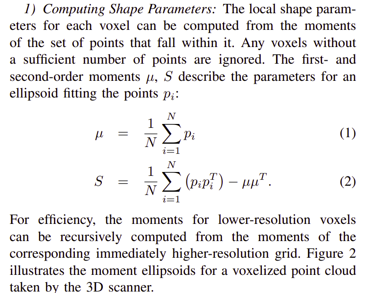

1. Continuous 3D Scan-Matching with a Spinning 2D Laser

    摘要:
    存疑:由于激光径向扫描导致的非均匀采样的问题

    内容:
    1. Sweep-matching 算法
   
    1.1. 计算外形:

    
    

    内部含有多分辨率的金字塔设计:
    

    1.2. 数据关联评价:

    计算描述子用于ICP的最近邻搜索

    

    1.3. 多种约束的优化

    

    因为涉及到一个sweep 里面的多个pose采样，所以存在多个r和t,实际上都是一个sweep里面的

    1.3.1. matching constraint

    

    几何约束，这里就是把Planar Voxel 的有误差方向，限制在发现上，Cylinder Voxel的误差方向限制在垂直 Cylinder 方向的垂直方向上。

    考虑采样时间和实际时间的差别，进行修正

    

    考虑Planar Voxel的角度约束

    
    
    1.3.2. 平滑性约束(源于加速度不可能是有界的)

    

    权重由加速度大小来调整

    1.3.3. 初始值约束 可以考虑IMU 所以这里的内容省略

    2. 总体流程到pseudo-code
   
    

说实话感觉不到优秀的地方，有时间的话之后去问一下。

2. Be your own Benchmark:
No-Reference Trajectory Metric on Registered Point Cloud
    摘要: 使用构造出来的其他测量。从来在没有真值的情况下，使用点云来对轨迹的精度进行评价。

    1. 相关工作:  

    三种对于SLAM 或者里程计的评价方式:
    基于轨迹、基于点云质量、前两者交叉的方式

    基于轨迹 APE RPE

    基于点云质量 主要用于衡量降噪和点云压缩的效果

    为了可以衡量轨迹的精度使用了 Person correlative coefficient 进行估计

    Map-Based 方法 MME[10] MPV[11] 叫做 no reference 方法 

    2. 
