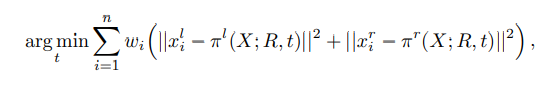

<!--
 * @Author: Liu Weilong
 * @Date: 2021-01-19 11:35:48
 * @LastEditors: Liu Weilong 
 * @LastEditTime: 2021-02-01 18:10:08
 * @FilePath: /3rd-test-learning/doc/paper-21.1.18-21.1.30/reading.md
 * @Description: 
-->
1. SOFT_SLAM:SOFT-SLAM: Computationally Efficient Stereo Visual
SLAM for Autonomous UAVs 
摘要: 
a. odometry thread + mapping thread 
b. 优秀方法组合 
感觉是一篇纯工程的文章 

内容: 
a. odometry thread  非常重的前端
feature extraction tracking matching selection 
feature extraction:Geiger et al., 2011 blob and corner masks  
matching: SAD + circular matching (add for outliers) +NCC(cicular matching 成功之后的判断)  
circular matching :
$$
    I^{L}_{k-1}\rightarrow I^{R}_{k-1} \rightarrow I^{R}_{k} \rightarrow I^{L}_{k} \rightarrow I^{L}_{k-1} 
$$
if IMU available then add predict  
circular 匹配完全，认为是高质量的特征，用于后续的分析 
feature 的descriptor 不进行更新。 
每一次追踪都会和 initial desciptor 进行矫正  
descriptor更新能让feature 活更久，但是会更容易引入drift,所以这里保持descriptor 不变 
一直在追踪的feature 会被认为更加可靠，但也会引入drift。所以新旧feature 的量需要保持平衡。
在长期tracking上，选择点的策略平衡远近(ORB在插入关键帧的时候也会有考虑)、新旧、部分三个部分。Kitt
et al., 2010 
tracking： 
先估计旋转，然后旋转+平移一起重投影  
旋转: 
Without IMU: 
5-point method In (Nister et al., 2004)  
多frame 进行5point + SLERP 进行平滑 
With IMU: 
直接使用IMU 的旋转,后方一个EKF进行bias的更新(Cviˇsi´c and Petrovi´c, 2015) 
会用IMU的假设再去一次Feature里面的outliers 
平移: 
1point RANSAC method 一个点 一个点的进行优化??? 存疑 Nister et al., 2004 
最后加一个,大GN优化  内部会对feature 进行分类对于不同的feature类别设置不同weight 
这里$X$ 提前三角化好的位置,虽然没有明说,但是猜测是多帧混合三角化的结果 

b.Exponential filtering 
一个插值 
c.Mapping thread 内容相对较少 
Looping 内容相对较少 

2. REMODE: Probabilistic, Monocular Dense Reconstruction in Real Time 
    摘要: 

3. 2-Point-based Outlier Rejection for Camera-IMU Systems with
applications to Micro Aerial Vehicles 

4. Geometric-based Line Segment Tracking for HDR Stereo Sequences  线匹配