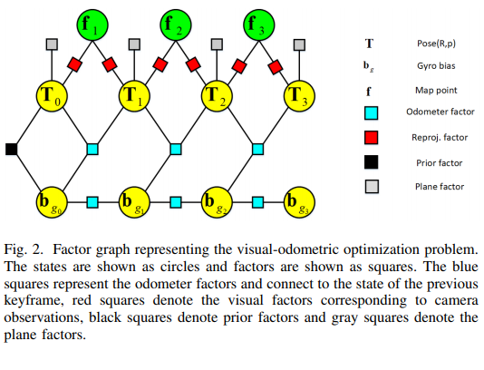
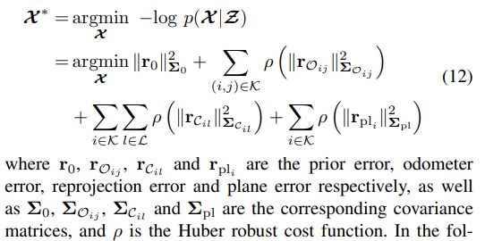
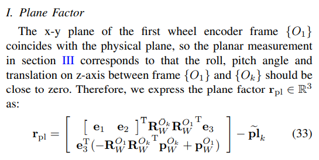
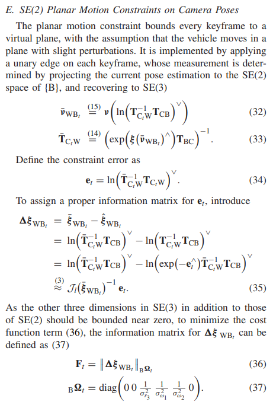

<!--
 * @Author: Liu Weilong
 * @Date: 2021-01-14 19:49:35
 * @LastEditors: Liu Weilong
 * @LastEditTime: 2021-01-30 18:42:38
 * @FilePath: /3rd-test-learning/doc/paper-21.1.4-21.1.15/reading_doc.md
 * @Description: 
-->

1. Visual-Odometric Localization and Mapping for Ground Vehicles
Using SE(2)-XYZ Constraints 
相关工作: 
a. 地面约束
Instantaneous Center of Rotation (ICR) [17]  
Deterministic SE(2)-constraints [18]  
Stochastic SE(2)-constraints [13][15][19] 
摘要： 
a. 提供地面约束
b. SE2上的预积分
内容: 
具体见 
./doc/SLAM-related/se2lam/theory.md 
这里加平面约束的方法还是比较新奇的

2. Tightly-coupled Monocular Visual-odometric
SLAM using Wheels and a MEMS Gyroscope
摘要: 
一个大融合框架，但是没有放开源　结果不好说

内容: 
a. 误差项
   
b. Odom 预积分和 IMU预积分没有区别 应该是Forster14 的过程推导 
c. 地面约束
   
   $\widetilde{pl_k} =[0,0,0]^{T}$
相当于Odom 还是使用SE3 表示，然后遏制住SE3 的roll pitch 和z  
d. 对于不同的情况设置不同的策略  
d.1. 皮带打滑的情况： 如果匹配点大于一半都是outlier 就判断打滑 

3. IMRL: An Improved Inertial-Aided KLT Feature Tracker
   摘要：  
   a. 深度估计+惯导初值KLT

4. Accurate Monocular Visual-inertial SLAM using a
Map-assisted EKF Approach

5. VINS on wheel 
之后再看,这里的平面约束有一个对于平面的估计 

6. A Square Root Inverse Filter for Efficient
Vision-aided Inertial Navigation on Mobile Devices

7. Inertial-Aided KLT Feature Tracking for a Moving Camera
   摘要： 
   a. 一个Inverse Compositional + Affine Warp + IMU 的融合光流
   内容： 
   a. 在大旋转运动的时候，使用 Rotation 来做一个单应矩阵的假设 
   如果加入轮子，就可以单应和基础矩阵，进行判断和转换了
   
   b. 从这个单应矩阵假设来得到Affine Warp 用于转换 像素值
   
   c. 从IMU + 外参误差分析, 得到 Template 的Size 假设
   

8. 顶会点子2 空间特征关系的slam
   现在的视觉SLAM 大多依靠图像前后无法确认是不是同一个特征
   对于点来说，是这样的，那么如何使用线来构建一个空间特征，而不是一个平面特征就有的说了

9. Odometry-Vision-Based Ground Vehicle Motion
Estimation With SE(2)-Constrained SE(3) Poses 

内容： 
1. 一升一降构建 zrp 约束
