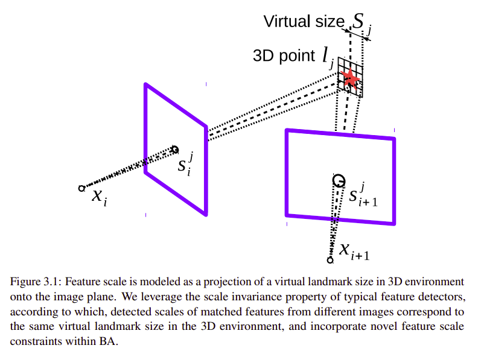
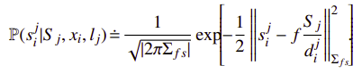
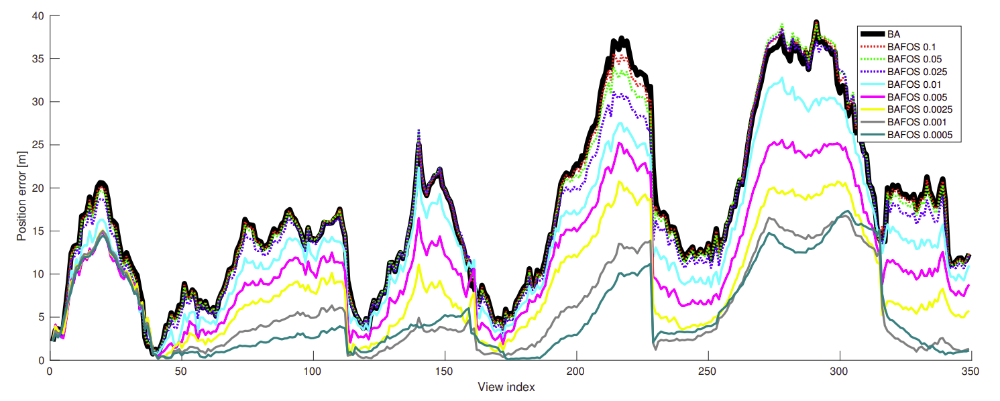

<!--
 * @Author: Liu Weilong
 * @Date: 2021-05-21 12:18:08
 * @LastEditors: Liu Weilong
 * @LastEditTime: 2021-06-02 08:47:46
 * @Description: 
-->
1. Bundle Adjustment with Feature Scale
Constraints for Enhanced Estimation
Accuracy

摘要:使用 尺度大小信息，进一步约束landmark的深度，residual 的构造整体上还是一个 几何误差的构造方式

关于方差的建模，属于尝试性的方法，选了几个值测试结果，结果如下:

2. Probabilistic Normal Distributions Transform Representation
for Accurate 3D Point Cloud Registration

