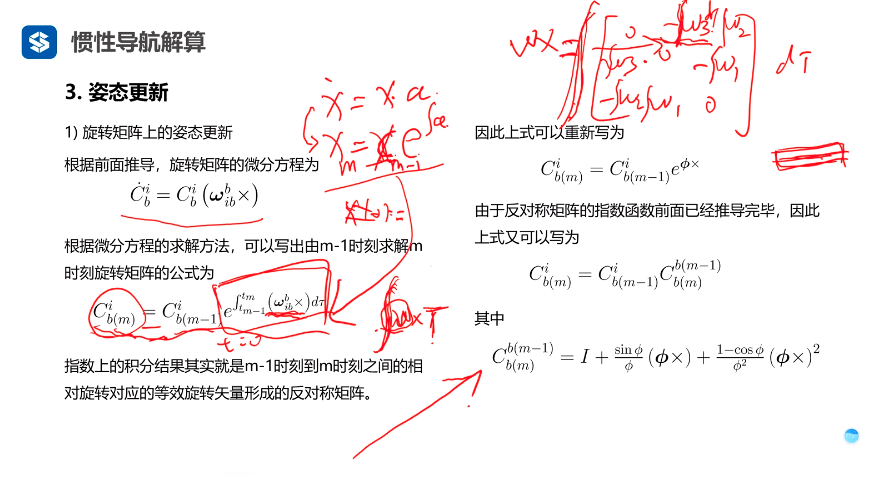
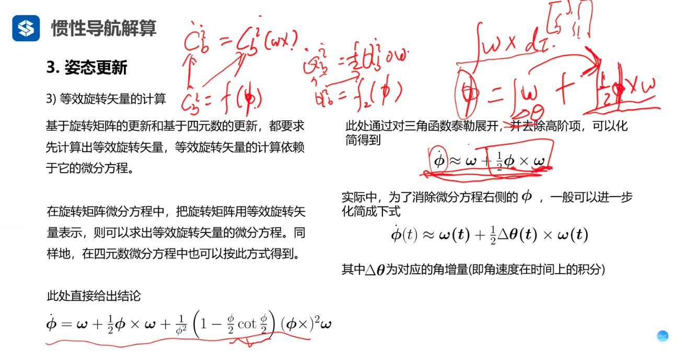
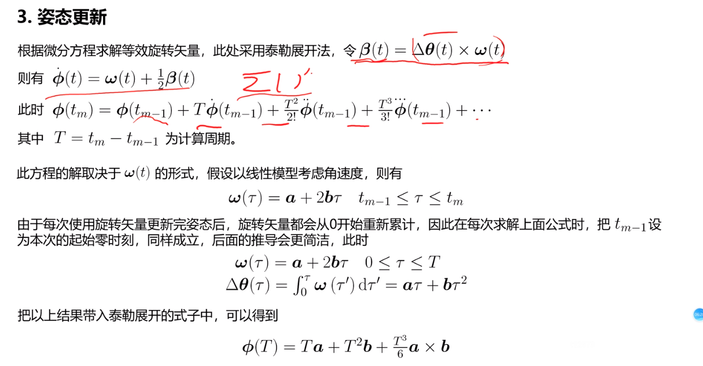
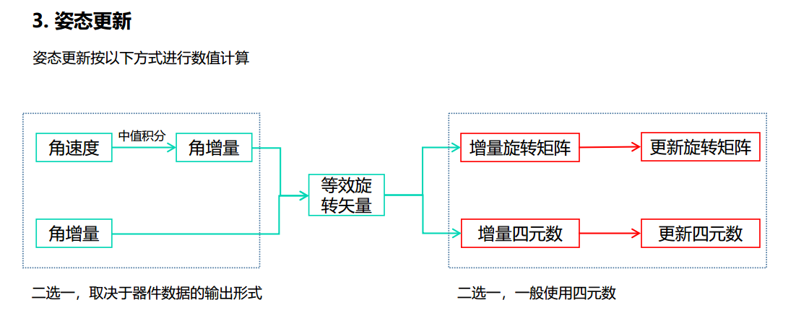
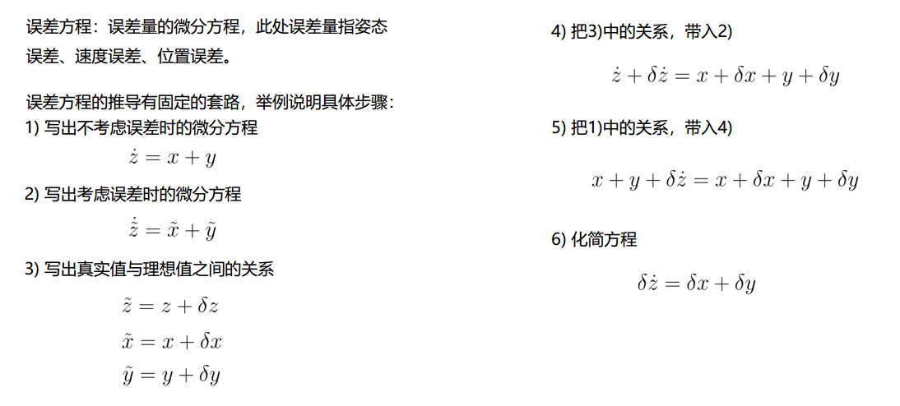

<!--
 * @Author: Liu Weilong
 * @Date: 2020-11-19 09:40:37
 * @LastEditors: Liu Weilong 
 * @LastEditTime: 2021-02-03 13:53:31
 * @FilePath: /3rd-test-learning/doc/sensor_fusion/chapter3/chapter3_error_analysis.md
 * @Description: 
-->

### IMU误差分析
1. 量化噪声 采样步长越大 量化噪声越大
2. 角度的随机游走      来自速率噪声积分
3. 角速率的随机游走    来自角加速度噪声积分
4. 零偏不稳定性        核心指标
5. 速率斜坡           这个是补在哪里的？
6. 零偏重复性         每次上电零偏不同
   
Allen 方差分析只是估计了前5项  
也就是说估计了 accel 和gyro Bias 的随机游走

### 惯性导航解算

tips： 死知识 和 活知识

tips： 因为运动环境在地球模型上运动比较小，所以当作平面模型来做

   1. 旋转矩阵和四元数的更新
   2. 等效旋转矢量：旋转可以等效成绕一个轴旋转一个角度
   3. 姿态等新：
   
   这里想说的就是，如果不是定轴转动的话，角速度的积分不能直接对每一个速度积分进行累加来进行求解 
   下文会引入一个等效旋转矢量的方法，在处理这种情况
   4. 等效旋转矢量的方法用于处理非定轴转动的积分
  
   这里是直接给出了 旋转轴角和角速度的关系 会发现简化之后是由两项组成的， 
   后面的一项就是一个对于不定轴旋转的一个补偿 
   IMU 线性运动模型求解
   看ppt即可 
   
   最后对得到的delta 量 转换到增量旋转矩阵/增量四元速 对 原本的旋转表示进行更新
   

   感悟：
   这里讨论的 phi(T) 实际上，只是一个相对量。还是需要进行一次 向增量矩阵的变换+旋转更新的。
   但是在实际使用的过程中，还是要看IMU 的频率和运动是否剧烈的关系，如果IMU非常高频+慢运动，那么匀速模型也可以用。 
   高阶模型应该还是适用于 IMU 频率和运动相比相对低频的情况下。

### 误差分析
   分为六步走：
   
   关于SO3+R3上的误差分析 参考ppt 即可 
   这里最主要但是学这里的分析套路
 
 
还需要之后根据讲解再进一步的修正自己的想法