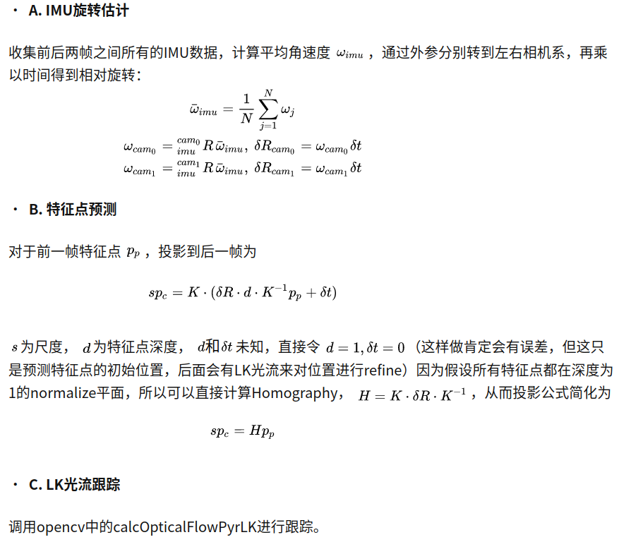

## VIO 好效果重点

### 图像预处理
1. 角点特征追踪的SLAM，先将图像锐化一遍，SLAM累计误差降低60%。-> 这个大概率告诉我们要为算法营造符合它本身假设的环境，而不是想办法让它去适配所有的环境
   交点的匹配都会受到运动模糊的影响
2. 进行一个内容的测试，那就是图像边缘和深度takeCare，

### FrontEnd Feature

#### 初始化
   1. "Closed-form solution of visual-inertial structure from
motion"   
按照VI-DSO Mono-IMU 初始化的问题已经是一个研究的很好的问题了，那么现在进行初始化的方向就是看哪个初始化的快？ 
   2. IMU 初始化的顺序 
      猜想： 
      a. IMU的初始化顺序应该是和算法的可观性有关，有大可观性开始标定 原因是小可观性的参数波动过大。和大可观性的参数一起标定，很容易得到一个illed-systemed。 
      这也是为什么IMU初始化需要分开优化。
   3. keyframe之间需要有足够大的视差

#### Point Feature-Based
   1. 网格的划分与特征提取： 
      现在一般采用的方法是 恒定均与划分 然后使用NMS 使其均匀和稀疏  
      但是根据目前的信息来讲 
      并不建议这样的方式，因为有些场景下会存在大空白(ie. 天空)的情况，这种情况会导致特征点数量不足的情况。 
      最终影响到累计误差的情况。 
      所以可能 四叉树 这一类的自适应网格效果会更好？ 之后再试试 
      框架实现： 
      a. (S-MSCKF) 4×5 个格子进行特征提取每个不超过4个特征点。可以很简单实现自适应提取恒定个点的算法。
   2. 特征点数量 过多过少都有问题
      从 S-PTAM 的实验结果中可以知道，特征点过多和过少都会对定位结果有不好的影响。 
      点多的话 可能会误匹配？ 
      点少的话 是因为什么呢？ 
      这个特征点数量的调整可能还是要放在具体的环境里进行调参才可以了
   3. 对抗误匹配 
      a. (ORB/Trifo-VIO ...)H F RANSAC + PnP 二次去误差
      b. (LARVIO)描述子去误匹配
      c. (DSM) T 分布去outlier ？？ 没有仔细看这里存疑
      d. (SELF) 待验证 先验运动用于去掉误匹配
   4. 特征尽可能在视野中央(SVO SOFT2 都有提到这个问题)
   
#### 光流/Direct 

   1. Data Assoicate 的问题 
      光流和 直接法 出现的误匹配的情况会更加严重(运动模糊、非全局曝光 等多种原因)，所以对于初始位姿的要求会更高。 
      感觉是不是如果相机的处理频率更高就会有一些好的改善？ 
      框架实现： 
      a. (Direct、LK方法都有)金字塔 
      最多的处理方法是就是金字塔,觉得是害怕无匹配，现在看更多是避免大运动的情况 
      b. (DSO)邻域匹配 
      另外一种就是直接使用周围一圈的点的进行匹配(SVO/DSO貌似都有这种操作，留给之后进行探索吧) 圆圈的大小，肯定是会和概率相关的 
      c. (Direct、LK 都有相应的使用)跟踪点均匀化 
      均匀化和 Feature-Based 的方法可能有一些相关性
      d. (S-MSCKF) 外点剔除 
      用于LK 之后，已经有了匹配的点对之后 
      如果有平移的话 通过极线做RANSAC，去除外点。 
      如果没有平移，极线约束退化，直接使用点的旋转来进行外点去除 
      RANSAC在内部左右图像匹配使用，和前后帧匹配上使用了2-Point Ransac 
      e. 利用描述子再进行一次筛选(LARVIO)
         ie. LK + ORB refine
   2. FAST和gradient的选择 
      追踪可以是FAST又可以是gradient 的点 
      关于如何选择，如何混合，选择多少，DSO的 Parameter Study可以提供一些思路
   3. 光度标定 
      从DSO那里可以得知，有没有光度标定。光度不变假设的符合性对于光度衡量类算法的影响 
      也可以从硬件方式上面解决？ 
      也可以自动调节曝光 
      ->Active Exposure Control for Robust Visual Odometry in
HDR Environments 
      2017 年的文章差距真的太大了 真正的植根于硬件来做算法
   4. IMU 
      IMU是否可以算作匹配初值来进行使用，从而加速匹配 
      框架实现： 
      a. (S-MSCKF) IMU旋转做LK初值 
      S-MSCKF已经在使用这种预测了，但是imu在gyro上更加可信所以只是做了旋转上的预测。很容易想到拓展到轮子上。 
      这个对于LK光流 对于 直接法 都有启示。 
      对于线面等高级特征的匹配似乎意义更大。因为更高级的特征就意味着需要对更多维度进行搜索。 
      
      猜想： 
      a. IMU 数据和LK结合的时候，是不是可以根据方差来选择匹配的金字塔层数？ 
      b. 这个方法对于雷达的特征匹配是不是也有一定的指导性作用？ 
      使用IMU的累计均值和方差确定匹配的初始位置和搜索范围 
   5. 融合时 更好的光度误差模型建模 
      将论文中需要调参的lamda 换成一个从误差模型得到的参数会不会更好？ 
   6. (SVO)对于大差别的光流跟踪：
      需要考虑亮度变化  进行亮度补偿 a×I +m or -m 
      考虑到放射变化  进行Affine 补偿 template(patch)的仿射 
      考虑到边界畸变  进行mask判断，边缘的点不进行光流 或者 跟踪之后的优化部分对这种边框上的点不进行考虑
   7. (BASALT) SE2单个像素 帧间光流相对于SVO 的SE3 帧间直接光流，对于旋转都有克服的作用，但是BASALT的SE2 单个像素帧间光流有助于后续的动态场景处理。
   8. 光流的template 如何设置

### 综合类
   1. Point Manage 
      框架实现： 
      a. (SVO/DSO) 点的深度之后在不断更新，直到相对收敛之后，才会被加入系统。用于之后新帧的估计。(inleir select) 
      相反的，ORB只要从新帧中抽取了Feature就会被加入系统，直接用于匹配。 
      这里怀疑是一个鸡生蛋，蛋生鸡的逻辑。
      b. Conventionally, 就是RANSAC-like 的方法(inlier select)
      c. ZhaoYiPu Good 三篇 
         +Optimally observable and minimal cardinality monocular slam 
         + Attention and anticipation in fast visualinertial navigation 
      d. (ORB) MapPointCulling 检验方法相对暴力 
      c3：一般来讲，是三帧以上连续追踪就可以判断是好的点。 c1: 和回环有关 c2: 和长时间追踪，但是观测次数有限有关

   2. Depth 使用逆深度
   3. 均匀撒点
   4. 离散误差 
      框架实现： 
      a. DSO 是使用基线搜索，是一个亚像素精度的方法，但是ORB是按一个pixel一个pixel 的分离，所以会有更大的离散误差。可以使用LK+ORB refine 的方式进行克服。
   5. 参数模型->快速收敛
   6. 子图管理 
      Good Graph to Optimize: Cost-Effective,
   7. 对于图像曝光 添加
      这个地方是不是可以和IMU 的运动估计信息进行融合？
      框架实现
      a. (trifo-vio) 先一个mean brightness check 然后需要的话做一个histogram matching来克服自动曝光的问题 
      b. (Cutting_line)AdaptiveFAST
   8. 图像模糊的问题  如何处理？  因为较高的速度下运动模糊的情况可以说是经常发生。DSO SVO 的取周围pixel 的方法？
   9.  关键帧管理  
      框架实现: 
      a. (ORB) KeyFrameCulling
   10. 子图管理 
      a. Budget-Aware Bundle Adjustment in Visual SLAM
   11. Challenges in Monocular Visual Odometry:
Photometric Calibration, Motion Bias and
Rolling Shutter Effect 大佬们给出的讨论
   12. ORB 的PoseOptimzation 在优化之后会去掉不合理的点，然后再次从头进行优化(算是一种类型的点管理吧)
   13. MapPoint 和 KeyFrame 都需要进行去重复,不然之后一定会出现计算量过大的问题
   14. 视觉需要维护一个共视关系
   15. (ORB)描述子可以提供更大的视差 这个观点是片面的，对于ORB 的描述子对于SO2 有比较好的适应性,但是对于SO3的适应性是不太行的
   16. (SVO)仿射可以修正偏差，这里的放射是指SE3上的仿射(可以对于template 大小和形状有一个调节，让两幅图片在平面上更加相似)，和光度上的放射
        目的应该是提高匹配的正确率和精度(防止出现源于图像大小尺度变化、SE3 运动视觉变化所导致的问题)，对于ORB 来说是使用多层金字塔上的特征描述子 进行克服的。但是因为是描述子，没有办法完全匹配，所以会存在误差
   17. (BASALT) 仿射可以修正偏差，这里的放射是指SE2上的仿射,也就是平面上的仿射, 适合用于连续帧间光刘(SVO没有添加SE2 ，是直接平移小方块光流)
   18. (ICE-BA) 相机畸变 应该有对应的方差刻画
   19. (ORB)尽量让当前帧和更加古老的帧建立关系，来减少累计误差，这也是为什么有回环，几乎所有的算法都是Frame2Map 的匹配。ORB会有CreateNewMapPoint 的原因，说到底都是为了和更加古老的帧建立关系
   20. (SELF) patch matching + 极线搜索对于匹配有很大的潜力，可以好好探索一下的。 已经有论文出多点的线匹配了
   21. (BASALT) 进一步加速: 恒定线性化点，让所有线性化之后的帧都不在进行线性化。减少大量计算量。每一帧都参与到slide window 当中，那样精度的确会有大量的加速。
   22. (FAST-LIO + 猜测) 进一步加速: BASALT的思路是减少线性化的思路。FAST-LIO的EKF思路，对于VIO来说，让算法更新的从landmark 的维护降低到 state 的维护。结合SVO的深度滤波应该效果也不会差。更重要的是搭建起 MSCKF方法到图优化方法的桥梁

### FrontEnd SlideWindow

   1. SlideWindow的策略制定会对算法有影响
      DSO   

### 关于地面约束
   1. 如果地面比较平、并且加减速也做的比较好，可以直接用 光度误差的 物理意义来进行限制。 也就是只要是同一个点 uv v 代表y v 就不会变化太大。 也就是说这个v 的信息矩阵权重可以设置的比较大

### 硬件
   1. 关于自动曝光
   2. 关于图像rect与否

## Lidar 好效果重点

### FrontEnd
   1. 点云匹配之后，再加一个IMU修正。 
      据说效果会更好?没有理明白这个逻辑     
   2. 在进行点云匹配的时候，其实应该添加一个imu预测。 
      特别是在旋转上，在剧烈旋转的时候，不添加IMU 的旋转预测，一定会出问题
   3. 关注intensity,有时候代表的物体的关系，有时候还会代表这个点是否可靠
   4. 更高的收敛判断要求，更快速的收敛速度。毕竟有实时性的考虑，在这样的情况下，一定时间内，更多的迭代会带来更高的精度。这个地方感觉激光和视觉差别比较大，视觉几次之后，感觉会收敛到更高的量级上，但是激光需要更多次的进行迭代. 
      关于这个收敛速度的探讨，希望之后有时间可以去认真地看一下
   5. (猜测)点云特别是密集的点云对于outlier的要求越高。
      特别是到了cm级的精度要求之后，越是需要进一步的对点云进行过滤。
      参考 RANSAC or  深度学习(去动态点云)
   6. (猜测)在点云已经可以比较好的表示特征的时候，尽量保持最老的那一帧点云。也就是尽量保持点云的不重叠。
      来减少多帧点云重合，带来的不可避免的累积误差。
      这个也应该结合LOAM的LocalMap来进行实现
      当然可以这么做也是因为激光雷达非常准确的深度。
   7. (猜测) 利用好激光数据的连续性特性(LOAM)，和NDT的栅格离散特性，两两结合，一定会有非常好的效果
   8. 点云是否能够使用ICP  和点云信息的准确性有关
   9. 关于结构导致的点云结构退化的问题(也就是跳变的问题),根本上是Hessian 存在零空间导致的，解决方法1是想办法添加一个运动假设，来让Hessian 非奇异。方法2 做一次零空间的限制。
   10. Gmapping 的思想还是有必要去看一下
   11. Demotion 这件事除了对于 预处理的时候可以进行。 紧耦合也可以起到一定的作用。 而Demotion 是雷达SLAM 的关键
   12. 激光SLAM 相对于视觉更加容易受到 结构性退化导致的 Hessian 矩阵 奇异的问题。所以才需要添加各种运动先验来保证Hessian矩阵的非奇异性。关于具体如何变化，可以之后进行一下测试
   13. 对于场景退化的问题，如果添加上intensity，也的确可以很好的克服场景退化的问题。但是intensity的准确性的问题，值得之后进行深入的探讨
   14. LOAM + NDT的融合，LOAM做前端提供初始化位姿。NDT作为精定位
   15. 使用点云密度信息，进行动态物体的过滤
### 融合
1. 在长距离里IMU 的作用是不是会比Camera更大？ 除了提供视差以外。感觉并不会啊,没有从根本上解决SE3视角不同时的匹配的问题
2. (OC-EKF\DSO) 注意可观性分析之后，对于SLAM问题的可观性的维护
3. 基于可观性分析，对于可能出现退化的场景，进行多传感器融合。补足可观性

## 哲学
a. 匹配的初值预测 
b. 误差模型的分析 
c. 不去要求传统方法(用公式可表达的可建模的方法)的泛化，追求给传统方法更好的数据，营造好的运行环境给他。

d. 深度学习 
e. 因子的设置 
f. 累计误差的消除，是和更古老的帧发生约束来进行的(ORB) 

### 图像质量

1. 模糊
   Reading_List
   Image Deblurring using Smartphone Inertial Sensors
   Inertial-aided Motion Deblurring with Deep Networks
   图像去模糊之初探--Single Image Motion Deblurring

2. 光照 
   Reading_List
      Active Exposure Control for Robust Visual Odometry in HDR Environments
   微软的技术积累有点吓人嗷

